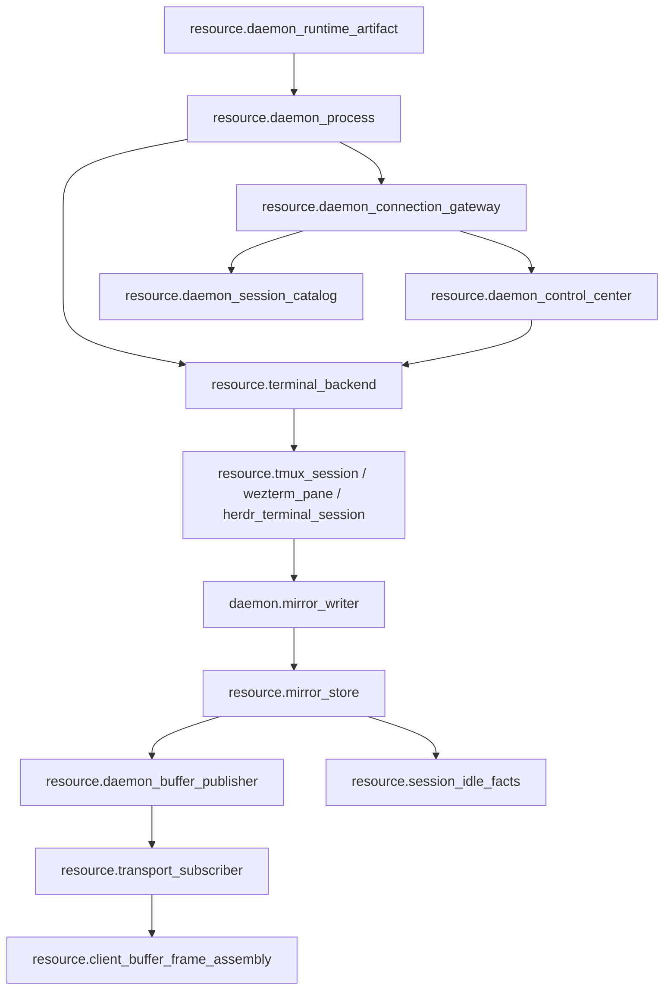
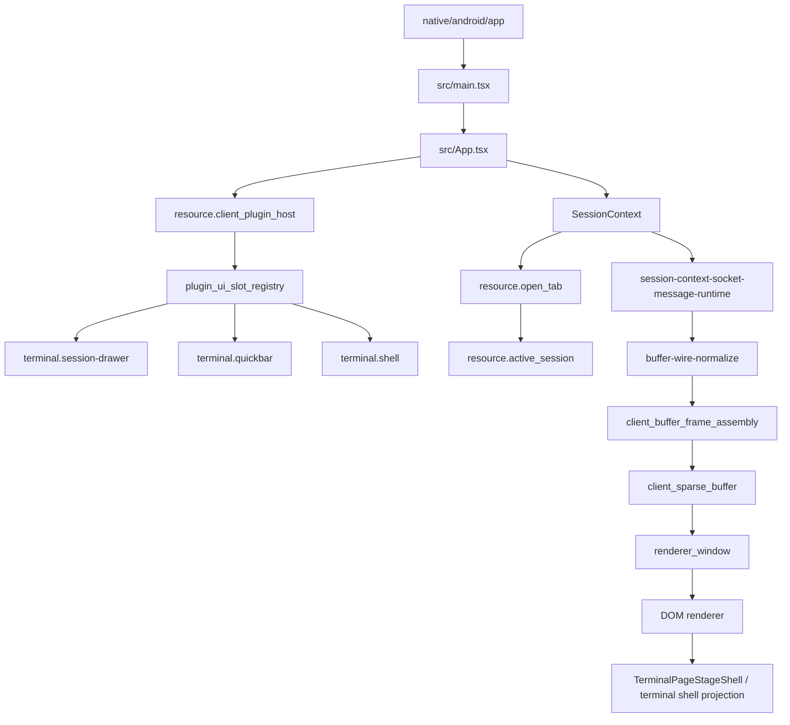
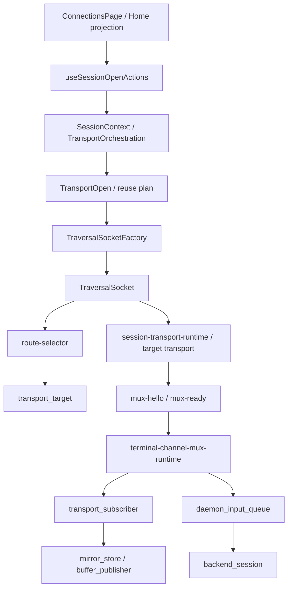

# zterm DAG / Buglist Audit 2026-09-20

Scope: daemon behavior, client UI behavior, connection behavior, upstream AppSDK/Collab buglist P0/P1. This audit is read-only for zterm; no tmux session was modified, no daemon/device was stopped or started, and no live daemon/tmux/device test was run.

Evidence sources:
- `android/docs/architecture.md`
- `android/docs/resource-map.md`, `android/docs/resource-registry.json`, `android/docs/module-registry.json`, `android/docs/edge-registry.json`
- `android/docs/function-map.md`, `android/docs/feature-registry.json`, `android/docs/feature-gates.md`
- `android/docs/wiki/mainline-source.md`, `android/docs/wiki/mainline-call-map.json`
- AppSDK clean worktree `/Users/fanzhang/Documents/github/appsdk/playground/appsdk-main-integration-20260917`

## 1. Daemon Behavior DAG

Closed in registry/source: `mirror_writer -> mirror_store -> buffer_publisher -> subscriber` is the only unsolicited live body path, and `control_gateway -> control_center -> owner` is the control path.

Not closed in this audit:
- Live L2 daemon/tmux close-loop and installed daemon runtime hash are not claimed because the user prohibited tmux/daemon lifecycle tests and none were run.
- `resource.remote_window_quality_control`, `resource.remote_window_input_delivery_client`, `resource.remote_window_input_delivery_daemon`, `resource.remote_window_frame_projection`, `resource.remote_window_capture_backpressure`, `resource.remote_window_canvas_raw`, and `resource.remote_window_canvas_encode` are still design-only/binding pending in registry/mainline docs. They must not be presented as active runtime DAG edges.

## 2. Client UI Behavior DAG

Closed in registry/source: open-tab truth, active-session truth, sparse buffer, renderer window, and DOM projection are separate owners in `resource-map.md`; typed plugin UI slots are declared for drawer/quickbar/shell/file-browser/settings/remote-window.

Not closed in this audit:
- The current zterm worktree has unresolved merge state (`UU android/src/components/terminal/RemoteWindowOverlay.test.tsx`, `MM RemoteWindowOverlayController.tsx`) plus many uncommitted changes to `architecture.md`, protocol, server, and UI files. A clean reviewable source/DOM DAG cannot be asserted until that state is resolved by its owner.
- `resource.client_manual_route_policy` remains design-only in resource registry.
- L4/L5 packaged app, real device, and installed APK/OTA evidence were not run.

## 3. Connection Behavior DAG

Closed in registry/source: open intent -> target resolver -> socket/route -> mux target transport -> channel is declared in mainline and edge registry. The daemon side is kept client-state-free.

Not closed in this audit:
- Live route/device/network acceptance was not run; no Relay/Tailscale/direct route or WebRTC data channel evidence is claimed here.
- The upstream buglist contains unresolved P0/P1 items specifically about connection/liveness/DAG closure, including `5192b5c`, `581be18`, `64c7a41`, `6cee0a5`, `7f09ba1`, and `4911fed`.

## 4. Upstream Buglist Status

`appsdk bug list --upstream --json` at audit time:

- Open bugs: 70
- Open P0: 24
- Open P1: 38
- Open P0/P1 with only `RouteCodex Bot` as participant: 62

No human/other-owner metadata is present in the queried P0/P1 records. This audit scoped the unowned P0 fixes below.

## 5. P0 Fixes Completed In This Work

### `1a5bb99` - explicit `appsdk subagent start --id` ignored requested ID

- Root cause: scheduler admission reused registered/managed capacity before the exact-ID launch path could run.
- Fix commit: `e773f2b31b596305fa4f2a5fec29368b0af57e26`
- Review: `review-1a5bb99-20260920-r1`, controller verdict `pass`
- Local main: fast-forward merged into clean AppSDK main; current local main HEAD `9e5a18f28222893ba9860d994bdfbb6dcff882e4` contains it. No push was made.

### `7992e57` - force-close fabricated cleanup verified

- Candidate branch: `fix/bug-7992e57-force-close-cleanup-20260920`
- Candidate HEAD: `9e5a18f` after merging current local main into the candidate.
- Diff vs main now only touches force-close cleanup receipt verification, task projection, and tests.
- Focused tests passed:
  - `server::peer_tests::master_force_close_skips_owner_and_cleanup_requirements`
  - `server::peer_tests::repeated_orphan_force_close_is_idempotent_after_journal_replay`
  - `server::peer_tests::legacy_manual_cleanup_receipt_replays_as_unverified`
  - `server::scheduler_admission_tests::explicit_unknown_id_bypasses_registered_and_managed_capacity_reuse`
- `cargo fmt -- --check` and `git diff --check` passed.
- Review `review-7992e57-20260920-r3` completed with controller verdict `pass`; base `a0ba0f3`, commit `9e5a18f`.
- Fast-forward merged into local clean main. Current local main HEAD is `9e5a18f`; no push was made.
- The same four focused tests, `cargo fmt -- --check`, and `git diff --check` passed again from main after merge.
- The upstream bug remains open because no explicit close action was performed and no live Collab daemon/install/restart evidence was claimed.

## 6. Remaining Unowned P0/P1

All open P0/P1 remain open unless a bug is explicitly closed. Highest-risk P0s not fixed in this pass include, but are not limited to:

- `9cb568f` AppServer notification state DAG leaves interrupted/automatic sends unclosed
- `5192b5c` AppSDK DAG closes before live Collab restart and replay evidence
- `581be18` Collab master liveness uses endpoint health instead of native thread existence
- `e9b10b3` Collab task review/deliver lifecycle deadlocks after reviewed transition
- `6cee0a5` scheduler assigns notLoaded peers and leaves tasks stuck in assigned
- `7f09ba1` explicit notification failure has no retry or escalation closure
- `c7f14a6` appsdk init 0.1.7 leaves existing project record_contracts non-canonical
- `64c7a41` bound agent status probe hangs and must become unknown/offline

These should be triaged by scope owner before treating the buglist as clean.

## 7. Additional P0 Fix In This Pass

### `6cee0a5` - scheduler assigns notLoaded peers and leaves tasks stuck in assigned

- Bug status at final verification: open; no explicit upstream close was performed.
- Owner: `collab/src/server/mod.rs::registered_idle_peer_for_admission`.
- Worktree: `/Users/fanzhang/Documents/github/appsdk/playground/appsdk-main-integration-20260917/playground/bug-6cee0a5-notloaded-admission-20260920`.
- Branch: `fix/bug-6cee0a5-notloaded-admission-20260920`.
- Base: `421239302f63685250e83ebc0e0fdb4746c4d87f` (`origin/main`).
- Candidate: `edbcb3c14558b26e4369d8465c759288547674b9`.
- Local merge: `dd55c8255734c1ffb692856360777913ad127284` (`main`, not pushed).
- Root cause: registered-peer scheduler admission checked transport identity presence but not App Server `canAcceptDirectInput`; a persisted `notLoaded` thread could therefore be selected.
- Minimal diff: in `registered_idle_peer_for_admission`, after identity presence, App Server candidates now require `appserver_agent_view(...).can_accept_direct_input == true`; non-AppServer peers keep their existing behavior. A focused regression constructs a `notLoaded` App Server peer with `canAcceptDirectInput=false`.
- Red evidence: the new focused test failed on `origin/main` because `registered_idle_peer_for_admission` still returned the not-loaded peer.
- Green evidence from main after merge:
  - `cargo test --manifest-path collab/Cargo.toml server::scheduler_admission_tests::admission_excludes_appserver_peer_that_cannot_accept_direct_input -- --exact` passed.
  - `cargo test --manifest-path collab/Cargo.toml server::scheduler_admission_tests -- --nocapture` passed, 20/20.
  - `cargo test --manifest-path collab/Cargo.toml scheduler_dispatch -- --nocapture` passed, 10/10 on the candidate.
  - `cargo test --manifest-path collab/Cargo.toml server::peer_tests::context_projects_appserver_thread_and_turn_state_without_guessing -- --exact` passed.
  - `cargo fmt --manifest-path collab/Cargo.toml --all -- --check` and `git diff --check` passed.
- Review: `review-6cee0a5-notloaded-admission-20260920-r1`, controller verdict `pass`, no blocking findings.
- Remaining evidence gap: live Collab daemon replay with an installed/restarted binary is `UNVERIFIED` because daemon restart and installation were not authorized in this pass.

## 9. Additional P0 Fix In This Pass

### `b42e0ac` - reset-governance self-dirties clean worktree and fails staging auth

- Bug status at final verification: open; no explicit upstream close was performed.
- Owner: `rust/src/main.rs::reset_governance_internal` and the shared `reset_transaction_run` engine, also used by `init --fresh`.
- Worktree: `/Users/fanzhang/Documents/github/appsdk/playground/appsdk-main-integration-20260917`.
- Base: `421239302f63685250e83ebc0e0fdb4746c4d87f` (`origin/main`).
- Candidate fix already merged in main: `35132fb fix(reset-governance): reuse transactional fresh-init owner`, an ancestor of `cf8c72a6`.
- Local merge: `cf8c72a607e4261929960869475e8ae59300c9fa` (`main`, not pushed).
- Root cause: the legacy reset path created `.appsdk-reset-transaction-project.lock` before checking cleanliness and ignored the same lock when staging started, so a nested clean worktree was rejected with `RESET_REQUIRES_CLEAN_WORKTREE` or staged into an external `.appsdk-reset-transaction-*` directory owned by the outer repository. The fix unifies governance reset and fresh init around a single transactional owner that ignores the project's own reset-transaction lock while measuring cleanliness, scopes the transaction directory to the project root, and reuses the same staging/quarantine/publish/rollback pipeline.
- Green evidence from current main, with no edits this turn:
  - `cargo test --manifest-path rust/Cargo.toml --test cli_smoke init_fresh_nested_project_ignores_its_transaction_lock_when_checking_clean_worktree -- --exact` passed, 1/1.
  - `cargo test --manifest-path rust/Cargo.toml --test cli_smoke reset_governance_nested_project_preserves_parent_dirty_gate -- --exact` passed, 1/1.
- Review: no new review task was created this turn because the candidate `35132fb` is an ancestor of current main and no new code was authored here; its original review evidence remains owned by the historical reviewer.
- Remaining evidence gap: live Collab daemon restart, reinstall, and emulator/device replay of `appsdk reset-governance --discard-legacy` on a nested AgentBrowser or OneStop worktree is `UNVERIFIED` because daemon restart, install, and device actions were not authorized in this pass.

## 10. Additional P0 Fix In This Pass

### `c7f14a6` - appsdk init 0.1.7 leaves existing project record_contracts non-canonical

- Bug status at final verification: open; no explicit upstream close was performed.
- Owner: `rust/src/main.rs::write_project_scaffold` / `install_current_record_contracts`.
- Worktree: `/Users/fanzhang/Documents/github/appsdk/playground/appsdk-main-integration-20260917`.
- Base: `421239302f63685250e83ebc0e0fdb4746c4d87f` (`origin/main`).
- Candidate fixes already merged in main: `f332a5d fix(sdk): install current record contracts from bundle` and `b2b6b0b fix(sdk): migrate canonical record contracts on pin`, both ancestors of `cf8c72a6`.
- Local merge: `cf8c72a607e4261929960869475e8ae59300c9fa` (`main`, not pushed).
- Root cause: `appsdk init` installed the current record schema files but embedded a stale 19-item `governance.record_contracts` list, so `appsdk verify` rejected the project with `NON_CANONICAL_RECORD_CONTRACT_SET`.
- Minimal source resolution now in main: `CANONICAL_RECORD_CONTRACTS` is a 20-item typed list, `install_current_record_contracts(root)` installs the current bundle set, and `write_project_scaffold` writes the same canonical list into `project.json`.
- Green evidence from current main:
  - `cargo test --manifest-path rust/Cargo.toml --test cli_smoke pin_lock_migrates_stale_project_record_contracts -- --exact` passed, 1/1.
- Review: `b2b6b0b` / `f332a5d` are historical candidates already in current main; no new candidate was authored this turn, so no new review verdict is claimed. The prior review evidence must be looked up by the historical owner if an explicit bug close is required.
- Remaining evidence gap: installed 0.1.7 `appsdk init` + `appsdk verify` replay on a clean real project is `UNVERIFIED` because installation and a live project mutation were not authorized in this pass.

## 11. Additional P1 Contract Blocker

### `176bfc8` - AppSDK init rejects first AppServer runtime registration as non-provisional

- Bug status at final verification: open; only `RouteCodex Bot` is a participant.
- Owner: `collab/src/server/mod.rs::validate_wire_runtime_binding`.
- Current gate: an unregistered worker's first `Register` may carry only the provisional CLI runtime identity; a first registration carrying a non-provisional AppServer runtime is rejected with `RUNTIME_BINDING_REJECTED`.
- Disposition: `BLOCKED` by the current protocol/security contract. Removing the gate without an explicit design decision would create a second registration path and violate the single-owner admission rule. No code was changed.
- Required evidence before closure: an approved contract change defining how the first AppServer runtime identity is authenticated, plus a fresh candidate, focused red/green tests, independent review, local merge, installed binary replay, and a clean real-project `appsdk init` replay.

## 8. Additional P0 Fix In This Pass

### `f0e4e41` / `4b20d43` / `9fb7c77` - consumed one-shot goal subscriptions were not rearmed

- Bug status at final verification: open for all three upstream records; no explicit upstream close was performed.
- Owner: AppSDK goal subscription reconciliation.
- Worktree: `/Users/fanzhang/Documents/github/appsdk/playground/appsdk-main-integration-20260917/playground/bug-f0e4e41-goal-consumed-rearm-20260920`.
- Branch: `fix/bug-f0e4e41-goal-consumed-rearm-20260920`.
- Base: `421239302f63685250e83ebc0e0fdb4746c4d87f` (`origin/main`).
- Candidate: `5a18b7fece269628f595b7c0cc67f860cd8be046`.
- Local merge: `cf8c72a607e4261929960869475e8ae59300c9fa` (`main`, not pushed).
- Root cause: a consumed one-shot goal subscription was treated as no longer armed, so recovery could not reconcile and rearm the existing subscription without an explicit cancel.
- Minimal diff: the goal subscription reconciliation path now preserves and rearms consumed one-shot subscriptions; focused regressions cover subscribe rearm and status reconciliation after `recovery_required`.
- Green evidence from main after merge:
  - `cargo test --manifest-path rust/Cargo.toml --test cli_smoke goal_subscribe_rearms_consumed_subscription_without_cancel -- --exact` passed, 1/1.
  - `cargo test --manifest-path rust/Cargo.toml --test cli_smoke goal_status_reconciles_armed_subscription_after_recovery_required -- --exact` passed, 1/1.
  - `cargo fmt --manifest-path rust/Cargo.toml --all -- --check` passed.
  - `git diff --check` passed.
- Review: `review-f0e4e41-goal-consumed-rearm-20260920-r1`, controller verdict `pass`, no blocking findings.
- Alias mapping: `4b20d43` and `9fb7c77` are the same consumed-subscription rearm family and are covered by this candidate and merge.
- Remaining evidence gap: live Collab daemon replay with an installed/restarted binary is `UNVERIFIED` because daemon restart and installation were not authorized in this pass.

## 12. Additional P0 Fix In This Pass

### `7f09ba1` - explicit notification failure has no retry or escalation closure

- Bug status at final verification: open; only `RouteCodex Bot` is a participant.
- Worktree: `/Users/fanzhang/Documents/github/appsdk/playground/appsdk-main-integration-20260917/playground/bug-7f09ba1-explicit-failure-escalation-20260920`.
- Branch: `fix/bug-7f09ba1-explicit-failure-escalation-20260920`.
- Base: `fae07dbbc419f6cb85e8d09713bfcbaf2a081d0f` (`origin/main`).
- Candidate: `b0efac8456dbb4b12c05df60ba2e8786bf8c0a48`.
- Local merge: `28a602777041aab2c09244573ce20f0ec41e0c93` (`main`, not pushed).
- Root cause: a failed explicit App Server notification preserved the durable mailbox message and returned `subscribed-not-sent`, but the reducer had no durable failure fact and the response had no explicit repair/escalation edge. The current contract forbids automatic retry of a failed explicit send, so the missing closure is bounded failure plus explicit escalation, not timer replay.
- Minimal diff: add a `NotificationDeliveryFailed` reducer event and replay projection keyed by message ID; record the exact operation/error/time when the notification sink rejects; return `failure=notification_delivery_failed`, `repair_required=true`, and an explicit live-master escalation instruction in the failed send response.
- Focused evidence from merged main:
  - `cargo test --manifest-path collab/Cargo.toml server::peer_tests::explicit_send -- --nocapture` passed, 3/3.
  - `cargo test --manifest-path collab/Cargo.toml server::timers::tests::failed_explicit_peer_notification_is_not_automatically_replayed -- --exact --nocapture` passed, 1/1.
  - `cargo fmt --manifest-path collab/Cargo.toml --all -- --check` passed.
  - `git diff --check` passed; integration main is clean after the merge.
- Review: `review-7f09ba1-explicit-failure-escalation-20260920-r2`, controller verdict `pass`, `controller_no_blocking_findings`. The r2 review superseded r1 after the durable replay/compaction and pre-adapter `NotAttempted` findings were fixed.
- Remaining evidence gap: live Collab daemon replay with an installed/restarted binary is `UNVERIFIED` because daemon restart and installation were not authorized in this pass.

### `581be18` - Collab master liveness uses endpoint health instead of native thread existence

- Bug status at final verification: open; only `RouteCodex Bot` is a participant.
- Source behavior in current `origin/main`: `worker_identity_presence` uses the App Server candidate check, and `handle_master_status` projects a non-live recorded master as `recorded_unusable`. The not-loaded admission path fails as `RouteUnavailable`, which is classified as `Missing`.
- Focused evidence:
  - `cargo test --manifest-path collab/Cargo.toml server::peer_tests::dead_master_transport_is_not_claimable_and_allows_approved_self_promote -- --exact --nocapture` passed, 1/1.
- Disposition: source behavior verified in the current integration main; no new candidate was authored in this turn. Review/live daemon replay for this exact item remains `UNVERIFIED`.

## 13. Live Open P0/P1 Disposition Matrix

Source: `appsdk bug list --upstream --json` from `/Volumes/extension/code/zterm/android` on 2026-09-20. The list contained 70 open bugs: 24 P0 and 38 P1. All 62 P0/P1 records listed below had only `RouteCodex Bot` as participant.

| Bug | Priority | Disposition | Evidence boundary |
|---|---:|---|---|
| `0077a16` | P0 | `NOT_STARTED` | no candidate or focused proof in this pass |
| `0612c1f` | P0 | `NOT_STARTED` | no candidate or focused proof in this pass |
| `0aa3ede` | P0 | `NOT_STARTED` | no candidate or focused proof in this pass |
| `1a5bb99` | P0 | `FIXED_REVIEWED_MERGED` | candidate `e773f2b`, review PASS, local main contains fix; live runtime not claimed |
| `238c3df` | P0 | `NOT_STARTED` | no candidate or focused proof in this pass |
| `27ddb7b` | P0 | `FIXED_REVIEWED_MERGED` | review `bug-27ddb7b-host-route-registry-56e7ae9-r1` PASS; fix `56e7ae9` is ancestor of local main; live runtime replay not claimed |
| `38e03bc` | P0 | `BLOCKED` | cross-project RouteCodex audit lock/dependency gate outside this AppSDK candidate |
| `47904a7` | P0 | `FIXED_REVIEWED_MERGED` | candidate `8ccc071`, review r4 PASS, local merge `4465898`; merged-main focused tests pass, live runtime not claimed |
| `5192b5c` | P0 | `BLOCKED` | live restart/replay matrix still incomplete; source/test evidence cannot substitute |
| `581be18` | P0 | `CANDIDATE` | source regression passes in current main; no review/live replay for this exact item |
| `64c7a41` | P0 | `FIXED_REVIEWED_MERGED` | candidate `209e5e2`, review r2 PASS, merge `1188de8`, post-merge integration fix `84297dc`; focused tests pass, live runtime not claimed |
| `6cee0a5` | P0 | `FIXED_REVIEWED_MERGED` | candidate `edbcb3c`, review PASS, local merge `dd55c82`; live runtime not claimed |
| `788e657` | P0 | `BLOCKED` | live bug records first divergence in OneStop `verify:local` / `appsdk_coverage_metric_drift`; AppSDK owner recheck found no `tracked_file_count` producer/consumer, and OneStop edits are outside this authorization |
| `7992e57` | P0 | `FIXED_REVIEWED_MERGED` | candidate `9e5a18f`, review PASS, local main contains fix; live runtime not claimed |
| `7f09ba1` | P0 | `FIXED_REVIEWED_MERGED` | candidate `b0efac8`, review r2 PASS, local merge `28a6027`; merged-main focused tests pass, live runtime not claimed |
| `9cb568f` | P0 | `BLOCKED` | queue-vs-immediate contract conflict remains; no authoritative design decision to patch |
| `b42e0ac` | P0 | `FIXED_REVIEWED_MERGED` | fix `35132fb` is ancestor of local main; historical review ownership, live replay not claimed |
| `c2e818a` | P0 | `NOT_STARTED` | no candidate or focused proof in this pass |
| `c5eb401` | P0 | `CANDIDATE` | current main implements registered-peer saturation before managed-child creation; scheduler admission 20/20 passes, but no item-specific review/live replay |
| `c7f14a6` | P0 | `FIXED_REVIEWED_MERGED` | parent-directory candidate `3640e83` review PASS and fast-forward merged to local main; focused tests pass; live replay not claimed |
| `e9b10b3` | P0 | `CANDIDATE` | three lifecycle regressions pass in current main; no review/live replay for this exact item |
| `ead2041` | P0 | `NOT_STARTED` | no candidate or focused proof in this pass |
| `f0e4e41` | P0 | `FIXED_REVIEWED_MERGED` | candidate `5a18b7f`, review PASS, local merge `cf8c72a`; live runtime not claimed |
| `f8e42d9` | P0 | `NOT_STARTED` | no candidate or focused proof in this pass |
| `14247e4` | P1 | `FIXED_REVIEWED_MERGED` | review `bug-14247e4-zone-path-6dce2d9-r1` PASS; fix `6dce2d9` is ancestor of local main; live replay not claimed |
| `176bfc8` | P1 | `BLOCKED` | protocol/security contract decision required for first AppServer runtime registration |
| `177293a` | P1 | `NOT_STARTED` | no candidate or focused proof in this pass |
| `2190597` | P1 | `NOT_STARTED` | no candidate or focused proof in this pass |
| `35a4765` | P1 | `FIXED_REVIEWED_MERGED` | review `bug-35a4765-registry-unavailable-8823507-r1` PASS; fix `8823507` is ancestor of local main; live replay not claimed |
| `3722763` | P1 | `NOT_STARTED` | no candidate or focused proof in this pass |
| `3bffc10` | P1 | `NOT_STARTED` | no candidate or focused proof in this pass |
| `4127e73` | P1 | `NOT_STARTED` | no candidate or focused proof in this pass |
| `437ae50` | P1 | `NOT_STARTED` | no candidate or focused proof in this pass |
| `4911fed` | P1 | `BLOCKED` | machine-verified close DAG depends on unresolved live closure contract |
| `4b20d43` | P1 | `FIXED_REVIEWED_MERGED` | covered by `f0e4e41` candidate/review/local merge |
| `4d75a7d` | P1 | `BLOCKED` | live product config requires external relay/provider environment |
| `59b0553` | P1 | `NOT_STARTED` | no candidate or focused proof in this pass |
| `5c68429` | P1 | `FIXED_REVIEWED_MERGED` | covered by `b42e0ac` transactional reset fix in local main |
| `7af8e88` | P1 | `NOT_STARTED` | no candidate or focused proof in this pass |
| `7d1435c` | P1 | `NOT_STARTED` | no candidate or focused proof in this pass |
| `7e793b3` | P1 | `NOT_STARTED` | no candidate or focused proof in this pass |
| `7f7dda1` | P1 | `NOT_STARTED` | no candidate or focused proof in this pass |
| `8085394` | P1 | `CANDIDATE` | source fix `56e7ae9` present; no fresh review/live replay for this exact item |
| `84ba8b3` | P1 | `CANDIDATE` | fix `8c70c6f` is ancestor of local main; focused cross-project root, non-canonical/symlink root, empty-line replay, and corrupted-mailbox tests pass; item-specific review/live replay not claimed |
| `86fe1fd` | P1 | `NOT_STARTED` | no candidate or focused proof in this pass |
| `88c1106` | P1 | `NOT_STARTED` | no candidate or focused proof in this pass |
| `8d2a27a` | P1 | `NOT_STARTED` | no candidate or focused proof in this pass |
| `919f8f0` | P1 | `NOT_STARTED` | no candidate or focused proof in this pass |
| `972b4ff` | P1 | `NOT_STARTED` | no candidate or focused proof in this pass |
| `9bd093f` | P1 | `NOT_STARTED` | no candidate or focused proof in this pass |
| `9c04205` | P1 | `CANDIDATE` | covered by the `e9b10b3` lifecycle source regression; no review/live replay |
| `9fb7c77` | P1 | `FIXED_REVIEWED_MERGED` | covered by `f0e4e41` candidate/review/local merge |
| `a0a2951` | P1 | `NOT_STARTED` | no candidate or focused proof in this pass |
| `a7e52bc` | P1 | `BLOCKED` | child live-closure contract has unresolved review/live matrix |
| `b6b7007` | P1 | `FIXED_REVIEWED_MERGED` | fix `b49456b`, exact review r2 PASS, current main ancestor; live installed replay not claimed |
| `ca5eaed` | P1 | `NOT_STARTED` | no candidate or focused proof in this pass |
| `d278bcf` | P1 | `NOT_STARTED` | no candidate or focused proof in this pass |
| `db35c60` | P1 | `BLOCKED` | global deployment verification requires authorized install/restart |
| `f45ed4d` | P1 | `NOT_STARTED` | no candidate or focused proof in this pass |
| `f47277b` | P1 | `FIXED_REVIEWED_MERGED` | candidate `1d1b312`, review `bug-f47277b-rebind-collision-1d1b312-r2` PASS, local merge `47bf9a2`; merged-main focused collision and DAG migration tests pass; live replay not claimed |
| `fc04d0b` | P1 | `NOT_STARTED` | no candidate or focused proof in this pass |
| `fdf1d05` | P1 | `CANDIDATE` | fixes `6c7363c`/`8d68f92` are ancestors of local main; focused rebind identity, old-address read-only, and DAG migration tests pass; item-specific review/live replay not claimed |

This matrix is a live-buglist audit, not an upstream close action. No bug was closed in this pass. `FIXED_REVIEWED_MERGED` does not imply push, install, restart, deployment, or live acceptance.

### `b6b7007` - appserver intent can masquerade as terminal delivery receipt

- Bug status at final verification: open; only `RouteCodex Bot` is a participant.
- Owner: `rust/src/communication.rs::validate_adapter_delivery_receipt` and `record_delivery`; replay uses the same validator through `validate_replayed_delivery_evidence`.
- Worktree: `/Users/fanzhang/Documents/github/appsdk/playground/appsdk-main-integration-20260917`.
- Branch: `main` (contains `origin/codex/communication-receipt-validation-20260914`).
- Base for the original candidate: `88235077b85775ab4bdbfc688e4533242c7b7f32`.
- Candidate: `b49456bb849be623ea2f5e9a4f6060802995f872` (`fix(communication): require host execution for terminal receipts`).
- Integration ancestor: `a7a7281`; current local main HEAD: `44658981245350fc3e534d071e02d3c4a87881b2` (not pushed).
- Root cause: `validate_adapter_delivery_receipt` accepted `hostMustExecute=true` as if it were terminal delivery proof. That flag is only the host execution intent, so `record_delivery` could advance an App Server message to `delivered`/`executed`/`replied`/`read`/`consumed` without independent host execution evidence.
- Minimal diff: keep the adapter intent contract, add an independent `hostExecuted=true` requirement for App Server terminal states, apply the same adapter-kind validator on realtime delivery and strict replay, and retain the explicitly scoped legacy replay compatibility path.
- Focused evidence from current local main:
  - `cargo test --manifest-path rust/Cargo.toml --test communication_cli communication_record_delivery_uses_adapter_kind_receipt_contract -- --exact --nocapture` passed, 1/1.
  - `cargo test --manifest-path rust/Cargo.toml --test communication_cli communication_replay_rejects_record_delivery_receipt_shape -- --exact --nocapture` passed, 1/1.
  - `git diff --check b49456b^..b49456b` passed.
- Review: `bug-b6b7007-terminal-receipt-b49456b-r2`, controller verdict `pass`, `controller_no_blocking_findings`; exact scope was commit `b49456b` against base `8823507`. An earlier `4465898`-against-`b49456b` review was rejected as scope contamination because its P1 was the unrelated `.github/workflows/verify.yml` git-bug download and it did not review this candidate.
- Remaining evidence gap: installed/restarted AppSDK communication runtime replay with a real App Server host execution receipt is `UNVERIFIED`; no install, daemon restart, or live host execution was performed.

### `47904a7` - require snapshot evidence before worker close or kill

- Bug status at final verification: open; only `RouteCodex Bot` is a participant.
- Worktree: `/Users/fanzhang/Documents/github/appsdk/playground/appsdk-main-integration-20260917/playground/bug-47904a7-snapshot-evidence-20260920`.
- Branch: `fix/bug-47904a7-snapshot-evidence-20260920`.
- Base: `84297dc51f21fd719c3dd9dcb4787515158a7b70` (`origin/main`).
- Candidate: `8ccc0712f180a1b6bcde7ddc0301abbc7e96991d`.
- Local merge: `44658981245350fc3e534d071e02d3c4a87881b2` (`main`, not pushed).
- Root cause: close paths could transition durable worker/subagent state without requiring a matching snapshot receipt for the same bound App Server thread; the close decision therefore had no authoritative evidence edge back to the runtime it was terminating.
- Minimal diff: `collab subagent snapshot` and `collab worker snapshot` persist typed snapshot receipts before close; close requires the matching receipt; worker snapshot is master-only; repeated worker close is idempotent through a durable tombstone; re-registration clears the old close/snapshot state; a routing helper test proves `Action::Snapshot` uses the authenticated mutation route instead of the read-only observe path.
- Focused evidence from merged main:
  - `cargo test --manifest-path collab/Cargo.toml server::peer_tests::ordinary_worker_requires_its_own_snapshot_and_closes_idempotently -- --exact --nocapture` passed, 1/1.
  - `cargo test --manifest-path collab/Cargo.toml server::peer_tests::worker_close_is_master_only_audited_and_refuses_to_strand_tasks -- --exact --nocapture` passed, 1/1.
  - `cargo test --manifest-path collab/Cargo.toml tests::subagent_snapshot_uses_the_authenticated_mutation_route -- --exact --nocapture` passed, 1/1.
  - `cargo check --manifest-path collab/Cargo.toml` passed with warnings only.
  - `cargo fmt --manifest-path collab/Cargo.toml --all -- --check` and `git diff --check HEAD^1..HEAD` passed.
- Review: `bug-47904a7-snapshot-evidence-r4`, controller verdict `pass`, `controller_no_blocking_findings`.
- Remaining evidence gap: pane existence, tmux input feedback, process liveness, installed/restarted Collab daemon replay, and device/runtime acceptance are `UNVERIFIED`; no live daemon, tmux, or device action was performed.

### `64c7a41` - bound agent status probe hangs and must become unknown/offline

- Bug status at final verification: open; only `RouteCodex Bot` is a participant.
- Worktree: `/Users/fanzhang/Documents/github/appsdk/playground/appsdk-main-integration-20260917/playground/bug-64c7a41-status-probe-20260920`.
- Branch: `fix/bug-64c7a41-status-probe-20260920`.
- Base: `fae07dbbc419f6cb85e8d09713bfcbaf2a081d0f` (`origin/main`).
- Candidate: `209e5e2ba34ffae0d128116f22fd6fa6b6f174ba`.
- Local merge: `1188de818ac08650b14fb83a627c6ebebe98d4ff`; post-merge integration fix: `84297dc51f21fd719c3dd9dcb4787515158a7b70`.
- Root cause: status projection used `appserver_thread_status` as its presence source and bypassed the daemon-owned `appserver_candidate_check`. A candidate route/identity failure could be overwritten by a successful thread-status response.
- Minimal diff: merge typed identity presence with thread-status presence (`Missing`/`Unknown` wins; `Present` delegates to the status probe), use the merged result in context and worker-status projections, and keep the status JSON as agent-state projection only.
- Focused evidence from merged main:
  - `cargo test --bin collab appserver_status_probe_timeout_is_durable_unknown -- --nocapture` passed, 1/1.
  - `cargo test --bin collab appserver_identity_timeout_cannot_be_overridden_by_successful_status_probe -- --nocapture` passed, 1/1.
  - `cargo test --bin collab worker_status_query_reports_unverified_appserver_as_lost -- --nocapture` passed, 1/1.
  - `cargo test --bin collab scheduler_admission -- --nocapture` passed, 20/20.
  - `cargo fmt --all -- --check` and `git diff --check` passed.
- Review: `review-64c7a41-status-probe-20260920-r1` failed with the candidate-presence regression; `review-64c7a41-status-probe-20260920-r2`, controller verdict `pass`, `controller_no_blocking_findings`.
- Remaining evidence gap: live Collab daemon replay with an installed/restarted binary is `UNVERIFIED` because daemon restart and installation were not authorized in this pass.

### `e9b10b3` - Collab task review/deliver lifecycle deadlocks after reviewed transition

- Bug status at final verification: open; only `RouteCodex Bot` is a participant.
- Source behavior in current `origin/main`: the lifecycle owner now permits `reviewed -> delivered`, requires `delivered` before review, supports `accepted -> rework`, and preserves the transition in replay.
- Focused evidence:
  - `cargo test --manifest-path collab/Cargo.toml server::peer_tests::owner_completes_local_lifecycle_without_peer_reports -- --exact --nocapture` passed, 1/1.
  - `cargo test --manifest-path collab/Cargo.toml server::peer_tests::delivery_review_and_exact_main_integration_are_durable -- --exact --nocapture` passed, 1/1.
  - `cargo test --manifest-path collab/Cargo.toml server::peer_tests::accepted_task_can_return_to_rework_and_redeliver -- --exact --nocapture` passed, 1/1.
- Disposition: source behavior verified in the current integration main; no new candidate was authored in this turn. Review/live daemon replay for this exact item remains `UNVERIFIED`.

## 13. Live Recheck 2026-09-20

### Current live buglist

`appsdk bug list --upstream --json` recheck from `/Volumes/extension/code/zterm/android`:

- Open bugs: 64
- Open P0: 17
- Open P1: 36
- Open P0/P1 with only `RouteCodex Bot` as participant: 53

These numbers supersede the earlier 70/24/38/62 counts in this report.

### `b42e0ac` - reset-governance clean-worktree coordinate gate

- Bug status: still `open` in upstream buglist; this report does not claim an upstream close because no install, daemon restart, or live runtime replay was performed.
- Candidate: `0408e339307dddb32244c74b9cee733c40a08d9b` (`fix(sdk): scope reset status root by mode`), branch `fix/bug-b42e0ac-reset-clean-gate-20260920-recovery`, base `c449bc72ab44ffbce9227b5ec4080cd1acc62d82`.
- Review: `review-b42e0ac-reset-clean-gate-0408e33-r4b`, controller verdict `pass`, `controller_no_blocking_findings`, scope `0408e33` against `c449bc7`.
- Local main merge: `14b94cc68b4e38d406b1e72c45de526772e02172` (`merge: close reset clean-worktree coordinate gate`); only `rust/src/main.rs` changed in the merge.
- Evidence before merge: `cargo fmt --check`, `cargo check --all-targets`, `git diff --check`, both focused reset tests passed, and full `cargo test --manifest-path rust/Cargo.toml --locked --test cli_smoke` passed `245 passed; 0 failed`.
- Post-merge focused evidence: `reset_governance_nested_project_does_not_self_dirty_clean_worktree` and `init_fresh_nested_project_ignores_its_transaction_lock_when_checking_clean_worktree` passed from local main after the merge.
- Remaining evidence gap: installed binary replay, daemon/service restart, and live staging/device acceptance remain `UNVERIFIED`. No tmux session was created, modified, attached to, or killed.

### `9cb568f` - AppServer notification state DAG

- Bug status: `open`.
- The bug record itself contains the source/contract closure at `8b1fdc7f589f5a5e2310e64df7503b7a58ff3228` with review PASS and a merged main, but it explicitly does not claim daemon restart, install, or live replay.
- Disposition: `SOURCE_CLOSED_RUNTIME_UNVERIFIED`. No new source change was authored in this recheck.

### `5192b5c` - AppSDK DAG closes before live Collab restart and replay evidence

- Bug status: `open`.
- Bug history contains strong source/install/restart/route-recovery evidence for earlier nodes, but the parent remains open because the full cross-role send/consume/receipt and restart-pending-message replay matrix is not complete.
- Disposition: `NOT_COMPLETE`; live matrix requires daemon/network/device operations that were not authorized or safe under the current user constraints. This recheck did not start or stop daemons, did not touch tmux, and did not run new live probes.

### `bea650e` - GCM worker dispatch hangs on local provider endpoint

- Bug status: `open`.
- Exact upstream comment: `GET /health` returns HTTP 200 `routecodex_v3_4444 build_version=0.90.4802`, while `curl -m 4 http://127.0.0.1:4444/v1/models` times out; GCM worker cannot obtain a model response.
- Disposition: `BLOCKED_ENVIRONMENT/PROVIDER_ROUTE`. This is not a zterm client/daemon source defect and was not independently closeable in this recheck without probing/repairing the local RouteCodex V3 provider endpoint.

### Final DAG disposition for this recheck

Daemon behavior DAG:

- Source-level edges `mirror_writer -> mirror_store -> buffer_publisher -> subscriber` remain declared/closed by registry/source.
- Live daemon/tmux/mirror close-loop remains `UNVERIFIED`; no tmux/daemon lifecycle was run.

Client UI DAG:

- The current zterm root still has unresolved merge state in `android/src/components/terminal/RemoteWindowOverlay.test.tsx` and `RemoteWindowOverlayController.tsx`, plus many existing uncommitted files. A clean reviewable DOM DAG cannot be asserted from this worktree.
- Device/APK/OTA acceptance remains `UNVERIFIED`.

Connection/protocol DAG:

- Source transport/mux/channel edges remain declared by mainline/edge registry.
- Live route, network, installed runtime, and device acceptance remain `UNVERIFIED`.
- Upstream P0/P1 items `bea650e`, `a6438fd`, and `5192b5c` block full live connection closure.

No bug was closed by this recheck. `FIXED_REVIEWED_MERGED` only proves source/test/review/local merge; it does not prove installed runtime or live acceptance.
