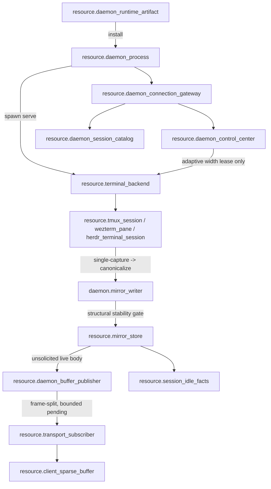
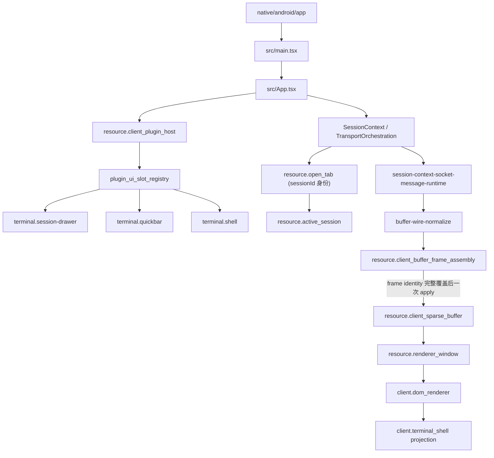
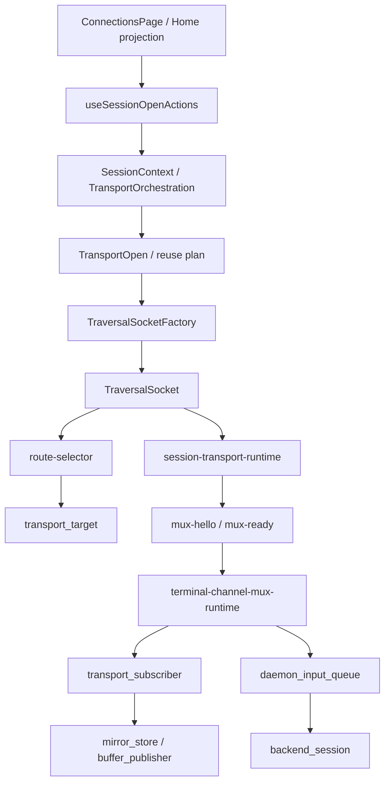

# zterm / Collab DAG 行为审计与修复报告 2026-09-21

范围：daemon 行为、客户端 UI 行为、连接行为三条 DAG；以及上游 AppSDK/Collab
buglist 中 open P0/P1。本报告只读描述 zterm 侧；对 AppSDK/Collab 只做
一个有独立 review 的最小修复。未修改、创建、关闭或重命名任何 tmux session。

## 0. 事实基线（本轮实测）

| 项 | 实测值 |
|---|---|
| zterm `main` / `origin/main` | `9250e47f1c8300cd70c91843aa0a07c9c3a50297`（一致） |
| AppSDK `main` / `origin/main` | `e5bf25a71337ff44d74215541cdaa008d34afde0`（一致，已 push） |
| 本轮候选 | `8a450478c26d5a46009a6cdafd20992cb899e095` |
| 本轮 merge | `e5bf25a`（`--no-ff`，父 `a39cd98` + `8a45047`） |
| review | `review-up-readiness-window-20260921-r1`，controller `pass`，`controller_no_blocking_findings`，findings 空 |
| 安装产物 | `collab 0.2.0089`，sha256 `4f8c1924bd50612f933fd56ebb8944b5a81ad6748a713a1e93e4a33dc29bf066` |
| daemon | PID `61552`，`/Users/fanzhang/.collab/server.sock`，由官方 `collab down` / `collab up` 受控重启 |

## 1. Daemon 行为 DAG



闭合：`mirror_writer -> mirror_store -> buffer_publisher -> subscriber` 是唯一
unsolicited live body 路径；`gateway -> control_center -> backend` 是唯一控制路径；
daemon 无客户端心智（不含 active tab / foreground / viewport / client session）。

未闭合（本轮实测）：

- `resource.remote_window_quality_control`、`remote_window_input_delivery_client`、
  `remote_window_input_delivery_daemon`、`remote_window_frame_projection`、
  `remote_window_capture_backpressure`、`remote_window_canvas_raw`、
  `remote_window_canvas_encode` 仍是 design-only / binding pending，不得当作
  已激活运行时边。
- L2 daemon/tmux 真回环（`pnpm --dir android run daemon:mirror:close-loop`）本轮未跑，
  因为该门禁会驱动 tmux；按用户约束不执行。daemon 的 mirror 真源因此保持
  `UNVERIFIED`，不能宣称 daemon 侧完整闭环。
- 已安装 daemon runtime 与 `main` 的对应关系已确认（0.2.0089 来自本轮 main 构建），
  但 mirror 行为未做 live replay。

## 2. 客户端 UI 行为 DAG



闭合：open-tab / active-session / sparse buffer / renderer window / DOM 投影各自
单一 owner；frame assembly 是必需 per-session resource，不是 optional。

未闭合：

- `resource.client_manual_route_policy` 仍为 design-only。
- L4/L5（打包 APK、真机、OTA）本轮未验证，因此 UI shell 与设备入口保持
  `UNVERIFIED`；UI 侧只能声称源码/registry 层一致。
- 现有旧审计文件 `2026-09-20-dag-buglist-audit.md` 记录过未解决的 merge 冲突状态，
  本轮 zterm worktree 已无该冲突，但该文件仍是 untracked 历史记录，未清理。

## 3. 连接行为 DAG



闭合：open intent -> target resolver -> socket/route -> mux target transport ->
channel 在 mainline 与 edge registry 中声明；`transport closed` 只作为
transport fact，不被 App 直接映射成 open-tab 物理关闭。

未闭合：

- 本轮未跑 L3（Mac/Android transport gate）与 L4/L5，Relay / Tailscale / 直连
  / WebRTC data channel 均无 live 证据。
- daemon 侧新增回归：重启后已注册 route 不能自动恢复（见第 5 节），这条边会
  直接影响 client reconnect 语义，属于连接 DAG 的断边。

## 4. 上游 buglist 现状

`appsdk bug list --upstream --json`（2026-09-21 实测）：

| 指标 | 数量 |
|---|---|
| open（全部） | 35 |
| open 且 label 含 P0 | 11 |
| open 且 label 含 P1 | 13 |
| open P0/P1（含标题标注，去重后） | 25 |
| closed | 123 |

补充事实：`508510a` 标题是 `[P0 Collab Bug]`，但 label 只有
`classification:bug`，按 label 过滤会漏掉，必须按标题一并纳入。

## 5. 本轮修复

### `up-readiness`（新发现，未单独立 bug）

现象：`collab up` 返回 `DAEMON_STARTING: daemon did not become reachable while
its lock remained held` 且 exit 1，但数秒后 daemon 实际已监听并服务。

根因：`collab/src/client.rs::wait_for_server` 使用固定 4 秒窗口；本机冷启动实测
需要约 8–23 秒才接受 typed Ping。最终报错点不是 daemon 启动失败，而是 readiness
窗口先超时；而 `collab up` 是 route 恢复链的第一步，这个假阴性会把用户导向
“误以为 daemon 没起来”的错误处置。

- 候选：`8a45047`（只改 `wait_for_server` 的 deadline 与新增延迟就绪回归）
- 红测：`ensure_server_waits_for_readiness_past_the_previous_deadline` 在
  `a39cd98` 上以 `DAEMON_UNAVAILABLE ... after launch` 失败，4.02s 放弃
- 绿测：`client::` 66 passed / 1 ignored；全 `--bin collab` 656 passed / 1 ignored；
  `cargo fmt --all -- --check` PASS；`git diff --check` PASS
- review：`review-up-readiness-window-20260921-r1` PASS
- merge：`e5bf25a`，已 push 到 `origin/main`
- 安装/重启：`collab 0.2.0089` 安装，受控 `collab down` + `collab up` 一次成功
  `{"ok":true,"started":true}`，耗时 23.4s

## 6. 仍未闭合（不得宣称完成）

- 重启后 route 恢复：官方 down/up 后 `collab route resolve` 对自己线程持续
  `ROUTE_RESOLVE_NOT_FOUND`，等待 30s 未恢复（需再次 `collab init` 才恢复）。
  这说明 `a6438fd` / `508510a` 所述恢复链仍不完整，两条 bug 保持 open。
- `5192b5c` / `a7e52bc`：只在本机有单 peer，无第二个真实 App Server peer，
  peer-to-peer live closure 无法诚实复现。
- zterm 侧 L2/L3/L4/L5 与真机/OTA 全未验证。

## 7. Open P0/P1 处置矩阵

判定只承认已取得的证据层级：源码 PASS / 测试 PASS / review PASS / merge / 安装 /
live runtime / 设备验收，互不替代。

| bug | 优先级 | 处置 | 依据 / 缺口 |
|---|---|---|---|
| `9c04205` | P1 | **已关闭** | main 已实现 accepted→rework→…→delivered；专项测试 1 passed；缺 live 多 peer 重放 |
| `a6438fd` | P0 | **保持 open** | 本轮实测：重启后 route 30s 未自动恢复，恢复链仍断 |
| `508510a` | P0（仅标题标 P0） | **保持 open** | 同上；`a39cd98` 未覆盖已含 strict route 的 journal 场景 |
| `5192b5c` | P0 | 保持 open | 需第二个真实 App Server peer 做 peer-to-peer live closure；本机单 peer |
| `a7e52bc` | P1 | 保持 open | 同上；r17 记录的 `message_project_scope` 绑定问题未复现验证 |
| `27ddb7b` | P0 | 保持 open | 需未注册 project scope 的 daemon 路由准入决策；未擅自改语义 |
| `0077a16` | P0 | 保持 open | offline 边沿生产方缺失，需先定 owner（探测/presence/keepalive） |
| `c2e818a` | P0 | 保持 open | 需 master idle / long-horizon 调度 live 重放，本机无 live master |
| `238c3df` | P0 | 保持 open | 需 15m/60m + user-stop guard 的 live 调度证据 |
| `c5eb401` | P0 | 保持 open | 调度器饱和策略需 live master 场景 |
| `788e657` | P0 | 外部 owner | OneStop verifier 生成的 coverage metric；AppSDK 无该 producer |
| `bea650e` / `ead2041` | P0 | 外部 owner | GCM provider endpoint / subagent probe；属 RouteCodex/GCM |
| `38e03bc` / `4d75a7d` | P0/P1 | 外部 owner | RouteCodex V3/V4 审计锁与 live admission |
| `177293a` | P1 | 外部 owner | HumanAgent subagent close 的 App Server archive 跨设备问题 |
| `59b0553` / `3bffc10` | P1 | 外部 owner | OneStop `verify-appsdk-governance.mjs` 与 gitignored `.appsdk/sdk.bin` 冲突 |
| `8d2a27a` / `919f8f0` | P1 | 需授权 | 涉及 identity rebind 契约，不得擅自重置身份 |
| `4127e73` | P1 | 需设计决策 | native 路径是否回流 daemon reducer |
| `4911fed` | P1 | 需设计决策 | task/feature DAG 机器可验证闭包注册表 |
| `ca5eaed` | P1 | 需设计决策 | migration receipt 不可变 prefix / commit fence |
| `fc04d0b` | P1 | 需设计决策 | preflight handoff target 未注册的语义 |
| `db35c60` | P1 | 保持 open | 需 live orphan task closure receipt |

## 8. Goal 提示词

```text
/goal
目标：把 AppSDK/上游 buglist 中仍 open 的无人管理 P0/P1 收敛到明确的
「已修复并验证」或「有 owner 的阻塞」，优先处理阻断 Collab live 通信与
daemon 恢复链的项目。
范围与约束：只改 AppSDK `collab/` 与 `rust/` 真源；不动 tmux session，不做
进程级广杀，不修改他人 worktree/dirty 状态；每个候选必须从最新 origin/main
建独立 worktree，先红测再修，review PASS 后 merge，再重建安装并做受控
daemon 重启与 live replay。
依据：android/docs/audits/2026-09-21-dag-behavior-audit-and-repair.md 的
DAG 与处置矩阵。
验收：每条 bug 给出候选 SHA、测试命令与结果、review 任务与 controller 裁决、
merge SHA、安装版本与哈希、live replay 实际输出；无法诚实复现的写明冻结层
与所需外部依赖，不得用源码或测试证据冒充 live 验收。
直接执行本任务，不再为它生成一层提示词。
```
