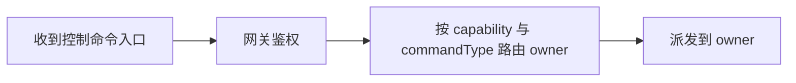
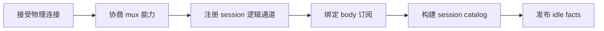
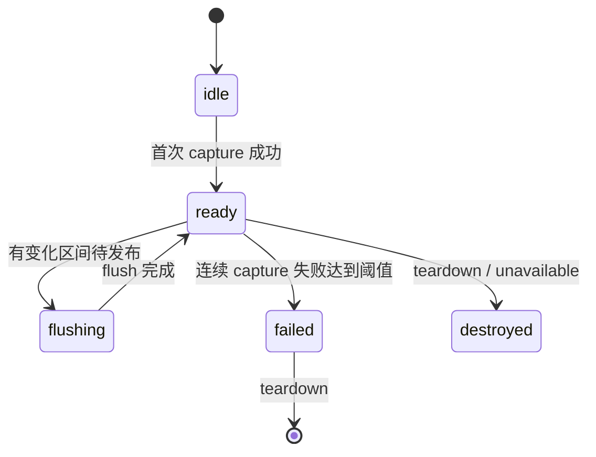

# daemon DAGpipe 标准审计（2026-09-25）

状态：只读审计落盘，等待 master 裁决；未包含代码修改、构建、安装、重启或发布结论。

## 审计目标与证据基准

- 目标：对 daemon 相关 DAGpipe 逻辑按 DAGpipe 标准重新审计，区分已接入、未改造、残留、需要消融的部分，并提交给 master 裁决。
- 证据基准：`origin/main` / `HEAD = 3951bf42ce931cd8674ed44add481c8878769a0f`。
- 工作树：审计使用 `git show HEAD:...` 和 `git grep HEAD` 等只读路径。本文件是本轮新增的 untracked 审计文档；未修改任何 tracked 文件，也未触碰 main root 中既有的 dirty DAGpipe 改动。
- 安装态：`~/.zterm/releases/zterm-daemon/0.1.3/runtime/server.cjs sha256=14c64b7e0e7b0e46f041215aa3b9a8e0402e5e7506edd5f61abc0aff31ca3300`，`dagpipe.node sha256=597ae9124be15ec07b9d80057e9cb4d33325c9666a403bc40dc9c3bf179f93a6`。
- 运行态（快照证据，非业务闭环）：`launchctl list` 显示 `com.zterm.android.zterm-daemon`（pid 85782）；`curl http://127.0.0.1:3333/health`（2026-09-26T02:10Z）返回 `{"ok": true, "pid": 85792, ...}`。这是当时刻的 health 快照，不证明业务闭环，也不证明进程当前仍存活。

## 角色与身份

- Collab 角色：普通 peer / worker。
- master：`codex-0119b256-17f8-7ccc-a010-f5c9fd527b64`，endpoint live。
- 审计角色：只读分析，不拥有调度、merge、发布或生产变更权限。
- DAGpipe 标准要求：语义节点必须表达业务语义，不能直接用函数名/文件名充当 DAG 节点。

## 总体结论

daemon 运行时已经真实加载并调用 `dagpipe.node`，启动时会执行 `compileAllDagpipePhases()`，并已调用 phase0/2/3/4 中的部分 operator。但是：

1. 多数 daemon DAGpipe 调用目前是 `gate / parity` 门禁，不是完整 graph 执行闭环。
2. 部分 graph 仅编译，未进入 daemon 生产调用链。
3. 多处 TS owner 与 Rust operator 语义重叠，尚未消融。
4. root 工作树存在未提交 DAGpipe 删除批次，需要 master 判定是否属于有意消融。

## 语义 DAG 与当前接线

### daemon.mirror_publish

语义 DAG（设计/静态 graph）：


实际接线：

- 生产入口：`android/src/server/server.ts:353` 调用 `mirrorPublishChangedRanges` -> `runMirrorPublish`。
- 实际消费：bridge 从 `arc.wire_frames` 提取 `ranges` 后，TS `terminal-mirror-runtime.ts` / `daemon-buffer-publisher-runtime.ts` 仍负责 mirror truth、pending bounds、head/body wire 发送。
- 旧 TS diff：`canonical-buffer.ts#findChangedIndexedRanges` 不再被生产 server 引用；只剩 tests/docs 和 `daemon-service-script.test.ts` 的否定断言。

结论：Rust graph 被执行，但只作为“变更区间决策”，不是 daemon mirror publish 的完整 owner。

### daemon.control_dispatch

语义 DAG（设计/静态 graph）：



实际接线：

- 生产入口：`android/src/server/server.ts:194` 调用 `runControlDispatch`。
- 实际消费：`daemon-control-gateway-runtime.ts` 用返回 `ownerId` 做 route owner mismatch 校验，但真实 capability 校验、audit、deadline、owner 执行仍在 TS `DaemonControlCenter`。
- Rust control graph 的 `authenticate_ingress` 只检查必填字段并置 `authenticated=true`。

结论：Rust 参与路由，但控制面鉴权/审计/执行没有迁到 Rust。

### daemon.connection_channel_catalog

语义 DAG（设计/静态 graph）：



实际接线：

- 生产入口：`android/src/server/daemon-session-catalog-runtime.ts:258` 调用 `runPhase2DaemonConnection`。
- 实际消费：仅作为 boolean gate；graph 的 `arc.session_catalog` / `arc.idle_facts` 输出未使用。
- 真实 catalog / idle facts 仍由 `buildSessionsCatalogPayload` 和 `publishSessionActivitiesRuntime` 生成。

结论：graph 已编译并被执行，但 daemon 没有消费其业务输出；operator 只是投影门禁。

### daemon.input_schedule

语义 DAG（设计/静态 graph）：


实际接线：

- 生产入口：`android/src/server/daemon-input-queue-runtime.ts:249` 调用 `runPhase3InputSchedule`。
- 实际消费：输入参数 `allowWrite=true`、`allowSchedule=false`、`jobs=[]`；输出未使用。
- 真实 queue/ack/write/schedule 仍由 TS `daemon-input-queue-runtime.ts` / `terminal-message-control-runtime.ts` 处理。

结论：graph 被执行，但只作为“允许写/禁用 schedule”的 rubber-stamp parity gate。

### daemon.file_transfer_* 与 daemon.attachment_delivery

语义 DAG（设计/静态 graph）：


实际接线：

- Rust / bridge 存在：`server/dagpipe-bridge.ts` 导出 `runPhase3FileBrowse`、`runPhase3Upload`、`runPhase3Download`、`runPhase3Attachment`。
- 生产 caller：daemon server 没有调用这些函数；安装态 `server.cjs` 中这些符号出现次数为 0。
- 实际 owner：`terminal-file-transfer-runtime.ts`、`terminal-file-transfer-list-runtime.ts`、`terminal-file-transfer-binary-runtime.ts`、`attachment-delivery-runtime.ts`。

结论：file transfer / attachment 的 daemon 生产路径完全没有 DAGpipe；graph、Rust operator、server bridge wrapper 目前是死重量。

### terminal.remote_screenshot

语义 DAG（设计/静态 graph）：


实际接线：

- 生产入口：`android/src/server/remote-screenshot-daemon.ts:22` 调用 `runPhase3Screenshot`，参数 `allowScreenshot=true`。
- 实际消费：输出未使用；真实捕获仍由 TS `captureRemoteScreenshotWithDaemon` 调用 native `zterm-daemon capture-screen`。

结论：截图 graph 只做了允许截图校验，capture/store 没有进入 DAGpipe。

### remote.window_stream_overlay

语义 DAG（设计/静态 graph）：


实际接线：

- 生产入口：`android/src/server/remote-window-stream-daemon.ts:676` 调用 `runPhase4RemoteWindow`，参数 `allowStream=true`、`allowQuality=true`、`allowInput=true`。
- 实际消费：输出未使用；真实 catalog/quality/capture/encode/send/input 仍在 TS `remote-window-stream-daemon.ts` 及其相关 runtime。

结论：remote window 的 13 个语义节点没有完整执行；只有启动流的 parity gate。

## 状态机

### mirror lifecycle



### subscriber publish

```mermaid
stateDiagram-v2
  [*] --> no-pending
  no-pending --> pending-diff: 收到变化区间
  pending-diff --> flushing: 进入 flush
  flushing --> no-pending: 发布完成
  pending-diff --> backpressured: transport high-water
  backpressured --> no-pending: low-water drained
  pending-diff --> resync-required: range/span/age 超阈值
```

### control

```mermaid
stateDiagram-v2
  [*] --> ingress
  ingress --> authorized: 网关鉴权
  authorized --> routed: control center 路由 owner
  routed --> owner-executing: dispatch owner
  owner-executing --> completed: owner 返回成功
  owner-executing --> failed: deadline/owner error
```

当前状态：状态机主要由 TS owner 维护；Rust 只在部分入口参与校验/路由。

## 节点映射与 owner

| 语义图 | Rust operator | 生产调用点 | 输出是否被消费 | 真实 owner |
|---|---|---|---|---|
| daemon.mirror_publish | `runMirrorPublish` | `server.ts:353` | 只消费 ranges | TS mirror/publisher + Rust range decision |
| daemon.control_dispatch | `runControlDispatch` | `server.ts:194` | 消费 ownerId | TS control center 真实执行 |
| daemon.connection_channel_catalog | `runPhase2DaemonConnection` | `daemon-session-catalog-runtime.ts:258` | 否 | TS session catalog/idle |
| daemon.input_schedule | `runPhase3InputSchedule` | `daemon-input-queue-runtime.ts:249` | 否 | TS input queue/schedule |
| daemon.file_transfer_browse | `runPhase3FileBrowse` | 无 daemon caller | 否 | TS file transfer list |
| daemon.file_transfer_upload | `runPhase3Upload` | 无 daemon caller | 否 | TS file transfer binary |
| daemon.file_transfer_download | `runPhase3Download` | 无 daemon caller | 否 | TS file transfer list/binary |
| daemon.attachment_delivery | `runPhase3Attachment` | 无 daemon caller | 否 | TS attachment delivery |
| terminal.remote_screenshot | `runPhase3Screenshot` | `remote-screenshot-daemon.ts:22` | 否 | TS/native capture |
| remote.window_stream_overlay | `runPhase4RemoteWindow` | `remote-window-stream-daemon.ts:676` | 否 | TS stream pipeline |

## 未改造部分

1. daemon file transfer：browse/upload/download 全部未进入 DAGpipe daemon runtime。
2. daemon attachment delivery：未进入 DAGpipe daemon runtime。
3. daemon connection/channel/mux/catalog：graph 语义未成为生产 truth owner。
4. daemon input schedule：真实 queue/ack/write/schedule 仍在 TS。
5. daemon remote window stream：catalog/quality/capture/encode/send/input 仍在 TS。
6. daemon control：鉴权/audit/deadline/owner execution 仍在 TS。
7. daemon mirror publish：commit/store/publish plan/emit 仍在 TS。

## 残留部分

1. `canonical-buffer.ts#findChangedIndexedRanges`：不再是生产路径，但保留为 parity/test source；`daemon-service-script.test.ts` 甚至断言 server production source（`src/server/server.ts`）不应再包含它。
2. `daemon-buffer-publisher-runtime.ts`：仍是生产 owner，与 Rust `BufferPublisherPlan / BufferPublisherEmit` 语义重叠。
3. `daemon-control-center-runtime.ts`：仍是生产 owner，与 Rust `ControlGatewayAuthenticate / ControlCenterRoute / ControlOwnerDispatch` 重叠。
4. `daemon-input-queue-runtime.ts` / schedule engine：与 Rust `DaemonInputQueue* / TerminalSchedule*` 重叠。
5. `terminal-file-transfer-*`、`attachment-delivery-runtime.ts`：与 Rust file-transfer/attachment operator 语义重叠，但后者没有 daemon 接线。
6. `remote-window-stream-daemon.ts` / screenshot TS：与 Rust phase3/phase4 graph 重叠，graph 目前只是 gate。

## 消融候选

以下候选需要 master 按目标架构裁决，不能由本次只读审计直接执行：

- 若目标是“Rust 作为唯一 truth owner”，需要先补真实接线，再物理删除 TS 重复 owner。
- 若目标是“Rust 只做 admission gate”，需要把 bridge/graph 的命名与文档改成 gate-only，不再宣称完整迁移。
- `server/dagpipe-bridge.ts` 中 `compilePhase0`、`runPhase3FileBrowse/Upload/Download/Attachment` 当前无 daemon caller，可作为 dead export 删除，除非客户端另有契约。
- daemon file-transfer/attachment graph 和 Rust operator 如果短期不接线，可先保留编译门禁，也可在审批后删除，避免死重量。
- `canonical-buffer.ts#findChangedIndexedRanges` 可作为 parity/test oracle 保留；若 bridge 测试足够稳定，可改为测试内 fixture，不再作为生产模块导出。

## root 工作树残留

`git status --short --untracked-files=no` 显示 root 存在一批未提交 DAGpipe 删除/修改，包括但不限于：

- `android/native/dagpipe/*`
- `android/native/android/app/src/main/java/com/zterm/android/DagpipeCore*.java`
- `android/src/server/dagpipe-bridge.ts`、`android/src/lib/dagpipe-bridge.ts`、`android/src/lib/dagpipe-*`
- `android/docs/dagpipe/*.graph.json` 等大量文件

这些路径的 tracked 版本仍存在于 `3951bf42` main（`HEAD`）中；dirty 记录是未提交的删除/修改，本身不属于 main 已提交内容。root 状态为 staged + working 混合（`git status --porcelain=v1 --untracked-files=no` 约 133 条），本次审计未 touch 这些 dirty 记录；需要 master 判定是有意 pending ablation，还是误留变更。

## 提交给 master 的裁决请求

1. 明确每个 daemon graph 的目标：完整 Rust ownership，还是 admission-gate-only。
2. 是否按完整 ownership 方向补接线，并消融 TS 重复 owner。
3. file-transfer / attachment：补 Rust 接线，还是删除 dead graph/wrapper。
4. root dirty DAGpipe 删除批次：如何处置。
5. 对 `canonical-buffer.ts#findChangedIndexedRanges` 和 `daemon-buffer-publisher-runtime.ts` 等残留做保留/删除裁决。

## 审计边界

- 本文件是只读分析落盘，不是 merge/push/review PASS。
- 本文件不包含 APK/OTA/设备/安装/重启结论。
- 后续执行任何代码消融或接线变更，都必须按项目 L1/L2 在独立 worktree 中完成，并补齐适用 gate、review、merge。
