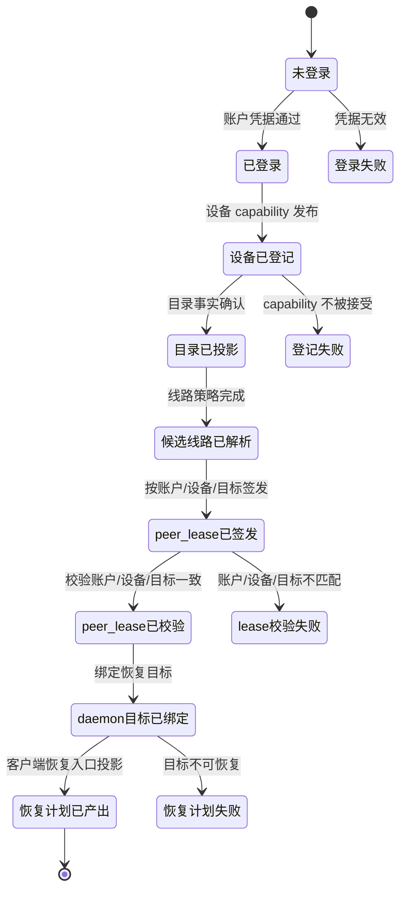
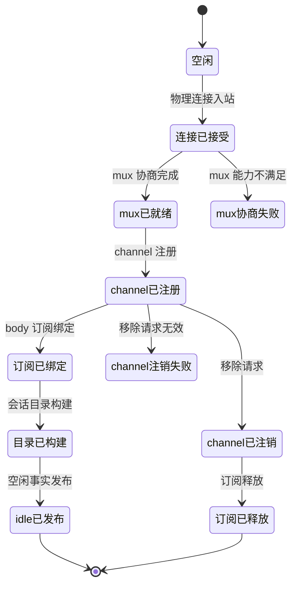

# zterm DAGpipe Phase2 静态管理面：Relay 账户/线路 + daemon 连接通道/会话目录

状态：静态管理面设计切片。未接 runtime，未新增 Rust crate，未重建/安装/OTA。
本文只描述两张 DAGpipe graph 的业务语义、owner、状态机与边界，不包含函数签名或代码调用关系。

## 1. 身份与角色

| 身份 | 角色 | 允许职责 | 禁止控制 |
| --- | --- | --- | --- |
| Relay 账户 | 登录/注销与账户目录主体 | 维护账号级设备、daemon 端点与线路目录；签发/校验 peer lease | 持有终端正文、channel、tmux、active tab、viewport 或 UI truth |
| 客户端设备 | Relay 客户端与恢复主体 | 登记自身 capability、展示候选线路、在已绑定 daemon 目标上生成恢复计划 | 把 Relay 目录当作终端状态真源；绕过 peer lease 直接开 transport |
| daemon 网关 | daemon 物理连接入站 owner | 接受物理连接、协商 mux、维护 channel registry | 持有 logical client session、客户端 active/foreground/viewport/pane |
| daemon channel mux | channel 注册/注销 owner | 按 mux 会话登记/移除 channel，维护 channel registry | 让一个 channel 失败连坐同 target 的 sibling channel |
| daemon transport subscriber | 正文订阅绑定/释放 owner | 为 channel 绑定/释放 per-subscriber body 订阅 | 把 `bodySubscribed=false` 当物理连接释放，不触发 zero-subscriber 之外的动作 |
| daemon session catalog | 会话目录 owner | 按 backend-qualified truth 构建/发布 session 列表与 idle facts | 读取客户端 active/foreground/viewport 决定目录或关闭 |
| client connection home | 客户端恢复入口 owner | 把已绑定 daemon target 投影为客户端恢复计划 | 修改 daemon 状态、持有 channel/mirror/renderer truth |

## 2. 事件

### Relay 账户/线路图

| 事件 | 生产者 | 消费者 | 触发时机 | 状态效果 | payload 边界 |
| --- | --- | --- | --- | --- | --- |
| 账户凭据提交 | 客户端配置/登录表单 | Relay 账户登录节点 | 用户登录或 token 刷新 | 未登录 -> 已登录 | 只含凭据/会话事实，不含终端正文 |
| 设备 capability 登记 | 客户端设备 | 目录发布节点 | 登录成功或设备信息变化 | 已登录 -> 设备已登记 | 只含设备标识/capability/线路事实 |
| 目录事实投影 | Relay 账户目录 | 候选线路解析节点 | 目录确认或刷新 | 设备已登记 -> 目录已投影 | 只含端点/presence/控制事实 |
| 线路解析 | 目录投影 + 线路策略 | peer lease 签发节点 | 目标候选就绪 | 目录已投影 -> 候选线路已解析 | 只含目标候选和路由策略 |
| peer lease 签发/校验 | Relay peer lease | daemon target 绑定节点 | 候选线路就绪后 | 候选线路已解析 -> lease 已签发/校验 | 只含账户/设备/目标绑定事实 |
| daemon target 绑定 | 已校验 lease + 候选线路 | 客户端恢复入口节点 | 绑定可恢复目标后 | lease 已校验 -> 目标已绑定 | 只含 daemon 目标恢复事实 |
| 恢复计划产出 | 已绑定目标 + 设备 presence | 图汇出 | 客户端需要恢复时 | 目标已绑定 -> 恢复计划已产出 | 只含恢复计划，不含 transport/channel/UI truth |

### daemon 连接通道/会话目录图

| 事件 | 生产者 | 消费者 | 触发时机 | 状态效果 | payload 边界 |
| --- | --- | --- | --- | --- | --- |
| 物理连接入站 | daemon 网关 | mux 协商节点 | daemon 收到新连接 | 空闲 -> 连接已接受 | 只含物理连接/mux capability |
| mux 协商完成 | 网关协商节点 | channel 注册节点 | 物理连接接受后 | 连接已接受 -> mux 已就绪 | 只含 mux 会话事实 |
| channel 注册 | mux 就绪事实 | subscriber 绑定节点、catalog 构建节点 | 新 session channel 打开 | mux 已就绪 -> channel 已注册 | 只含 channel 标识与目标事实 |
| body 订阅绑定 | channel registry | session catalog 构建节点 | channel 注册后 | channel 已注册 -> 订阅已绑定 | 只含 per-subscriber body 资格 |
| session catalog 构建 | channel registry + body 订阅 + catalog 请求 | idle facts 发布节点 | 列表查询或成员变化后 | 订阅已绑定 -> 目录已构建 | 只含 backend-qualified session 行 |
| idle facts 发布 | 目录构建结果 + idle 请求 | 图汇出 | 列表或 idle 检测后 | 目录已构建 -> idle 已发布 | 只含 idle/列表事实 |
| channel 移除请求 | 业务关闭/目标释放 | channel 注销节点 | 用户/目标明确关闭 channel | 任意已注册态 -> channel 已注销 | 只含 channel 标识与移除原因 |
| body 订阅释放 | channel 注销结果 | 图汇出 | channel 注销后 | channel 已注销 -> 订阅已释放 | 只含订阅释放回执 |

## 3. 状态机

### Relay 账户/线路状态机

终态：`恢复计划已产出`、`登录失败`、`登记失败`、`lease校验失败`、`恢复计划失败`。

非法转移：
- 未登录直接签发/校验 lease。
- 未校验 lease 直接绑定 daemon target。
- 已绑定目标跳过恢复计划产出直接进入 transport/session。
- 任何节点把 Relay 当作终端正文、channel、tmux、active tab 或 UI 真源。

### daemon 连接通道/会话目录状态机

终态：`idle已发布`、`订阅已释放`、`mux协商失败`、`channel注销失败`。

非法转移：
- 未接受物理连接直接注册 channel。
- channel 未注销就跳过订阅释放。
- session catalog 读取客户端 active/foreground/viewport 决定关闭。
- channel 关闭触发 `tmux kill-session`。
- 最后一个 subscriber 消失时销毁 mirror/input/timer 之外的物理资源。
- daemon 持有 logical client session 或客户端身份真源。

## 4. DAG 与数据契约

### relay-account-peer-route.graph.json

- 入口：`arc.request`（唯一输入）。
- 出口：`arc.result`（唯一输出）。
- 节点/边按业务依赖串成单源单汇：
  - 账户登录 -> 设备登记 -> 目录投影 -> 候选线路解析 -> peer lease 签发/校验 -> daemon target 绑定 -> 恢复计划产出。
- ARC 数据只承载账户/设备/线路/lease/恢复计划事实，不承载正文、channel、tmux、UI 状态。
- 成功终点是恢复计划产出；失败终点是明确错误事实，不静默降级为可点击目标。

### daemon-connection-channel-catalog.graph.json

- 入口：`arc.request`（唯一输入）。
- 出口：`arc.result`（唯一输出）。
- 一个请求内描述同一个 daemon 连接通道/catalog 生命周期，建立与释放在同一图、同一执行内共同收敛：
  1. 物理连接接受 -> mux 协商 -> channel 注册。
  2. channel 注册同时流向 body 订阅绑定、session catalog 构建与 channel 注销。
  3. body 订阅绑定后构建 session catalog，再发布 idle facts。
  4. channel 注销完成后释放 body 订阅。
  5. `dagpipe.collect` 要求 `arc.session_catalog`、`arc.idle_facts` 与 `arc.subscriber_released` 三个输出同时到达；这不是独立 release 分支，而是同一次生命周期的收口。catalog-only 查询的 no-removal/失败语义由后续 phase2-runtime 任务按 graph 契约实现，不在本静态分支写 runtime。
  - 后续 phase2-runtime 任务必须遵守：`daemon.channel_mux.unregister` 只看 graph schema 声明的 `removedChannelId`，不接受 `channelId` fallback；不存在的 channel 不得宣称 `unregistered` 成功，必须走显式失败或 `noop`；`daemon.transport_subscriber.release` 只有在已确认 bound+unregister 状态下才释放，不得无条件返回 released。
- 建立与释放之间通过 channel registry 保持 SESE；任一失败路径都显式进入失败终点，不跨节点回边。
- session catalog 只由 daemon 侧 backend/channel/subscriber 事实构建，不依赖客户端活跃状态。

## 5. 变更边界

- 本次只允许新增/修改：
  - `android/docs/dagpipe/relay-account-peer-route.graph.json`
  - `android/docs/dagpipe/daemon-connection-channel-catalog.graph.json`
  - `android/docs/dagpipe/android-phase2-route-catalog-design.md`
  - 仅当 registry/function map 与 graph 不一致时才同步对应条目。
- 本分支是静态管理面切片：只交付 graph JSON 与 design doc，不包含 runtime operator、Rust/TS 测试或注册表变更；channel 注销/订阅释放的 operator 与测试放入独立 phase2-runtime 任务。
- 禁止：触碰 native-rtc lane 文件、任何 runtime 代码、已有 graph 的无关修改、删除既有 graph/docs。
- 本分支不接 Rust core、不接 TypeScript runtime、不重建 APK/daemon，不 bump 版本、不 OTA；不 merge/push，不重启 daemon。

## 6. 单/多 session 语义

- 同一 daemon target 只维护一个物理 transport；session 是 mux 上的逻辑 channel。
- 多 session 共享同一物理 transport，各自拥有 channel registry、body 订阅和 catalog 行。
- 一个 channel 失败只注销该 channel 并释放其 body 订阅，不得连坐同一 target 的 sibling channel。
- daemon 不持有 active tab、foreground/background、viewport、pane 或客户端 session 身份；
  catalog 关闭/移除只由 backend-qualified channel/session 事实触发。
- Relay peer lease 按账户 + daemon 目标 + 具体客户端设备签发；另一台设备获得独立 lease，不替换他人。

## 7. 资源

参与本静态面的资源：

- `resource.relay_account_directory`
- `resource.relay_peer_lease`
- `resource.relay_control_connection`
- `resource.daemon_connection_gateway`
- `resource.daemon_channel_mux`
- `resource.transport_subscriber`
- `resource.daemon_session_catalog`
- `resource.session_idle_facts`

资源 owner 以 `android/docs/module-registry.json` 与 `android/docs/function-map.md` 为准；graph 不新增第二 owner。

## 8. 硬约束

- 无洞：channel 未完整注册不得绑定订阅；订阅未释放不得宣称 channel 关闭完成；catalog 缺行不得静默跳过。
- 无 fallback：失败不降级成另一条成功路径，不把 Relay 目录、日志或 snapshot 当控制真源。
- Relay 不是真源：Relay/peer lease 只承载线路/账户/目标恢复事实，不承载终端正文、channel、tmux、active tab、foreground、viewport 或 UI 状态。
- daemon 无客户端心智：daemon 只维护物理 transport、channel/subscriber/catalog/idle facts 与自身 tmux/mirror truth。
- 订阅边界：`bodySubscribed=false` 仍是物理连接；只有最后一个 subscriber 消失时，terminal runtime 才释放 daemon-owned mirror/input/timer 资源，且不得 `tmux kill-session`。
- 本文只证明静态管理面设计，不等同于 runtime 已接线或已运行。
