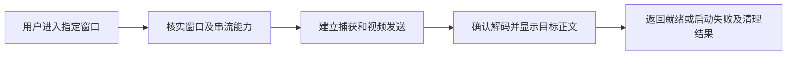
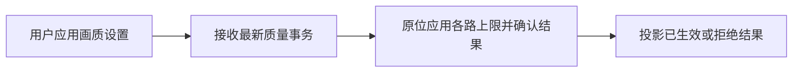
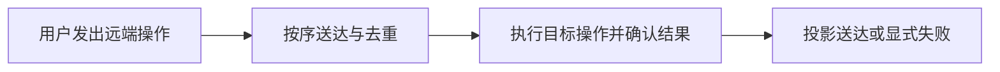
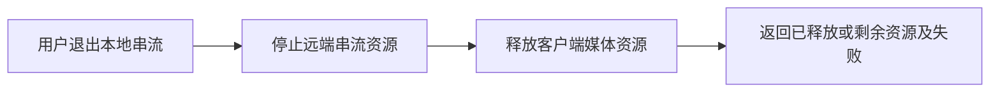
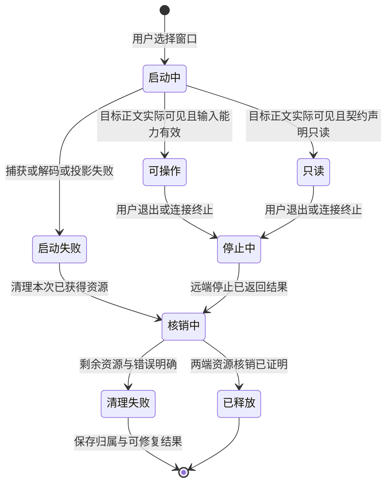

# 串流控制对象与验收设计

状态：D0-R2设计候选。独立D0审查已确认四图拓扑及U1 zoom/gesture/Back/passive-promotion设计准入；其余受影响scope按下方冻结契约再次审查。基线b18dcf91337ee6f42b421ec0601ba00fc4a18dd1。图的静态校验不证明Operator注册、SDK编译或真实功能接线。

目标：手机看清远端文字、缩放后仍能操作，Mbps/FPS独立控制，拥塞降载，进入与退出可验证。详细任务边界沿用已审remote-window-stream-execution-plan-2026-10-03.md；本文件只定义此前缺失的对象流与验收入口。

## 已有图的适用边界

`remote-window-stream-overlay.graph.json`是当前Phase4 ARC admission/parity模型。`native/dagpipe/src/phase4_core.rs`明确其Operators不拥有capture、transport或UI真相，README也声明生产调用是admission gate。其合成request/result不得用于证明一次实际请求同时完成目录、质量、视频与输入。

新增四张图分别记录真实串流启动、质量事务、输入送达与停止请求，复用同一docs/dagpipe治理目录，不引入第二注册表。它们是待接线设计，不修改旧admission consumer或伪造SDK编译。后续D0审查必须裁定原图的admission保留边界与这些控制对象的差异；若确认语义重复，由唯一Phase4 owner收敛，不保留重复生产流程。

每张图只有一个请求对象入口和一个结果对象出口。开始请求不等待未来质量/输入/停止事件；这些事件启动自己的执行。Retry使用新attempt，原delivery sequence在允许的同动作重试中保持稳定；图不回跳、不修改其他独立功能状态。

## 请求、状态与结果

请求/ACK/NACK、revision、stream/attempt/delivery身份与策略存于typed控制资源或声明的wire frame；视频帧与输入正文不承载这些控制事实。入口读取当前控制资源，不从日志、截图或旧payload重建业务状态。调试日志仅作只读证据。

- 启动：同一start request携带所选manifest身份与显式profile，唯一生命周期owner验证当前目录/路由与支持能力；daemon建立捕获及发送资源；接收/投影owner观测实际解码且可见的目标内容后返回ready。失败返回阶段与error chain，启动owner清理本attempt已获取的资源；清理失败返回cleanup_failed并保留资源归属。SDP应答不等于ready。
- 质量：request包含独立Mbps cap、FPS ceiling、偏好及revision。唯一quality owner保存desired/applied/inFlight/queuedLatest；daemon按lane应用原位事务并返回实际能力与ACK/NACK。pending不改applied；reject/unsupported保留最后ACK值。实时码率/FPS来自每lane可信stats，不能将上限或desired投影为actual。恢复与压力策略输入都是typed事实。
- 输入：action与delivery envelope物理分离。delivery owner分配稳定seq，当前保留有序单飞；daemon唯一注入owner按序去重并返回结果。连续move只保留最新，scroll累计增量；barrier先清前序连续动作，并阻隔后序相关动作。可靠key/click/release不因排队年龄被跳过，缺ACK用已有有界重试后显式失败。有限在途窗口不属于本轮第一修复，只有高RTT/目标副作用证据表明单飞仍是瓶颈时另行补设计及准入。
- 停止：本地exit intent只关闭本地投影；唯一生命周期owner继续持有stream/attempt身份直到停止结果。daemon停止该stream的capture/sender/input lease，回执实际结果；客户端释放peer/listeners与投影资源，最后生成released或明确failed/cleanup_failed。没有ACK时不能宣称released。远端窗口关闭是独立破坏性操作，有确认/取消和真实结果；不复用本地exit。

每个节点输出项目定义的结果union：ready/applied/delivered/released等成功态，或failed/cancelled/cleanup_failed，包含typed错误与剩余资源。失败结果向后传递，各owner仅核销自己已获取资源，禁止触发尚未准入的副作用；最终节点只有一个可观察结果。质量与输入局部结果字段按下方R2冻结；启动/stop资源lease和破坏性close的生产接线仍有单独准入依赖，不将这些未冻结scope混进已准入UI或native成本切片。

清理重试是新stop attempt，不修改旧结果或制造图回边。用户重新进入也是新start attempt；旧stream清理结果不可被UI unmount丢弃。

## 节点与唯一owner映射

| 对象/语义节点 | 设计Operator | 现有owner/允许改动边界 | 外部成功证据 |
| --- | --- | --- | --- |
| 启动准入 | client.remote_window_lifecycle.admit_start@0.1 | session-context-remote-window-runtime；parent单独分配 | 所选真实manifest及可用route，失败无capture泄漏 |
| 捕获/发送启动 | daemon.remote_window_stream.open_media@0.1 | remote-window-stream-daemon与canonical zterm-daemon | 实际capture身份及协商结果；错误显式 |
| 就绪收口 | client.remote_window_lifecycle.settle_start@0.1 | receiver/projection/lifecycle各自资源，唯一协调owner | 手机截图显示唯一探针正文及真实decoded/projection观测；失败清理结果 |
| 质量准入 | client.remote_window_quality_control.admit@0.1 | useRemoteWindowQuality，Q2唯一writer | 快速连续Apply最终revision与请求值可核对 |
| 质量应用 | daemon.remote_window_stream.apply_quality@0.1 | daemon媒体owner，串行交接 | ACK/NACK、实际sender cap、同一capture未重建 |
| 质量投影 | client.remote_window_quality_control.settle@0.1 | quality hook；UI只消费typed snapshot | reject不覆盖last applied；actual有可信stats |
| 输入调度 | client.remote_window_input_delivery.dispatch@0.1 | message runtime，I1 | 有序/稳定seq与barrier；增量不丢 |
| 注入/回执 | daemon.remote_window_stream.deliver_input@0.1 | daemon/native唯一input owner，I1 | 自有目标窗口实际文本/控件变化和ACK/NACK |
| 输入收口 | client.remote_window_input_delivery.settle@0.1 | delivery resource | 成功/失败可观察；cancel/up后host不保留按下 |
| 停止远端资源 | daemon.remote_window_stream.stop_resources@0.1 | stream lifecycle，parent单独分配 | 对应capture/sender/lease消失，非目标资源保留 |
| 释放客户端 | client.remote_window_lifecycle.release_local@0.1 | session/context/receiver/projection owner | peer/listeners解除；UI已离开仍可查停止失败 |
| 停止收口 | client.remote_window_lifecycle.settle_stop@0.1 | 唯一lifecycle owner | 再次进入无旧lease；remote文档仍存在 |

以上Operator均为设计绑定，未注册/编译/接线；不得冒充当前实现。新增生命周期/协议/consumer写入范围由parent在能力确认及独立设计PASS后逐一派单，不允许UI worker修改shared context/App/TerminalPage。

## UI与策略定稿条件

清晰文字/流畅操作只改变偏好；不覆盖用户Mbps/FPS。FPS档位15/30/60作为上限，默认继承旧值。Mbps有效范围须由当前encoder能力确认后冻结。设置为draft→Apply/Cancel事务，Back先关闭最内层并恢复焦点，再缩小fullscreen，再退出。embedded半屏继续是passive preview；提升路径必须可发现、易点击，不能为了输入测试绕过该契约。

缩放后点击/hold-drag与双指pinch/scroll互斥，cancel必须release。新zoom语义先追加到2026-08-30 amendment并标记替代条款，再修改touch/SOP/sample gate；不能用改测试迁就未定义实现。压力码率next<=min(userCap,lastAcknowledgedCap)，所有lane预算之和不越cap；多轨统计基线隔离且累计计数只差分一次，RTT使用实际selected candidate pair。

## R2质量及输入局部契约冻结

Q0r2只读冻结绑定基线b18dcf9，协议owner为`packages/shared/src/connection/protocol.ts`，质量profile/request/result保持现有versioned控制通道，不能新增并行协议。profile复用`preference`、`maxBitrateBps`、`maxFrameRateFps`、`maxCaptureWidth/Height`、`maxFrameAgeMs`、`interactionActive`、`overviewMaxBitrateBps/FrameRateFps`。request复用`requestId/streamId/streamGroupId/mediaPlan/mediaPlanVersion/revision/purpose?/targetId/videoProfile`；result复用相同identity、`status:applied|rejected`、`requestedVideoProfile`、可选`appliedVideoProfile/appliedGroupBudget/error{code,message}`。没有actual编码值字段，绝不把ACK配置当实际输出。

独立用户控件：`maxBitrateBps`为显式总cap，UI显示Mbps（协议校验0.5–25Mbps，不承诺全部encoder能力）；FPS为15/30/60上限且继承旧存储值。偏好只选择策略，不改已手动cap。旧倍数仅在读旧存储时按旧偏好解析一次为明确bps；新存储只保存用户偏好/caps，不保存applied真相。无手动值继续按现有默认解析，不能为改UI悄悄bump FPS。Apply一次提交三个draft值、一次quality intent并持久化desired；Cancel不发请求、不持久化。

Q2唯一writer仍为`useRemoteWindowQuality`及现有quality controller：desired/inFlight/queuedLatest继续复用，增加同owner的last-ACK profile/budget/revision记录。该记录绑定stream/group身份，只在对应applied ACK或带明确applied字段的start结果时更新；请求、pending、reject、unsupported不清空或覆盖它。stream身份改变/完成teardown时清空；未知初始应用值显示“尚未确认”，不能取desired补齐。UI只消费该snapshot，不维护第二applied缓存。actual由每lane可靠stats独立投影，无样本则不显示数字。

unsupported复用wire的rejected结果，以明确typed error code`remote_window_stream_quality_unsupported`区分；quality controller据该code产生typed unsupported投影。唯一quality apply owner在已验证缺sender方法/capture控制或已完成协商而无合法encoding等能力缺口处产生该code，不能从错误文案、任意InvalidStateError或OperationError推断。协商未完成用明确busy/pending，普通apply/rollback失败仍为原失败code。profile/revision/state不新增epoch大重构；8s UI与10s transport双timeout收敛到现有transport请求结果，由quality owner投影同一失败，不保留两个独立裁决。

Q2允许生产写入：`remote-window-video-quality.ts`、`remote-window-quality-controller.ts`、`useRemoteWindowQuality.ts`、`useRemoteWindowDisplayQualityControls.ts`、daemon `remote-window-quality.ts`及其quality调用点、必要shared typed错误常量；UI Controller/MorePanel在U1a交接后才另派writer。receiver stats由Q1单独owner，daemon同文件I1/Q2/P1保持串行。现有profile validator的服务器边界不因UI收窄改变；encoder拒绝必须显式，不作为静默成功。

输入第一修复I1a只针对已实测的同步聚焦成本：唯一native owner是`remote-window-input-script.ts`中的foreground查询/激活和`focusTargetWindow`；拟复用进程内AppKit API，物理移除同语义osascript分支。每action仍即时检查前台PID及目标WindowID，不缓存/防抖省略校验，不增加fallback，不改helper 3s或client 8s常数。作者在隔离候选做原方案→native方案→恢复原方案的真实目标A/B/A，确认前台/目标window切换、完整文字/Enter及匹配结果。证据当前只确认成本/队列风险，未证明全部focus失败根因；若native方案未解决，回首个偏离继续debug，不能宣称已修。

输入可靠年龄丢弃是独立违反现行契约的缺陷。I1b在现有delivery owner中取消可靠队列的continuous-age判定；连续move/scroll继续原stale/merge边界。结果使用client-local typed control resource，不冒充daemon ACK或伪造`receivedAtMs`：`RemoteWindowInputDeliveryOutcome{sequence,streamId,targetId,status:delivered|failed|cancelled,source:daemon-ack|client-timeout|client-teardown,execution:confirmed|not-dispatched|unconfirmed,error?}`。这是现有delivery对象的唯一settle结果，不是新的wire输入action；daemon ACK只作输入事实，稳定重试的duplicate ACK不产生第二结果/副作用。

`discardStreamInput`/transport teardown由同一client delivery owner逐条settle：queued未dispatch→cancelled/not-dispatched；in-flight等待被取消→cancelled/unconfirmed，不能声称OS动作回滚；已settle不二次取消。回执丢失超过现有retry bound→failed/unconfirmed。UI消费typed结果显示失败/取消，不只debug。stop请求向daemon发出后，其资源owner拒绝后续未执行业务，并对实际由该stream持有的down执行release；该daemon-held状态/lease准确字段及失败结果尚需另派生命周期设计，I1b client终态不替代daemon release。没有实际release证明不得报告stop完整成功。

I1a允许native脚本及其直接helper/测试和现有公开live-input probe；I1b允许message runtime及必要client-local control类型/订阅接线。TerminalPage/context生产文件由parent单独分配且不与U1a同写；先补public结果consumer及黑盒断言。I1a/b均禁止有限窗口、deadline通胀、跨target注入或第二媒体路径。现有daemon去重、ordered tail及capture主体继续复用。

R2局部黑盒：独立cap同值切换偏好保持上限；Cancel零wire/存储副作用，Apply经UI实际single-flight只一事务；quality reject/typed unsupported保留上一ACK及可见错误。输入用相同owned target/native IME字符串及Enter、真实OS marker/文本和matching结果验证完整且仅一次；A/B/A记录候选内容、canonical运行主体及实际焦点；高RTT在公开控制传输的外部有界delay proxy验证排队输入不被年龄丢弃，ACK丢失有显式failed/unconfirmed。代理必须转发真实消息而非mock backend，端口/进程归属并清理。媒体网络扰动仍属P1独立能力，不用控制代理冒充UDP视频丢包。

## 黑盒入口及未完成能力

真实业务用例：安装app→选择真实窗口→正文标记可见→独立设置Mbps/FPS→确认实际ACK及sender→放大操作与文字输入→取消草稿→逐层返回→本地退出→再次进入。失败用例：quality reject/unsupported、断线、ACK延迟/丢失、stop失败、远端关闭取消/确认/失败。只对自有测试窗口演练副作用。

公开consumer入口目前只确认项目声明的`pnpm --dir android run test:remote-window-webrtc-loopback`及`test:remote-window-ui`，覆盖边界需作者核实；不能凭名称判定上述场景完整。真实设备操作目前为有记录的ADB/UI动作，需固化可重复黑盒命令与外部断言。网络扰动/完整capture-to-projection测点及失败注入入口尚未确认：定稿和派单必须补齐实际命令，不能先创建mock成功consumer。

当前能力结果：B0已确认官方JDK/SDK/Gradle依赖及canonical capture permission preflight；C1与parent的真实Android入口已显示唯一TextEdit正文、进入fullscreen并打开native IME。parent发现连续文字末尾缺字，I0独占同一真实入口定位首次偏离；不能以旧half-sheet无输入或未drain的初读文本认定根因。15T已通过当前mDNS发现连接并确认OnePlus 15T型号；安装0.1.3.3191，模拟器0.1.3.3204，不等于同候选验收。

B1已交付外部视觉标记/CDP读回harness，仅语法与CRC算法通过。正式验收不使用midpoint marker age冒充capture-to-projection：需要同一帧的标记绘制早于capture、projection早于读回且时钟误差已覆盖，才可把`markerAgeUpperBoundP95Ms`作为更保守的上界证据。上界超标只表明该测量不能证明达标，不足以归因raw媒体链路；FPS/实际尺寸、多lane及物理屏幕截图仍分别取证。此替代证明方式须由D0独立review裁定，未经裁定不能放宽现行100/180ms门禁。若无法建立保守界，P1先补可信测点再决定媒体迁移，不为测点欠缺直接重写媒体路径。

## 黑盒执行合同与能力边界

所有用例记录候选SHA、installed APK buildNumber/digest、canonical daemon/runtime digest、目标/stream身份、原始结果及资源归属。读取源码是前置契约确认，不是用例通过。用例harness可在作者实现阶段补齐；编码前确认真实公开接口/目标副作用/工具可用，不要求尚未实现的新行为提前通过。

| 用例 | 真实入口及可重复命令 | 外部断言与必须补的harness |
| --- | --- | --- |
| 输入raw/mux与burst | 候选根目录：`ZTERM_REMOTE_WINDOW_PROBE_BURST=1 pnpm --dir android exec tsx scripts/remote-window-live-input-probe.ts`；之后串行加`ZTERM_REMOTE_WINDOW_PROBE_MUX=1` | Matching ACK与AppKit file-backed markers同时成立；稳定seq重试只一个副作用、cancel/up后无stuck button，stop后无输入tail。当前probe仍有历史release-time swipe，不可冒充move-phase gate；I1负责原位更新该公开consumer。 |
| 输入clock skew | 上述入口加`ZTERM_REMOTE_WINDOW_PROBE_CLIENT_CLOCK_OFFSET_MS=600000`，再跑`-600000` | 可靠文本/按钮不被跨端墙钟判stale；连续过期只用daemon-local receive age。 |
| 真机文字完整性 | 自有测试窗口进入fullscreen并打开键盘；`adb -s <本次设备序列号> shell input text <唯一ASCII串>`，再`keyevent 66` | host最终正文含完整字符串且仅一次；匹配每条ACK/显式NACK及失败投影，等待delivery终态而非首次文本读取。输入CJK/标点另走真实IME commit，不用ADB ASCII代表全部字符。I0确定可重复红例与最终drain依据。 |
| 页面触摸/缩放 | 候选`test:remote-window-ui`作为开发辅助；installed-phone真实ADB/touch与CDP公开wire、AppKit marker联证 | 1x/zoom tap、move-phase scroll、hold-drag、pair pan/pinch、five-second/cancel release，无terminal input泄漏。I1/U1原位补现有page consumer，unit/isolated overlay不等于真机通过。 |
| 质量原位应用 | 当前live-input consumer已发quality request/result；Q2在同一consumer补独立cap、快速Apply及失败边界 | ACK字段与实际sender/capture控制值匹配、capture PID/对象连续、拒绝保留最后applied。只看到请求/ACK或数字变更不能证明编码值。Q0冻结现有wire及真实输出缺口后派发。 |
| 视频保守界 | 对实际选中探针窗口，`node <measure目录>/stream-measure-consumer.mjs --devtools-port <本次forward端口> --lane focus --source canvas --duration-ms 10000 --sample-hz 60 --input-sha <候选SHA> --output-dir <本次证据目录>` | 0 rejected/negative samples；校准及上界可信；真实尺寸、distinct-frame FPS与profile要求分别通过。overview等lane分别取样并报告同时运行条件；没有marker或decoder即明确失败，非性能成功。 |
| 高RTT/限带宽/丢包 | 从真实stream公开控制/媒体边界施加有界扰动，当前未确认具体工具；P1任务先确认该能力再测试，不得操纵共享网络或伪造stats | 实际延迟/吞吐/丢包输入与输出证据一致；manual cap不越界，可靠输入有ordered/dedupe/显式failure，质量事务保持原位。缺少媒体扰动工具不授予媒体优化验收PASS。 |
| 本地退出及远端关闭 | installed-phone真实退出按钮/Back；只对本任务自有窗口从More确认远端close | 本地退出后host文档保留、该stream capture/sender/lease已释放、再次进入无旧资源。远端close取消无副作用，确认有真实关闭结果或明确失败；不能用退出按钮替代破坏性操作。 |

缺能力、未冻结受影响黑盒命令或缺独立设计PASS时禁止该下游产品代码。图文件与Operator绑定先完成设计审查；只有项目需要SDK运行这些对象流时才要求注册/compile，不能仅因设计图存在而新增第二生产执行框架。当前Phase4 ARC admission继续按其现行compile gate验证。独立review裁定这些图是生产设计图还是SDK执行图，并核实与现有图不重复。静态图合法只能报告static topology PASS。
