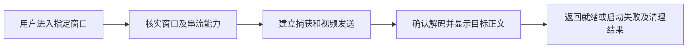
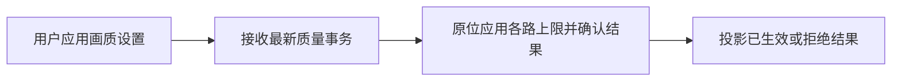
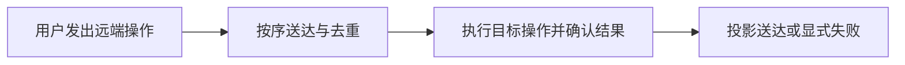
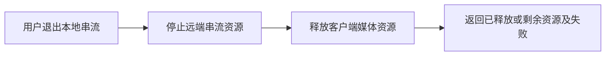
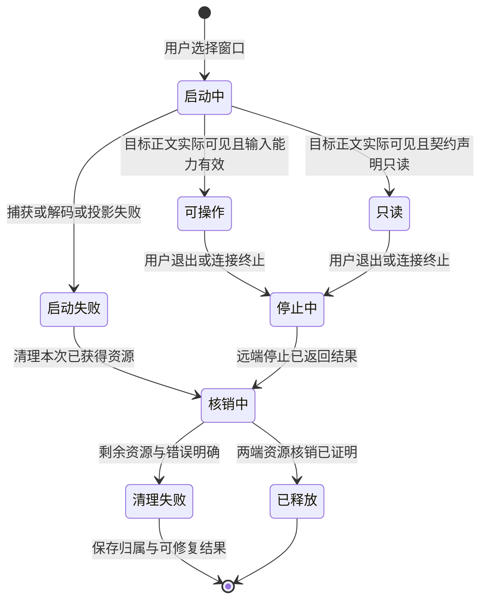
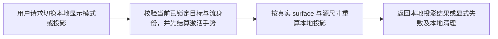
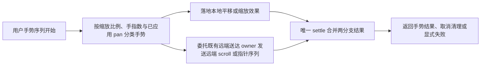
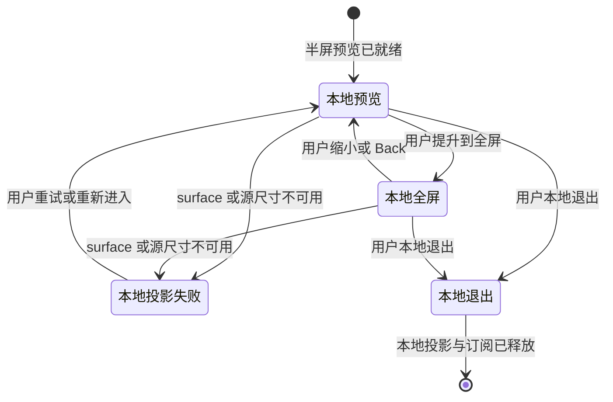
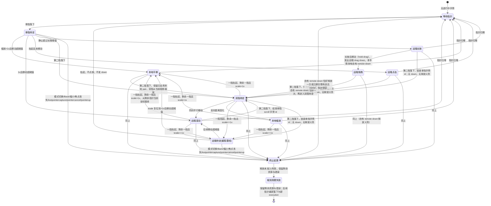
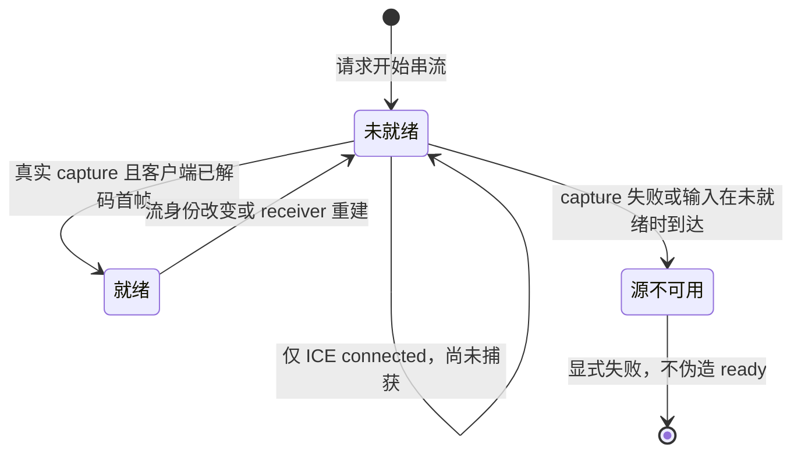

# 串流控制对象与验收设计

状态：D0-R2设计候选。独立D0审查已确认四图拓扑及U1 zoom/gesture/Back/passive-promotion设计准入；其余受影响scope按下方冻结契约再次审查。基线b18dcf91337ee6f42b421ec0601ba00fc4a18dd1。图的静态校验不证明Operator注册、SDK编译或真实功能接线。

目标：手机看清远端文字、缩放后仍能操作，Mbps/FPS独立控制，拥塞降载，进入与退出可验证。详细任务边界沿用已审remote-window-stream-execution-plan-2026-10-03.md；本文件只定义此前缺失的对象流与验收入口。

## 已有图的适用边界

`remote-window-stream-overlay.graph.json`是当前Phase4 ARC admission/parity模型。`native/dagpipe/src/phase4_core.rs`明确其Operators不拥有capture、transport或UI真相，README也声明生产调用是admission gate。其合成request/result不得用于证明一次实际请求同时完成目录、质量、视频与输入。

新增四张图分别记录真实串流启动、质量事务、输入送达与停止请求，复用同一docs/dagpipe治理目录，不引入第二注册表。它们是待接线设计，不修改旧admission consumer或伪造SDK编译。后续D0审查必须裁定原图的admission保留边界与这些控制对象的差异；若确认语义重复，由唯一Phase4 owner收敛，不保留重复生产流程。

每张图只有一个请求对象入口和一个结果对象出口。开始请求不等待未来质量/输入/停止事件；这些事件启动自己的执行。Retry使用新attempt，原delivery sequence在允许的同动作重试中保持稳定；图不回跳、不修改其他独立功能状态。

## 请求、状态与结果

请求/ACK/NACK、revision、stream/attempt/delivery身份与策略存于typed控制资源或声明的wire frame；视频帧与输入正文不承载这些控制事实。入口读取当前控制资源，不从日志、截图或旧payload重建业务状态。调试日志仅作只读证据。

- 启动：同一start request携带所选manifest身份与显式profile，唯一生命周期owner验证当前目录/路由与支持能力；daemon建立捕获及发送资源；接收/投影owner观测实际解码且可见的目标内容后返回ready。失败返回阶段与error chain，启动owner清理本attempt已获取的资源；清理失败返回cleanup_failed并保留资源归属。SDP应答不等于ready。
- 质量：request包含独立Mbps cap、FPS ceiling、偏好及revision。唯一quality owner保存desired/applied/inFlight/queuedLatest；daemon按lane应用原位事务并返回实际能力与ACK/NACK。pending不改applied；reject/unsupported保留最后ACK值。实时码率/FPS来自每lane可信stats，不能将上限或desired投影为actual。恢复与压力策略输入都是typed事实。
- 输入：action与delivery envelope物理分离。delivery owner分配稳定seq，当前保留有序单飞；daemon唯一注入owner按序去重并返回结果。连续move只保留最新，scroll累计增量；barrier先清前序连续动作，并阻隔后序相关动作。可靠key/click/release不因排队年龄被跳过，缺ACK用已有有界重试后显式失败。有限在途窗口不属于本轮第一修复，只有高RTT/目标副作用证据表明单飞仍是瓶颈时另行补设计及准入。
- 停止：本地exit intent只关闭本地投影；唯一生命周期owner继续持有stream/attempt身份直到停止结果。daemon停止该stream的capture/sender/input lease，回执实际结果；客户端释放peer/listeners与投影资源，最后生成released或明确failed/cleanup_failed。没有ACK时不能宣称released。远端窗口关闭是独立破坏性操作，有确认/取消和真实结果；不复用本地exit。

每个节点输出项目定义的结果union：ready/applied/delivered/released等成功态，或failed/cancelled/cleanup_failed，包含typed错误与剩余资源。失败结果向后传递，各owner仅核销自己已获取资源，禁止触发尚未准入的副作用；最终节点只有一个可观察结果。质量与输入局部结果字段按下方R2冻结；启动/stop资源lease和破坏性close的生产接线仍有单独准入依赖，不将这些未冻结scope混进已准入UI或native成本切片。

清理重试是新stop attempt，不修改旧结果或制造图回边。用户重新进入也是新start attempt；旧stream清理结果不可被UI unmount丢弃。

## 节点与唯一owner映射

| 对象/语义节点 | 设计Operator | 现有owner/允许改动边界 | 外部成功证据 |
| --- | --- | --- | --- |
| 启动准入 | client.remote_window_overlay.admit_start@0.1 | session-context-remote-window-runtime；parent单独分配 | 所选真实manifest及可用route，失败无capture泄漏 |
| 捕获/发送启动 | daemon.remote_window_stream.open_media@0.1 | remote-window-stream-daemon与canonical zterm-daemon | 实际capture身份及协商结果；错误显式 |
| 就绪收口 | client.remote_window_overlay.settle_start@0.1 | receiver/projection各自资源，overlay模块协调owner | 手机截图显示唯一探针正文及真实decoded/projection观测；失败清理结果 |
| 质量准入 | client.remote_window_quality_control.admit@0.1 | useRemoteWindowQuality，Q2唯一writer | 快速连续Apply最终revision与请求值可核对 |
| 质量应用 | daemon.remote_window_stream.apply_quality@0.1 | daemon媒体owner，串行交接 | ACK/NACK、实际sender cap、同一capture未重建 |
| 质量投影 | client.remote_window_quality_control.settle@0.1 | quality hook；UI只消费typed snapshot | reject不覆盖last applied；actual有可信stats |
| 输入调度 | client.remote_window_input_delivery.dispatch@0.1 | message runtime，I1 | 有序/稳定seq与barrier；增量不丢 |
| 注入/回执 | daemon.remote_window_stream.deliver_input@0.1 | daemon/native唯一input owner，I1 | 自有目标窗口实际文本/控件变化和ACK/NACK |
| 输入收口 | client.remote_window_input_delivery.settle@0.1 | delivery resource | 成功/失败可观察；cancel/up后host不保留按下 |
| 停止远端资源 | daemon.remote_window_stream.stop_resources@0.3 | stream lifecycle，parent单独分配 | 对应capture/sender/lease消失，非目标资源保留 |
| 释放客户端 | client.remote_window_overlay.release_local@0.3 | session/context/receiver/projection owner | peer/listeners解除；UI已离开仍可查停止失败 |
| 停止收口 | client.remote_window_overlay.settle_stop@0.3 | 既有overlay模块的message-runtime owner | 再次进入无旧lease；remote文档仍存在 |

以上Operator均为设计绑定，未注册/编译/接线；不得冒充当前实现。新增生命周期/协议/consumer写入范围由parent在能力确认及独立设计PASS后逐一派单，不允许UI worker修改shared context/App/TerminalPage。

## UI与策略定稿条件

清晰文字/流畅操作只改变偏好；不覆盖用户Mbps/FPS。FPS档位15/30/60作为上限，默认继承旧值。Mbps有效范围须由当前encoder能力确认后冻结。设置为draft→Apply/Cancel事务，Back先关闭最内层并恢复焦点，再缩小fullscreen，再退出。embedded半屏继续是passive preview；提升路径必须可发现、易点击，不能为了输入测试绕过该契约。

缩放后点击/hold-drag与双指pinch/scroll互斥，cancel必须release。新zoom语义先追加到2026-08-30 amendment并标记替代条款，再修改touch/SOP/sample gate；不能用改测试迁就未定义实现。压力码率next<=min(userCap,lastAcknowledgedCap)，所有lane预算之和不越cap；多轨统计基线隔离且累计计数只差分一次，RTT使用实际selected candidate pair。

## R2质量及输入局部契约冻结

Q0r2只读冻结绑定基线b18dcf9，协议owner为`packages/shared/src/connection/protocol.ts`，质量profile/request/result保持现有versioned控制通道，不能新增并行协议。profile复用`preference`、`maxBitrateBps`、`maxFrameRateFps`、`maxCaptureWidth/Height`、`maxFrameAgeMs`、`interactionActive`、`overviewMaxBitrateBps/FrameRateFps`。request复用`requestId/streamId/streamGroupId/mediaPlan/mediaPlanVersion/revision/purpose?/targetId/videoProfile`；result复用相同identity、`status:applied|rejected`、`requestedVideoProfile`、可选`appliedVideoProfile/appliedGroupBudget/error{code,message}`。没有actual编码值字段，绝不把ACK配置当实际输出。

独立用户控件：`maxBitrateBps`为显式总cap，UI显示Mbps（协议校验0.5–25Mbps，不承诺全部encoder能力）；FPS为15/30/60上限且继承旧存储值。偏好只选择策略，不改已手动cap。旧倍数仅在读旧存储时按旧偏好解析一次为明确bps；新存储只保存用户偏好/caps，不保存applied真相。无手动值继续按现有默认解析，不能为改UI悄悄bump FPS。Apply一次提交三个draft值、一次quality intent并持久化desired；Cancel不发请求、不持久化。

Q2唯一writer仍为`useRemoteWindowQuality`及现有quality controller：desired/inFlight/queuedLatest继续复用，增加同owner的last-ACK profile/budget/revision记录。该记录绑定stream/group身份，只在对应applied ACK或带明确applied字段的start结果时更新；请求、pending、reject、unsupported不清空或覆盖它。stream身份改变/完成teardown时清空；未知初始应用值显示“尚未确认”，不能取desired补齐。UI只消费该snapshot，不维护第二applied缓存。actual由每lane可靠stats独立投影，无样本则不显示数字。

unsupported复用wire的rejected结果，以明确typed error code`remote_window_stream_quality_unsupported`区分；quality controller据该code产生typed unsupported投影。唯一quality apply owner在已验证缺sender方法/capture控制或已完成协商而无合法encoding等能力缺口处产生该code，不能从错误文案、任意InvalidStateError或OperationError推断。协商未完成用明确busy/pending，普通apply/rollback失败仍为原失败code。profile/revision/state不新增epoch大重构；8s UI与10s transport双timeout收敛到现有transport请求结果，由quality owner投影同一失败，不保留两个独立裁决。

Q2允许生产写入：`remote-window-video-quality.ts`、`remote-window-quality-controller.ts`、`useRemoteWindowQuality.ts`、`useRemoteWindowDisplayQualityControls.ts`、daemon `remote-window-quality.ts`及其quality调用点、必要shared typed错误常量；UI Controller/MorePanel在U1a交接后才另派writer。receiver stats由Q1单独owner，daemon同文件I1/Q2/P1保持串行。现有profile validator的服务器边界不因UI收窄改变；encoder拒绝必须显式，不作为静默成功。

输入第一修复I1a只针对已实测的同步聚焦成本：唯一native owner是`remote-window-input-script.ts`中的foreground查询/激活和`focusTargetWindow`；拟复用进程内AppKit API，物理移除同语义osascript分支。每action仍即时检查前台PID及目标WindowID，不缓存/防抖省略校验，不增加fallback，不改helper 3s或client 8s常数。作者在隔离候选做原方案→native方案→恢复原方案的真实目标A/B/A，确认前台/目标window切换、完整文字/Enter及匹配结果。证据当前只确认成本/队列风险，未证明全部focus失败根因；若native方案未解决，回首个偏离继续debug，不能宣称已修。

输入可靠年龄丢弃是独立违反现行契约的缺陷。I1b在现有delivery owner中取消可靠队列的continuous-age判定；连续move/scroll继续原stale/merge边界。结果使用client-local typed control resource，不冒充daemon ACK或伪造`receivedAtMs`：`RemoteWindowInputDeliveryOutcome{sequence,streamId,targetId,status:delivered|failed|cancelled,source:daemon-ack|client-timeout|client-teardown,execution:confirmed|not-dispatched|unconfirmed,error?}`。这是现有delivery对象的唯一settle结果，不是新的wire输入action；daemon ACK只作输入事实，稳定重试的duplicate ACK不产生第二结果/副作用。

`discardStreamInput`/transport teardown由同一client delivery owner逐条settle：queued未dispatch→cancelled/not-dispatched；in-flight等待被取消→cancelled/unconfirmed，不能声称OS动作回滚；已settle不二次取消。回执丢失超过现有retry bound→failed/unconfirmed。UI消费typed结果显示失败/取消，不只debug。stop请求向daemon发出后，其资源owner拒绝后续未执行业务，并对实际由该stream持有的down执行release；该daemon-held状态/lease准确字段及失败结果尚需另派生命周期设计，I1b client终态不替代daemon release。没有实际release证明不得报告stop完整成功。

I1a允许native脚本及其直接helper/测试和现有公开live-input probe；I1b允许message runtime及必要client-local control类型/订阅接线。TerminalPage/context生产文件由parent单独分配且不与U1a同写；先补public结果consumer及黑盒断言。I1a/b均禁止有限窗口、deadline通胀、跨target注入或第二媒体路径。现有daemon去重、ordered tail及capture主体继续复用。

R2局部黑盒：独立cap同值切换偏好保持上限；Cancel零wire/存储副作用，Apply经UI实际single-flight只一事务；quality reject/typed unsupported保留上一ACK及可见错误。输入用相同owned target/native IME字符串及Enter、真实OS marker/文本和matching结果验证完整且仅一次；A/B/A记录候选内容、canonical运行主体及实际焦点；高RTT在公开控制传输的外部有界delay proxy验证排队输入不被年龄丢弃，ACK丢失有显式failed/unconfirmed。代理必须转发真实消息而非mock backend，端口/进程归属并清理。媒体网络扰动仍属P1独立能力，不用控制代理冒充UDP视频丢包。

### R3：I1b client-local结果接口与真实consumer冻结

本段仅补D0-R2的R2-B1；Q2与I1a已准入的语义、四图拓扑不变。I1b编码前仍需本段独立复核。

- 类型规范位置是`android/src/lib/remote-window-message-runtime.ts`导出的`RemoteWindowInputDeliveryOutcomeV1`；沿用R2字段，`source`增加`client-send`以准确表达同步派发失败，不把它冒充timeout。它是client-local control type，禁止加入`RemoteWindowControlMessage`、`ServerMessage`或shared wire union。第一切片只为可靠输入产生此结果；连续sample继续既有合并/过龄边界，不把每个被合并sample伪装成可靠事务。
- 唯一producer是`createRemoteWindowMessageRuntime`的现有delivery owner。增加公开`subscribeInputOutcome(handler: (outcome: RemoteWindowInputDeliveryOutcomeV1) => void): () => void`，使用与server-message subscribers物理分离的callback集合；返回函数只解除自己的订阅。emit仅由同owner的`settleReliableInput`调用。listener失败经typed listener-error回调显式暴露，不改变已settle投递结果、不重发业务输入。
- settle身份为`streamId + sequence`，沿用当前队列/单飞记录及单调sequence，不新增无界历史缓存。每条pending record只settle一次，先标settled/移出pending再emit；重复/迟到ACK没有matching pending则不产生第二outcome。所有终点（matching daemon ACK、client-send失败、ACK重试耗尽、stream/transport teardown、dispose）只调用同一settle出口。可靠队列等待不使用绝对action deadline拒绝/删除；已有legacy deadline字段按现行wire校验保留，不增大常数，也不作可靠入队/派发/重试的age判据。ACK timeout从实际派发开始，保留4s、最多2次同sequence attempt与daemon dedupe。
- accepted ACK→`delivered/daemon-ack/confirmed`。NACK→`failed/daemon-ack`，只有已有typed拒绝边界明确证明未派发才可标`not-dispatched`，否则`unconfirmed`；helper异常不能声称没有OS副作用。发送函数抛错→`failed/client-send`，传输若不能证明零submission同样`unconfirmed`，不能从异常文字推断未派发。retry耗尽→`failed/client-timeout/unconfirmed`。queued取消→`cancelled/client-teardown/not-dispatched`；已attempted/in-flight取消→`cancelled/client-teardown/unconfirmed`。
- `stopStream`先关闭本stream的client输入准入并逐条settle，再发既有stop request；stop请求失败不得把已settle cancelled复活成delivered或重新派发。dispose/transport teardown先settle并通知仍注册的consumer，最后清订阅/定时器。client取消不替代daemon-held release；后者保持单独blocked。stream的新生命周期须用新streamId，不能重用已结束identity。
- 唯一订阅接线在`SessionContext.tsx`现有runtime ref公开facade，增加`onRemoteWindowInputOutcome`到`session-context-core.ts`、`session-context-public-facade-runtime.ts`等现有facade类型及必要assembly传递；不另建runtime。`App.tsx`只透传该接口给`TerminalPage.tsx`。TerminalPage订阅并按当前stream/target过滤，维护最新结果投影，失败/取消显示用户可见提示；不从debug日志或原ACK-shaped debug ref重建业务结果。不建议自动重做`unconfirmed`动作。现有wire ACK订阅继续只承担真实wire资料/resize结果等语义，不接收synthetic ACK。可靠结果diagnostic改消费同一local outcome，避免duplicate ACK重复计数。
- 本次允许writer：message-runtime及对应tests、上述context/facade/必要assembly、App/TerminalPage接线与page tests；U1 overlay/controller/MorePanel仍归U1，不并发同写。UI失败提示可在TerminalPage现有提示投影owner实现，不能新增第二delivery缓存/副作用。shared协议、daemon/native、quality和版本文件只读。
- 新公开consumer文件为`android/scripts/remote-window-client-delivery-live-probe.ts`，必须直接import并调用真实`createRemoteWindowMessageRuntime`公开方法与`subscribeInputOutcome`；使用真实WS→canonical daemon及自有命名TextEdit测试文档，依现有public catalog/start/answer/stop接口，读取真实AX正文/窗口身份。它不复制或改写既有AppKit probe巨型fixture，不模拟daemon ACK，不访问pending map/private React。自有窗口创建/关闭必须核验精确标题/PID/windowID/正文owner，只关闭本probe文档，不动已有用户文档。成功输入可见文本和Enter，匹配outcome与OS文本，只一次副作用。
- 负向外部边界是任务独占的真实WS delay/drop proxy：只延迟或丢弃本run matching ACK，其他消息真实转发，视频RTC不受代理。`--case queued-cancel`：首个无held副作用的focus action ACK有界延迟，其后排队文字动作，立即公开stop；断言queued outcome cancelled/not-dispatched、没有文字wire/OS副作用，首项最多一个unconfirmed cancelled。`--case ack-drop`：仅丢首个focus action的真实ACK，保留两次同seq retry，断言唯一failed/client-timeout/unconfirmed，随后late ACK不二次settle；真实daemon去重/OS结果独立记录。`--case high-rtt-burst`：原完整文本/Enter经实际client delivery owner排队并确认，等待超过旧8s的项仍派发、完整文本仅一次。`--case baseline-burst`：无代理同入口正常完整输入。时序由真实proxy参数/实际wire回执报告，不能改产品timeout或假时钟取得PASS。
- consumer拟定命令：`pnpm --dir android exec tsx scripts/remote-window-client-delivery-live-probe.ts --case baseline-burst|queued-cancel|ack-drop|high-rtt-burst --output-dir <owned-evidence>`。每次只有一个case串行；nonzero是明确失败，报告候选/runtime/target/stream/sequence/outcome、原始wire及host文本，完整清自己的proxy/文档/forward/tmp。新脚本尚未实现，本段冻结可执行公开边界及预期，作者实现阶段补harness并真实运行后才功能完成。

### R4：Q1 lane统计与纯策略冻结

本段只准入receiver统计与既有纯policy，不接运行时ABR，不修改Q2质量事务、shared wire、daemon或native。复用质量3节点对象流及现有owner；新的stats接口仍是该receiver的公开读取，不新增独立统计runtime。编码前需本段独立设计审查。

- 生产writer仅`android/src/lib/remote-window-receiver-runtime.ts`、`remote-window-video-quality.ts`、对应tests和新公开consumer `android/scripts/remote-window-quality-stats-contract-probe.ts`。既有`RemoteWindowVideoStatsSample`导出名及no-arg `collectStats`保留，新增lane/track/ssrc/mid/transport/pair身份为兼容可选字段；真实receiver输出必须携带明确lane与track身份，旧typed fixture缺新字段不破坏无关consumer。interval字段允许null，所有受影响policy读取在同owner处理，不把null当健康样本。
- 冻结`getStatsSample(streamId, lane = 'focus')`，默认保持focus投影；同一真实stream可分别读取focus/overview。baseline为stream内每lane独立记录，identity使用现有mediaEpoch/trackId及同lane inbound SSRC/MID，不新增epoch控制源。lane匹配使用真实trackIdentifier/既有transceiver MID；未匹配的inbound不能塞给另一lane。首样本、字段缺失与身份替换后interval为unknown/null；stop/dispose删除该stream baseline，lane替换仅清该lane。
- raw累计bytesReceived/framesDropped/freezeCount/jitterBufferDelay与emitted count仅在receiver差分一次。输出receivedBitrateBps、framesDropped、freezeCount、jitterBufferDelayMs是interval；policy直接消费，不再对interval counterDelta。FPS/RTT/available bitrate为gauge，缺可信来源不输出伪0，不从ACK/cap制造actual。
- selected pair的标准owner是同lane inbound的transportId所指`RTCTransportStats.selectedCandidatePairId`；按该ID读取真实candidate-pair及RTT，相关身份一并输出。不能仅依赖非标准`candidate-pair.selected`字段，更不能选任意succeeded/nominated pair或remote-inbound RTT。缺transport关联/selected ID/匹配pair则RTT unknown；不新增transport fallback。
- 纯`resolveRemoteWindowVideoAdaptiveDecision`显式接收独立userMaxBitrateBps与lastAcknowledgedMaxBitrateBps，不从desired推断ACK；任一必需cap未知则hold且不制造applied。压力降档next总cap不超过min(userCap,lastACKcap)，也不得高于当前ACK档，overview子预算<=总cap、focus预算为剩余。偏好不改手动cap，现有FPS ceiling保留。恢复必须经过既有稳定窗口与可信健康samples，可逐步向userCap恢复，不把刚降下来的lastACK低值同时作为不可突破的恢复上限；恢复请求仍需后续Q2真实ACK才改变applied。无可信stats不能因缺样本自动恢复。本切片无运行时quality dispatch，不能宣称ABR已生效。
- 审计红例复用固定policy-probe：smooth level1从1.5涨到2.5Mbps、quality level1从2涨到6Mbps、重复interval drops被double-delta遮蔽；作者补public纯函数paired用例，验证pressure不增、overview总预算、同值cap换偏好不改上限、unknown不调整、健康恢复在usercap/FPS之内。仅数字policy证据不替代receiver或设备验收。
- 新consumer命令`pnpm --dir android exec tsx scripts/remote-window-quality-stats-contract-probe.ts --case policy-pressure|policy-recovery|receiver-lanes|receiver-restart --output-dir <owned-evidence>`，每case串行。必须import既有导出policy与真实receiver runtime；receiver cases用真实wrtc RTCPeerConnection、两路RTCVideoSource与真实frame接收，不mock getStats、baseline或private state。对公开raw getStats累计值与公开lane样本差值联证，focus/overview交错读取互不污染；公开stop→新stream start第一interval unknown，旧peer/resources终点可核对。没有stats字段或接口能力则nonzero并明确缺口，不fake成功。
- 作者phase可以补consumer并先验证类型/--help；真实peer consumer必须完成后才实现后review，是否实际注入drop/freeze由真实公开能力决定，不用人工改private计数。lane replacement开发paired tests可辅助，真实consumer只调用已实现公开生命周期，不伪造ontrack。输出绑定candidate/source/addon身份、实际原始reports、样本/decision、退出码及ownedpeer/source/sink/timer清理；没有产品媒体performance/P95声明。

### R5：ABR 串流运行自适应接线冻结（补链）

本段把已独立设计准入的 `abr-design-r3.md`（SHA256 641caca2f5e33a2a75cc60708f7c3ed6841753c1e3b8442991db84a797c08bb3）落到运行时接线，作为 R4 纯策略冻结之后的补链实现契约；整体替代旧 proposal A.2–A.6 与 r2 的实施设计。本段不新增调度器/owner/协议/框架，继续复用 `remote-window-quality.graph.json` 的 admit owner 与既有三节点 SESE 对象流，沿现有 request closure 的 generation/revision 边界结算。R4 末句“本切片无运行时 quality dispatch”只描述 R4 冻结时的状态；R5 接线合同在实现自测通过、且 parent 在 B 安装后完成真实媒体 E2E 之前，同样不构成 ABR 功能完成。

- 预算契约：`profile.maxBitrateBps` 始终为组总量，`overviewMaxBitrateBps` 为其中份额；cap 只把组总量限到 userCap，再把 overview 份额限制在该总量内，不能从组总量预扣 overview。focus 子预算只由 daemon 公开 `resolveRemoteWindowStreamGroupBudget` 推导（focus = total - overview）。压力 total ≤ min(userCap, lastACK)，恢复 total ≤ userCap。consumer 直接断言 daemon total 以及 focus+overview==total。
- 健康/未知语义：低 FPS 不独立触发 render 压力，也不独立证明恢复健康；可信压力仍用真实 drop/freeze 增量与 selected-pair RTT/jitter。first-interval delta（receivedBitrateBps 为 null）、collectStats 返回 null 或 rejected、身份未知或变化、fps-only 都进入 policy 的 unknown 分支：保留已应用 level/pressureCause，清 consecutivePressureSamples/stableSinceMs/lastSample 观察窗口，不派发、不消耗两个 fresh 有效采样槽。12 秒恢复窗口从 unknown 之后的第一个可信健康样本重新计时，不能跨越未知区间累计。unknown 先于 skip>0 与 manual 在飞早退。
- origin 类型化：现有 hook request options 增加 client-local `origin: 'manual' | 'adaptive'`，不进入 wire 或 payload metadata。manual 跟随用户 desired profile 走原 latest-wins 队列；adaptive 不排队、不覆盖 pending manual，manual 在 auto 在飞期间仍沿原 latest-wins 排队。auto 不改 user Mbps/FPS，再套既有 FPS ceiling。
- 唯一提交点：auto 的 candidate state 随同一次 request closure 保存，只有 matching applied ACK 才提交该候选档位（已应用 level/pressureCause、清计数、lastSample 置空、调整时间绑定本次 settle 时间）；rejected/throw/timeout/迟到/陈旧 generation 一律 discard 候选，保留 lastACK 与旧已应用档位。manual applied 清 adaptive state 为 baseline。每次 matching applied（manual 与 adaptive 均含）置 skip=2，只有新的有效采样消耗这两个槽。unsupported 沿现有 typed rejected.unsupported 守卫停止本 stream 自动派发。
- teardown/reset/identity 变化：在既有 generation bump、queue 清空、interval 释放之外清 adaptive 观察 state 与 skip，所有旧 closure 结果丢弃。adaptiveCause 如显示只描述观测原因，qualityStatus/activeProfile 仍只来自 controller 的 ACK。
- 生产 writer 仅六文件：`useRemoteWindowQuality.ts`、`useRemoteWindowQuality.test.tsx`、`remote-window-video-quality.ts`、`remote-window-video-quality.test.ts`、`remote-window-quality-stats-probe.ts`、本文档；其余 daemon/protocol/receiver/controller/graphs/UI 只读。真实媒体 stats→公开 hook→现有质量 wire→真实 daemon matching ACK→原位输出 caps/连续帧的完整 E2E 由 parent 在 B 配套安装与现场交还后串行执行，本段不宣称 ABR 功能已生效。

## 黑盒入口及未完成能力

真实业务用例：安装app→选择真实窗口→正文标记可见→独立设置Mbps/FPS→确认实际ACK及sender→放大操作与文字输入→取消草稿→逐层返回→本地退出→再次进入。失败用例：quality reject/unsupported、断线、ACK延迟/丢失、stop失败、远端关闭取消/确认/失败。只对自有测试窗口演练副作用。

公开consumer入口目前只确认项目声明的`pnpm --dir android run test:remote-window-webrtc-loopback`及`test:remote-window-ui`，覆盖边界需作者核实；不能凭名称判定上述场景完整。真实设备操作目前为有记录的ADB/UI动作，需固化可重复黑盒命令与外部断言。网络扰动/完整capture-to-projection测点及失败注入入口尚未确认：定稿和派单必须补齐实际命令，不能先创建mock成功consumer。

当前能力结果：B0已确认官方JDK/SDK/Gradle依赖及canonical capture permission preflight；C1与parent的真实Android入口已显示唯一TextEdit正文、进入fullscreen并打开native IME。parent发现连续文字末尾缺字，I0独占同一真实入口定位首次偏离；不能以旧half-sheet无输入或未drain的初读文本认定根因。15T已通过当前mDNS发现连接并确认OnePlus 15T型号；安装0.1.3.3191，模拟器0.1.3.3204，不等于同候选验收。

B1已交付外部视觉标记/CDP读回harness，仅语法与CRC算法通过。正式验收不使用midpoint marker age冒充capture-to-projection：需要同一帧的标记绘制早于capture、projection早于读回且时钟误差已覆盖，才可把`markerAgeUpperBoundP95Ms`作为更保守的上界证据。上界超标只表明该测量不能证明达标，不足以归因raw媒体链路；FPS/实际尺寸、多lane及物理屏幕截图仍分别取证。此替代证明方式须由D0独立review裁定，未经裁定不能放宽现行100/180ms门禁。若无法建立保守界，P1先补可信测点再决定媒体迁移，不为测点欠缺直接重写媒体路径。

## 黑盒执行合同与能力边界

所有用例记录候选SHA、installed APK buildNumber/digest、canonical daemon/runtime digest、目标/stream身份、原始结果及资源归属。读取源码是前置契约确认，不是用例通过。用例harness可在作者实现阶段补齐；编码前确认真实公开接口/目标副作用/工具可用，不要求尚未实现的新行为提前通过。

| 用例 | 真实入口及可重复命令 | 外部断言与必须补的harness |
| --- | --- | --- |
| 输入raw/mux与burst | 候选根目录：`ZTERM_REMOTE_WINDOW_PROBE_BURST=1 pnpm --dir android exec tsx scripts/remote-window-live-input-probe.ts`；之后串行加`ZTERM_REMOTE_WINDOW_PROBE_MUX=1` | Matching ACK与AppKit file-backed markers同时成立；稳定seq重试只一个副作用、cancel/up后无stuck button，stop后无输入tail。当前probe仍有历史release-time swipe，不可冒充move-phase gate；I1负责原位更新该公开consumer。 |
| 输入clock skew | 上述入口加`ZTERM_REMOTE_WINDOW_PROBE_CLIENT_CLOCK_OFFSET_MS=600000`，再跑`-600000` | 可靠文本/按钮不被跨端墙钟判stale；连续过期只用daemon-local receive age。 |
| 真机文字完整性 | 自有测试窗口进入fullscreen并打开键盘；`adb -s <本次设备序列号> shell input text <唯一ASCII串>`，再`keyevent 66` | host最终正文含完整字符串且仅一次；匹配每条ACK/显式NACK及失败投影，等待delivery终态而非首次文本读取。输入CJK/标点另走真实IME commit，不用ADB ASCII代表全部字符。I0确定可重复红例与最终drain依据。 |
| 页面触摸/缩放 | 候选`test:remote-window-ui`作为开发辅助；installed-phone真实ADB/touch与CDP公开wire、AppKit marker联证 | 1x/zoom tap、move-phase scroll、hold-drag、pair pan/pinch、five-second/cancel release，无terminal input泄漏。I1/U1原位补现有page consumer，unit/isolated overlay不等于真机通过。 |
| 质量原位应用 | 当前live-input consumer已发quality request/result；Q2在同一consumer补独立cap、快速Apply及失败边界 | ACK字段与实际sender/capture控制值匹配、capture PID/对象连续、拒绝保留最后applied。只看到请求/ACK或数字变更不能证明编码值。Q0冻结现有wire及真实输出缺口后派发。 |
| 视频保守界 | 对实际选中探针窗口，`node <measure目录>/stream-measure-consumer.mjs --devtools-port <本次forward端口> --lane focus --source canvas --duration-ms 10000 --sample-hz 60 --input-sha <候选SHA> --output-dir <本次证据目录>` | 0 rejected/negative samples；校准及上界可信；真实尺寸、distinct-frame FPS与profile要求分别通过。overview等lane分别取样并报告同时运行条件；没有marker或decoder即明确失败，非性能成功。 |
| 高RTT/限带宽/丢包 | 从真实stream公开控制/媒体边界施加有界扰动，当前未确认具体工具；P1任务先确认该能力再测试，不得操纵共享网络或伪造stats | 实际延迟/吞吐/丢包输入与输出证据一致；manual cap不越界，可靠输入有ordered/dedupe/显式failure，质量事务保持原位。缺少媒体扰动工具不授予媒体优化验收PASS。 |
| 本地退出及远端关闭 | installed-phone真实退出按钮/Back；只对本任务自有窗口从More确认远端close | 本地退出后host文档保留、该stream capture/sender/lease已释放、再次进入无旧资源。远端close取消无副作用，确认有真实关闭结果或明确失败；不能用退出按钮替代破坏性操作。 |

缺能力、未冻结受影响黑盒命令或缺独立设计PASS时禁止该下游产品代码。图文件与Operator绑定先完成设计审查；只有项目需要SDK运行这些对象流时才要求注册/compile，不能仅因设计图存在而新增第二生产执行框架。当前Phase4 ARC admission继续按其现行compile gate验证。独立review裁定这些图是生产设计图还是SDK执行图，并核实与现有图不重复。静态图合法只能报告static topology PASS。

## 2026-10-04 本地模式与手势最终契约（superseding appendix）

状态：设计契约候选（R1 修订，修复 gesture SESE 三处 P1：剩余一指针语义、终止/结算释放、远端委托依赖在持久化图中的显式表达）。
历史章节与 Root 已记录的 installed 3207 红证据全部保留，不作实现目标。本附录替代
`2026-08-30-remote-window-quality-gesture-control-amendment.md` 中「zoomed 单指 no-op /
显式 remote-operation 模式 / 显式 hand-pan 模式」的旧 zoom 条款，以及本文档上方 2026-10-02
proposal 的 zoom 替换条款。独立 design review 通过前不进入产品修复。

新增两张项目自有图，仅表示设计拟定的 TypeScript owner，**不是已注册 Rust Operator，也不新增第二运行时框架**：

- `remote-window-local-display.graph.json`：一个本地显示模式/投影请求 -> 一个本地显示结果。
- `remote-window-gesture-sequence.graph.json`：一个用户手势序列 -> 一个手势结果；分类后
  显式分裂为「落地本地效果」与「委托既有远端送达」两个节点，二者经唯一 settle 汇合成单一结果。

每一张图都只有一个外部输入 ARC 与一个输出 ARC（SESE）。gesture 图在 wave 2 分裂为
`apply_local_gesture_effect`（本地平移/缩放分支）与 `delegate_remote_gesture_delivery`
（远端 scroll/指针序列分支）两个节点，两分支都在 wave 3 由唯一 `settle_gesture_sequence`
合并。每个节点一个职责/owner 边界；结果 union（成功/失败/取消/未应用/清理失败）在唯一
出口被消费；新用户手势是新 execution，状态机跨 execution 循环，静态图不回边、不成环。
两张图都不与 video/quality/start/stop 图建立隐式 cross back-edge；远端分支只经
`delegate_remote_gesture_delivery` 委托既有 `remote-window-input-delivery.graph.json`
的送达 owner，不依赖视频或质量图，不新增第二 ACK/第二运行时代理。静态 `dagpipe graph
validate` 只证拓扑，`inspect` 只列 Operator 绑定，均不证明注册、编译或真实接线。

### 四个独立状态 owner

| 状态对象 | 唯一 owner | 职责 | 禁止 |
| --- | --- | --- | --- |
| 客户端 mode（local preview / fullscreen） | `resource.remote_window_overlay`（`remote-window-overlay-runtime.ts` + Controller `handleFullscreen`/`handleShrink`） | 只切本地显示模式 | 写远端 geometry/profile/start/stop；restart/replace stream/track；等待 resize ACK 或手势 ACK |
| 本地 viewport（scale/panX/panY/displayMode） | `useRemoteWindowViewport`（`useRemoteWindowViewport.ts`） | 测量真实 surface、clamp、本地投影 | 成为 daemon truth；触发 wire |
| 媒体生命周期 readiness | daemon `remote-window-stream-daemon`（captureSource）+ client `attachRemoteWindowStreamReceiver`/receiver decoded frame | 真实 capture + 真实 decoded frame 才算 ready | 把 offer/answer/localDescription/`streamStarted` 当 ready |
| 手势序列（含终止结算） | `remote-window-touch-action-runtime` + Controller 手势 ref | 按 scale/pointer count/inputMode 分类并落地 local/remote 效果；终止/结算时恰好释放自有 remote down 或移交既有送达 owner | 越权改 mode；跨 owner 建第二手势真源；viewport reset 在结算前清指针义务 |

### 语义 DAG（中文业务图，非函数调用图）

以上两张语义 DAG 分别对应 `remote-window-local-display.graph.json` 与
`remote-window-gesture-sequence.graph.json`。DAG 边表示业务依赖或数据/控制事实，
不表示函数调用；实现追踪见表。对 mode 请求，`admit_local_display` 有一个必需前置契约：
切换模式前必须先调用手势 owner 的终止结算入口（对激活手势恰好释放或移交自有 remote down，
成功或返回显式清理失败），之后才允许清空指针状态并重算投影；本地投影立即推进，不等远端
resize/ACK/stream restart。

### 状态机（中文；与 DAG 不同，不能替代持久化图）

状态机是 caller-owned 生命周期，跨 execution 可以循环；每个新用户操作/手势是新 execution，
静态 DAG 不得因此增加回边。重复的 cancel/lostcapture/pointerup 对同一 sequence（手势身份 =
`pointerId + 手势启动时间戳`，长按/双指以主指针 id 为准）只结算一次：第一次消费义务并标记
该 sequence 已结算，后续重复事件为 no-op，不重复释放、不重复构造清理失败。

状态图只表达生命周期，不替代 `remote-window-local-display.graph.json` /
`remote-window-gesture-sequence.graph.json`；两者必须同时存在且语义一致。

#### 异步结算边界（本地指针终止 / 义务移交 / ACK 结算 / 可观察失败）

远端 up/按下等 wire 结算可能是异步的，必须显式区分四层，禁止把本地提升等待远端 ACK，
禁止 drop 义务或建重复状态：

1. **本地指针终止**：gesture owner 把本手势状态收敛到空闲，本地效果（pan/pinch commit）已
   提交——立即发生，不等任何远端结果。
2. **清理义务移交**：若本手势持有自有 remote down，其释放事件经 `dispatchRemoteWindowInputEvents`
   准入（返回 true）后，义务即移交既有 `client.remote_window_input_delivery` / reliable-input
   owner（`remote-window-message-runtime.ts` 的 pending/ACK 记录）。移交后 gesture owner 不再持有
   该 down 义务，也不为它再建结清状态。
3. **实际 ACK 结算**：由既有 owner 单点结算，产出 `RemoteWindowInputDeliveryOutcomeV1`
   （`status: delivered|failed|cancelled`，`source: daemon-ack|client-send|client-timeout|client-teardown`，
   `execution: confirmed|not-dispatched|unconfirmed`），经 `input-outcome` 订阅发出。
4. **可观察失败**：上一条的 failed/cancelled 或 `dispatchRemoteWindowInputEvents` 未准入
   （返回 false，如非 targetLocked），都作为明确结果保留；gesture owner 在「移交前」未准入时
   记 `remote-delegation-failed`/`cleanup-failed`，保留剩余资源与错误，不静默归零。

模式切换/Back/缩小、焦点丢失、lostpointercapture 先走到第 1 层终止，再按第 2 层移交或
第 4 层保留失败；本地投影立即推进，与第 3 层 ACK 无关。viewport reset 不得先于第 2 层
移交/第 4 层失败保留清空指针义务。

### 外部事件审计（event/current state -> owner guard -> next state -> observable outcome）

| 外部事件 / 当前状态 | owner guard | 下一状态 | 可观察成功 | 可观察失败/取消/清理 |
| --- | --- | --- | --- | --- |
| 用户提升到全屏（半屏预览就绪） | mode owner：`phase==targetLocked` 且流身份存在；经 gesture owner 先结算激活手势 | 本地全屏 | 本地投影变全屏，stream/track/源比例不变，零 wire resize | surface/源尺寸不可用 -> 本地投影失败，无远端副作用；激活手势释放失败 -> 显式清理失败，不先清义务 |
| 用户缩小 / Back（本地全屏） | mode owner + gesture owner 结算 | 本地预览 | 先结算激活手势，本地投影回半屏，同 track | 同左 |
| 切换 fit/fill 显示模式 | viewport owner（本地）；显式远端 resize 是独立操作 | 本地投影更新 | 本地裁切/平移改变 | 不得自动触发远端 geometry |
| orientation / surface / IME inset 变化 | viewport owner：真实 `getBoundingClientRect` | 本地投影重算 | 新 rect clamp 后投影 | 无有效 rect -> 保持上一投影并记录失败 |
| 缩放 >1x 单指移动 | gesture owner：`scale>1.01` 且 touch/mouse 不改变语义 | 本地平移 | 本地 panX/panY 改变，零 remote scroll/down | 无有效 surface -> 本地效果失败，零 wire |
| 双指同向平行移动 | gesture owner：两指在场 | 远端滚动 | 既有 input-delivery 送达 scroll | 送达失败 -> 显式 failed，本地投影不变 |
| 双指反向距离变化 | gesture owner | 本地缩放 | 本地 scale 改变，零 remote scroll | 无有效 surface -> 本地效果失败 |
| 1x 单指移动 | gesture owner | 远端滚动 | 既有 input-delivery 送达 scroll | 显式 failed |
| tap / double-tap | gesture owner | 远端点击 / 本地 zoom 切换 | 远端 click 或本地 scale 改变 | 未移动判定失败不误发 click |
| 长按静止 | gesture owner | 远端右键或拖拽 | 远端 right click / drag down | 取消/终止结算时不发 down 释放（长按无 down），不重复注入右键 |
| 第二指落下（单指已本地平移） | gesture owner guard：localPan 在场 | 双指待定 | 保留已应用本地 pan，双指从当前投影接管，零 wire | 把本地 pan 恢复回 startPanX/Y 判失败 |
| 第二指落下（单指已远端拖拽，持有 remote down） | gesture owner guard：actionDrag 在场 | 双指待定 | 先释放本手势自有 remote down 恰好一次（或移交既有送达 owner），再进入双指待定 | 释放未准入上 -> 显式清理失败，保留资源 |
| 第二指落下（远端滚动/远端点击/远端长按/远端待定重取基线） | gesture owner guard | 双指待定 | 结束单指手势 id；这些状态无 down，无释放义务 | 无 |
| 双指后剩一指（scale>1x） | gesture owner guard：一对状态在场、一指抬起、scale>1.01 | 本地平移（从剩余指针当前坐标） | 发出一次 pair 结束本地效果；剩余单指从当前坐标本地平移，零 remote scroll/down | 无有效 surface -> 本地效果失败，零 wire |
| 双指后剩一指（scale<=1x） | gesture owner guard：一对状态在场、一指抬起、scale<=1.01 | 远端待定（重取基线，suppressTap） | 剩余单指按既有单指分类重取基线；不因第二指抬起发 click/down；后续移动超阈值才发远端 scroll | 无 down 归属则不释放；不得凭空发 down |
| pointer up（单指） | gesture owner | 等待指针 | 指针归零；actionDrag 发 up 恰好一次；localPan 提交本地 pan-end | 无 |
| pointercancel / lostpointercapture | gesture owner；同一 sequence 重复事件 | 终止结算 -> 等待指针 | 自有 remote down 恰好释放一次或移交；幂等（重复 no-op） | 释放失败或指针未清 -> 取消清理失败，保留剩余资源 |
| 模式切换 / Back / 缩小 / 焦点丢失 | mode owner 触发；gesture owner 结算 guard | 终止结算 -> 等待指针（投影按 mode 独立推进） | 先结算激活手势，本地投影立即推进，不等 resize/ACK | 释放失败 -> 取消清理失败，保留资源；viewport reset 不得先清义务 |
| 收到 offer/answer/localDescription | media owner | 仍为未就绪 | 无（不是 ready 证据） | 不得据此发 ready |
| 真实 capture + 客户端解码首帧 | media owner | 就绪 | 允许输入与后续手势 | 未就绪时输入 -> 显式 source-unready |
| 重复 half<->fullscreen 往返 | mode owner + media owner | 本地投影循环 | 同 stream/track、同源比例 | 任何自动 resize/start/stop 都判失败 |

### 图节点 / ARC 分支与结果契约

`remote-window-gesture-sequence.graph.json` 的 `arc.gesture_class` 由 `classify_gesture_sequence`
产出并作为唯一分支源。各节点执行守卫（operator 内判定）与分支/结果契约：

| ARC | 生产者 | 消费者 | 契约（项目定义 payload，非 shared wire） |
| --- | --- | --- | --- |
| `arc.gesture_sequence` | 外部输入（Controller 手势事件） | `classify_gesture_sequence` | 一个真实指针事件序列 + 当前 `scale`/活动指针身份 |
| `arc.gesture_class` | `classify_gesture_sequence` | `apply_local_gesture_effect`、`delegate_remote_gesture_delivery` | `{ branch: 'local-pan'|'local-scale'|'remote-scroll'|'remote-pointer'|'cancel'|'terminate', sequence, pointerId }`；`branch` 是唯一分派键 |
| `arc.gesture_local_effect` | `apply_local_gesture_effect` | `settle_gesture_sequence` | `{ status: 'applied'|'inactive'|'failed', effect }`；当 `branch` 非本地时 `status='inactive'`，不注入 |
| `arc.gesture_remote_delivery` | `delegate_remote_gesture_delivery` | `settle_gesture_sequence` | `{ status: 'delegated'|'inactive'|'rejection-failed'|'admission-failed', deliveryOutcomeRef? }`；`delegated` 携带既有 `{streamId, sequence}` 引用，只表示义务已移交既有 owner，不代表已送达；实际 ACK 由既有 owner 单独结算为 `RemoteWindowInputDeliveryOutcomeV1`，gesture 层不建第二 ACK/pending；`admission-failed` 表示 `dispatchRemoteWindowInputEvents` 未准入（返回 false，如非 targetLocked），义务未移交，保留错误；`rejection-failed` 表示委托已被既有 delivery 层同步拒绝、义务未移交，保留剩余资源与错误；`inactive` 当 `branch` 为本地或无释放义务时产生，不注入 |
| `arc.gesture_result` | `settle_gesture_sequence` | 唯一手势结果消费者（测试/观察者） | `{ outcome: 'local-applied'|'remote-delegated'|'cancelled-clean'|'cleanup-failed'|'failed' }`；合并两分支，生效分支覆盖 inactive 分支，`cleanup-failed` 保留剩余资源与错误 |

终止/取消输入经两分支到唯一 `settle_gesture_sequence` 的推导：

- 本地分支 `arc.gesture_local_effect`：本地 pan/pinch commit 已提交 -> `applied`（本地结算先行，不等任何远端 ACK）。
- 远端/释放分支 `arc.gesture_remote_delivery`：
  - 无自有 remote down（无释放义务）或释放义务已移交（`delegated`）-> `settle` 产出 `cancelled-clean`；移交释放的实际 ACK 由既有 owner 单独结算为 `RemoteWindowInputDeliveryOutcomeV1`，不提升为 gesture 结果（`delegated` 不等于 `delivered`）。
  - 释放/委托未准入或派发被拒绝（`admission-failed` / `rejection-failed`）-> `settle` 产出 `cleanup-failed`，保留剩余资源与错误，不静默归零。

`apply_local_gesture_effect` 只落地本地平移/缩放，绝不调用 `dispatchRemoteWindowInputEvents`
（本地分支不注入）。`delegate_remote_gesture_delivery` 只委托既有 `remote-window-input-delivery`
owner/契约（`RemoteWindowInputDeliveryOutcomeV1`），不建第二 ACK、第二运行时。两者静态上都在
wave 2 运行，但由执行守卫按 `branch` 唯一生效，另一方输出 inactive；DAG 边表达依赖关系，
不表达二者必须同时产生网络副作用。

### 节点 / owner / 消费者 / 证据映射

| 图 | 节点 / Operator（设计绑定，未注册） | 真实 TypeScript owner | 消费者 | 证据入口 |
| --- | --- | --- | --- | --- |
| local-display | `admit_local_display@0.1` | `remote-window-overlay-runtime.ts`（`enterRemoteWindowFullscreen`/`shrinkRemoteWindowOverlay`）、Controller `handleFullscreen`/`handleShrink`；先结算激活手势 | `useRemoteWindowViewport` | `RemoteWindowOverlay.test.tsx`；installed 3207 模式往返 |
| local-display | `client.remote_window_viewport.reproject@0.1` | `useRemoteWindowViewport.ts`（surface 测量 + `clampFullscreenViewport`）、`useRemoteWindowLockedPortal.ts` | overlay DOM 投影 | `useRemoteWindowDisplayQualityControls.test.tsx`；真实 DOM content rect |
| local-display | `settle_local_display@0.1` | overlay 结果投影 / `publishRemoteWindowInputContext` | input context、toolbar | 公开 DOM + CDP 读回 |
| gesture | `client.remote_window_touch_action.classify_sequence@0.1` | `remote-window-touch-action-runtime.ts`（pointer/pair 分类 + 剩余一指派生 + 终止结算） | `apply_local_gesture_effect`、`delegate_remote_gesture_delivery` | `remote-window-touch-action-runtime.test.ts`、`RemoteWindowOverlay.gesture-matrix.test.tsx` |
| gesture | `client.remote_window_overlay.apply_gesture_local_effect@0.1` | Controller `applyRemoteWindowTouchLocalEffect`（本地 only） | 本地 viewport | 真实 PointerEvent 序列 + DOM content rect |
| gesture | `client.remote_window_overlay.delegate_gesture_remote_delivery@0.1` | Controller `dispatchRemoteWindowInputEvents` + 既有 input-delivery owner（remote only） | 既有 input-delivery | 既有 input-delivery 黑盒 + `RemoteWindowInputDeliveryOutcomeV1`；不新增第二 ACK |
| gesture | `settle_gesture_sequence@0.1` | Controller 结果投影合并 | 手势结果消费者/测试 | 公开 DOM、pointer 序列、wire 观察 |
| 远端送达 | 既有 `remote-window-input-delivery.graph.json`（dispatch/deliver/settle） | `remote-window-message-runtime.ts` + daemon input owner | gesture 远端分支的委托结果 | 既有 input-delivery 黑盒；不新增第二 ACK |

### 当前实现缺口（implemented / missing / wrong edge）

已核实、可直接复用：

- mode reducer 只改本地 `mode`（`remote-window-overlay-runtime.ts:522-541`）。
- 本地 viewport 独立 owner（`useRemoteWindowViewport.ts:91-133`），pinch/local-pan 经
  `applyRemoteWindowTouchLocalEffect`（`RemoteWindowOverlayController.tsx:2013-2112`）落地。
- embedded 半屏预览被动（`RemoteWindowOverlayController.tsx:529-530`）。
- daemon 只在 localDescription + remoteDescriptionApplied + ICE connected 后才送帧
  （`remote-window-stream-daemon.ts:875-894`）。
- 既有输入送达 owner 已单点结算 `RemoteWindowInputDeliveryOutcomeV1`
  （`remote-window-message-runtime.ts:118-139, 412-443`），gesture 远端分支只消费该结果。

missing：

- 媒体 readiness 缺「真实 capture + 客户端 decoded frame」的统一 observable；
  当前 client `streamStarted` 由 `attachRemoteWindowStreamReceiver` 写入
  （`remote-window-overlay-runtime.ts:382-392`），接近但不等于 decoded-frame 证据。**仍然
  是 pending owner 工作，本设计不宣称已实现。**
- capture-ready 未在 start 事务中作为 observable 输出；Root 已确认 offer 先于 captureSource 赋值，
  enter 时暴露 capture-not-ready。
- 双指结束后剩余一指语义（scale>1x -> 本地平移；scale<=1x -> 远端待定重取基线）未落地。
- 模式切换/Back/缩小、焦点丢失、lostpointercapture 的终止结算与幂等释放未落地
  （无 blur/lostpointercapture 手势结算 handler；`resetFullscreenViewport` 在结算前清指针）。
- `apply_local_gesture_effect` / `delegate_remote_gesture_delivery` 分支节点尚未实现
  （本次图 v0.2 预定义的分支契约）。

wrong edge：

- `remote-window-touch-action-runtime.ts:595-624` 的 `resolveRemoteWindowTouchPointerDownRuntime`
  接收 `zoomedProjection` 却不使用，单指在 zoomed 落入 `actionPending` -> `actionScroll`
  （L665-702），发 remote scroll；Controller 调用点 `RemoteWindowOverlayController.tsx:2252-2253`。
  **这是 zoomed 单指发 9 个 remote scroll、本地 rect 不变的首个偏离。**
- 自动远端 resize：`RemoteWindowOverlayController.tsx:1197-1208` 在 mode/surfaceSize 变化时
  `requestRemoteTargetFillResize()`；`handleDisplayOrientationChange` L1191-1194、
  `handleToggleFullscreenDisplayMode` L1214-1222、L1224-1238 effect 同源。**mode 切换不得写远端 geometry。**
- `RemoteWindowOverlayController.tsx:2196-2202` 双指升级时无条件把本地 pan 恢复回 `startPanX/Y`，
  与「保留已应用 pan」冲突，须删除（双指从当前投影接管）。
- `resolveRemoteWindowTouchPairPointerUpRuntime` 的 `remainingPointerMode` 在 Controller L2562 硬编码
  `'remote-action'`：应改为按抬起时投影 scale 派生——`scale>1.01` 传 `'local-pan'`（剩余手指从
  当前坐标进入本地平移），`scale<=1.01` 传 `'remote-action'`（= 远端待定重取基线，suppressTap，
  不点按、不发 down）。
- 模式切换路径 `resetFullscreenViewport`（`useRemoteWindowViewport.ts:116-126`）先重置 viewport 再
  `onResetGestures=clearSurfacePointerState`（只清 ref 不结算）——**布局先清指针义务**；须改为
  先经 gesture owner 结算/移交自有 remote down，成功或显式失败保留后，才允许清指针并切投影。

### 黑盒验收（actual pointer/DOM + actual device）

用例记录候选 SHA、installed APK buildNumber/digest、canonical daemon digest、stream/track 身份、
原始结果与资源归属。单元测试只作开发辅助。

| 用例 | 公开入口 | 成功断言 | 失败/取消断言 |
| --- | --- | --- | --- |
| 半屏<->全屏同源同轨 | installed 设备真实提升/缩小，CDP 读回 receiver track 与 DOM content rect | 同 stream/track/源比例跨重复往返；零自动 remote resize/start/stop | 出现自动 resize/start/stop 或 track 变化即失败 |
| zoomed 单指本地平移 | 真实 PointerEvent `pointerdown`+多次 `pointermove`+`pointerup` | 本地 panX/panY 改变；remote scroll/down 计数为 0 | 出现 remote scroll/down 即失败 |
| 双指同向远端滚动 | 真实双指序列 | 既有 input-delivery 送达 scroll；本地 pan/scale 不变 | 送达失败必须显式 failed，不静默成功 |
| pinch 本地缩放 | 真实双指反向距离变化 | 本地 scale 改变；remote scroll 计数为 0 | 出现 remote scroll 即失败 |
| 双指后剩一指（scale>1x） | 真实双指 scroll/pinch 后抬一指，剩一指 `pointermove` | 剩一指从当前坐标本地平移；发一次 pair 结束效果；remote scroll/down 计数为 0 | 剩一指发 remote scroll/down 即失败 |
| 双指后剩一指（scale=1x） | 同入口，scale 1x | 剩一指不发 click/down；后续移动超阈值才发远端 scroll；本地 pan/scale 不变 | 抬一指即发 click/down 判失败 |
| 双指升级保留 pan | 单指本地平移后第二指落下并向同向移动 | 已应用本地 pan 保留；双指发远端 scroll | 本地 pan 被恢复回 startPanX/Y 判失败 |
| 双指升级保留 pan（交错 Android 派发） | 单指本地平移后第二指落下，仅第一指继续移动（第二指可静止） | 已应用本地 pan 保留；双指发远端 scroll 且真实送达 | 本地 pan 被恢复回 startPanX/Y，或仅第一指继续移动时未送达远端 scroll 判失败 |
| 模式切换/Back 中释放 | 全屏持有 remote down（长按拖拽）时 Back/缩小 | 自有 remote down 恰好释放一次（或移交既有送达 owner），随后本地投影切回半屏；不等 ACK | 未释放 down 或 viewport reset 先清义务判失败；移交后 ACK timeout -> 既有 owner 显式 failed |
| 焦点丢失 / lostpointercapture | 后台化 / 捕获丢失 / 释放捕获 | 结算激活手势一次，自有 down 释放一次或移交 | 同左；重复 cancel/lostcapture/up 为 no-op |
| 取消/抬起释放 | pointercancel / pointerup | 自有 remote down 恰好释放一次，指针数归零 | 释放失败 -> 取消清理失败，保留剩余资源，不静默归零 |
| 长按/按住 reentry | 长按发右键后抬起 | 不重复注入；无 down | 重复注入判失败 |
| 源未就绪 | 未解码首帧时发输入 | 显式 source-unready 结果 | 不得伪造 ready 或静默丢弃 |
| 重复 mode 循环 | 多次 half<->fullscreen | 同 stream/track，无旧资源残留 | 任一轮出现自动 resize/restart 即失败 |

真实设备入口沿用 `device-upgrade-3207/stream-gesture-device.mjs` 与 CDP 公开 wire 观察；
OS 副作用用自有 fixture 的 `events.log` 标记。harness 在作者实现阶段补齐，本设计不宣称已通过。

### 实现 allowlist（供 `../local-mode-gesture-author/worker-task.md` 更新）

允许 writer（产品仍只读，未授权不实现）：

- `android/src/components/terminal/RemoteWindowOverlayController.tsx`：删除自动 resize 副作用；
  删除双指升级恢复 pan；剩余一指按 scale 派生 `remainingPointerMode`；新增/接线
  `blur`/`lostpointercapture` 的 gesture 终止结算；模式切换/Back/缩小先经 gesture owner 结算
  再清指针；配套必要公开测试 handler。
- `android/src/lib/remote-window-touch-action-runtime.ts`：zoomed 单指 -> local pan；
  inputMode 不改变该语义；剩余一指语义按 scale 分支；终止结算/幂等释放原语。
- 对应 tests：`RemoteWindowOverlay.test.tsx`、`RemoteWindowOverlay.gesture-matrix.test.tsx`、
  `remote-window-touch-action-runtime.test.ts`。
- `useRemoteWindowViewport.ts`：仅当需要让 `resetFullscreenViewport` 在 gesture owner 结算
  完成后再清指针义务时修订；不为模式切换写远端 geometry。

设计拟定的 TS 绑定（`apply_gesture_local_effect` / `delegate_gesture_remote_delivery` /
`settle_gesture_sequence`）是图上的 operator 绑定，不是 SDK 的 Rust 注册；只有项目需要 SDK
运行这些对象流时才要求注册/compile，本设计不宣称已注册或已编译。

只读（他人 owner，不在本 allowlist）：daemon/server、quality hook/policy、shared protocol、
native、registry、buildmeta、`remote-window-stream-overlay.graph.json` 及既有
start/quality/input-delivery/stop/close 图；既有 `remote-window-message-runtime.ts` 的送达
结算 owner；backend 的显式远端 resize readback。

### 不适用与未验证

- 两张新图不是 Rust 注册执行图；不要求 SDK compile，不新增第二运行时框架；图 operator 绑定
  是设计绑定，不是注册。
- 本附录不宣称任何真实设备/媒体/手势已通过；installed 3207 红证据仍是当前事实；真实设备、
  APK/OTA、logcat 证据由 Parent 在实现后取。
- 显式远端 resize 的 readback、daemon capture-ready 发布顺序、媒体 readiness 的统一
  observable 仍标 UNVERIFIED，待各自 owner 与独立 review。
- 异步 ACK 结算与移交边界已在本附录定义（本地终止/义务移交/ACK 结算/可观察失败四层），
  但真实 ACK 观察由既有 input-delivery owner 完成，本设计只定义契约，不新建观察者。
