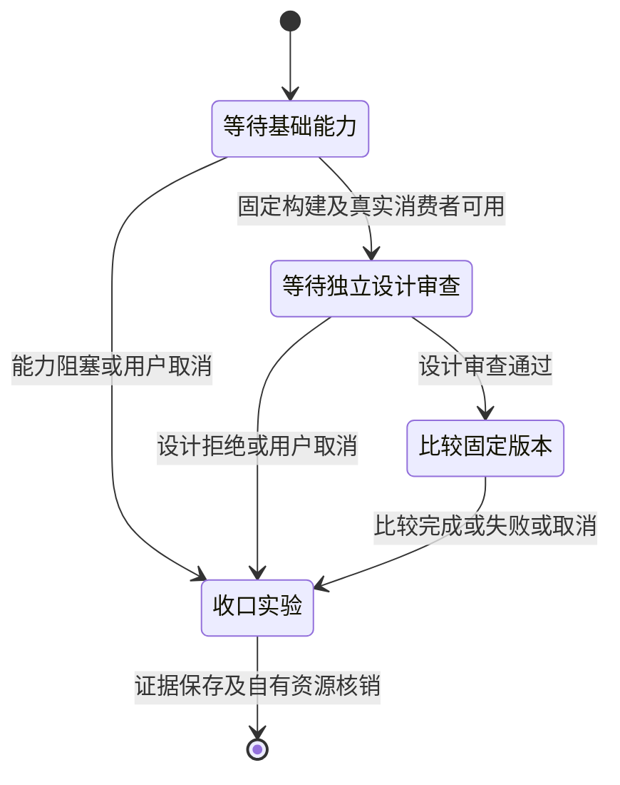

# 固定版本原位画质参数实验

当前状态（2026-10-04 codec owner 修订）：旧 sender snapshot 实现的 Codex 架构审查为 code_failure/P1。下方首轮状态与 SSRC 诊断保留为历史；当前最小 native 设计以本修订为准，等待定向设计准入后才能改 native 源码。已验 source adaptation 与 numeric encoding 不变；旧 f30d/e863 产物只作上一候选证据，不是最终发布输入。

状态：等待定向设计 review，未准入 native 编码。未修改 baseline 的官方 build、显式公开 import、真实视频消费者与自然清理已通过（2026-10-03，证据 binding-baseline-parent/raw17/18 与 consumer/baseline-a.json/exit）；单路 21 帧、双路各 39 帧完整 I420，九次原位 setter 均真实拒绝且逐次帧连续，consumer 自然 exit 0。三项 P1 前置已获真实基线证据：P1-1 发送 timer 清理后公开 getActiveResourcesInfo Timeout 回基线、发送 callback 停止后不增长（consumer baseline.json；getActiveResourcesInfo 只覆盖 libuv-backed 资源，native libwebrtc 线程/对象不在其范围，该限定同见 negative-probe.json limitations）；P1-2 38 项非法输入经公开 getParameters→setParameters 构造并调用、每项以对象深度相等证明投影确实变化、逐项 rejected 且连续性保持；1 项 optional 移除（视频 codec 的 channels）因公开投影本就不含该字段而不可构造，显式记为 available=unavailable 而非伪造存在；同值 setter 仅作合法对照、不计 negative（negative-probe.json）；P1-3 量化验收规则已写入下方章节（compare 节点 acceptance）。仍不授予真实功能/质量/设备/发布 PASS；候选 B 的 Mbps/FPS 达标是后续独立终点。

本实验回答既有 `@roamhq/wrtc@0.10.0` sender 的 get→set codec 与 encoding SSRC 投影遗漏是否造成原位 Mbps/FPS setter 拒绝，以及最小 native 修正是否保留公开契约。它不是第二视频链路、生产安装或发布设计。项目质量事务仍由 `remote-window-quality.graph.json` 所声明的唯一 owner 执行；native libwebrtc 是 transaction、编码数量、RID/SSRC、RTCP 和实际编码参数校验的 owner。

2026-10-04 修订：原作者在固定A的真实公开诊断中观察到codec往返修正后仍拒绝`Attempted to set RtpParameters with modified SSRC`；同时传回native实际SSRC才resolved并读回新maxBitrate，maxFramerate仍缺读回字段。源码证据确认既有encoding FROM读取optional ssrc，TO未输出native中实际存在的ssrc。原codec-only设计不足，原准入不授权本修订；仍需独立定向设计PASS后才能B编码。两个额外诊断的自然清理分别rc139与遗漏sink挂起后显式PID终止，保留失败，不作为自然清理PASS；既有正式baseline消费者的自然0能力仍有效。本修订选择唯一最小OptionA：补encoding TO的ssrc与maxFramerate；不回填或覆盖caller encoding身份，不扩大三个allowed文件，不做JS侧补偿。

## 输入与能力

固定 node-webrtc HEAD `75f1f55642d803ee558abd7f99b1915598ad21a0`、tree `c6de72e266ccb568dde8a6e66497bb105c340621`；libwebrtc 实际 HEAD `17f085c1d7f6f0cad9e6041aa55a22594925eca5`；depot_tools `495b23b39aaba2ca3b55dd27cadc523f1cb17ee6`，禁止自动更新。官方依赖下载已成功；官方 baseline build、显式本次 addon import、完整解码 I420 帧、参数同值 baseline 及 peer/sink/track 正常关闭仍是编码前必需能力。缺项时 admit 输出 blocked，compare 不写源、不运行候选，settle 保留解除条件和必要资源。Operator 名称是静态实验职责绑定，不声称项目 runtime 已注册执行这些实验步骤。

输入 ARC 只携实验身份、固定源码/工具/环境、基线能力证据、已审设计 hash、公开 consumer、允许路径及资源清单。输出 ARC 是 typed 实验结果 `{ status: passed | failed | blocked | cancelled, inputIdentity, evidenceRefs, failure, retainedResources, cleanup }`。自由文本日志只作诊断，不重建产品质量或 transaction 控制状态。重试启动新的实验 attempt，不回写上游结果，不在图中制造回边。

| 语义节点 | 唯一责任 | 外部效果与验收 |
| --- | --- | --- |
| 核验固定版本与实验能力 | 作者核对能力，编排者核对独立审查 | 必需 gate 未通过不写补丁；只读版本与证据检查 |
| 比较原位参数与真实视频行为 | 独立 gcm 作者 | 只修改下述三个 upstream 文件；构建、公开参数消费者及真实视频 A/B/A；所有退出关闭自有 peer/sink/track |
| 核对证据并收口实验 | 编排者 | 核对真实 rc/hash/行为；failed/blocked 不宣称 setter 可用；仅删除确认不再需要的自有资源，保留必要候选 |

## 最小 native 设计

本次 codec 修订允许 `src/dictionaries/webrtc/rtp_codec_parameters.cc` 与 `src/interfaces/rtc_rtp_sender.{hh,cc}`。保留已验 `rtp_encoding_parameters.cc` 和 `rtc_video_source.{hh,cc}` 字节不变。sender 两文件只删除旧补偿，最终须逐个与固定 upstream 相等。zterm 产品依赖、lock、daemon、UI、native capture、JS loader、构建源码和公共类型全部只读；consumer 与证据只在实验独占路径。基线 A 与旧 B 的源码和 addon 保留为独立不可变输入。

唯一 codec 转换 owner 是 `rtp_codec_parameters.cc`。现有 TO 写出 `a=fmtp:<pt> k=v`，现有 FROM 按 `;`/`=` 解析后得到错误的 `parameters["a"]`；native 全量 codec equality 因此拒绝往返。TO 改为既有 sibling `rtp_codec_capability.cc` 使用的 `k=v;k=v`：空初值，逐项追加 key、等号、value，只在项间加分号，不添加 SDP 前缀或空格。FROM 保持原有公开参数解析与错误路径；不新增兼容分支、trim、默认值或第二 parser。

物理删除 sender 的 `RtpCodecProjection`、projection 读取/equality、`_native_codecs`、`_public_codecs`、`_has_codec_snapshot`、getter 保存及 setter 替换，以及其专用 include。sender 恢复固定 upstream 原来的 get/parse/set 流程，caller 数据直接交 native 唯一 transaction/immutable owner，禁止缓存回填。固定 TO 的 clockRate 可缺省、FROM 仍 required，保留原拒绝，不编造值。count/order、字段类型、fraction/overflow/NaN、optional presence 的真实调用契约不放宽。

固定 SDK `api/rtp_parameters.h:589-595` equality 包含 name/kind/payload_type/clock_rate/num_channels/max_ptime/ptime/rtcp_feedback/parameters。`media/base/codec.cc:214-221,285-289` 的当前视频 projection 将后面三个未公开字段保持默认（nullopt/nullopt/empty），所以无需新增 ptime/feedback public 字段即可无损往返；这是固定视频路径的静态证据，不声称所有未来 SDK/audio 契约。保留 SDK gate `webrtc_video_engine.cc:1101-1106` 与 `rtp_sender.cc:226-237` 不变。公开 `sdpFmtpLine` 内容会从带前缀变为标准参数串，属于显式修正；不得保留 legacy malformed 输出双路径。

已验编码 converter 的 optional `maxFramerate`/`ssrc` readback 与非有限/安全整数拒绝保持不变；caller 修改/删除 SSRC 仍交 native 拒绝，不重建 encoding 身份。source AdaptFrame 既有修复与 geometry 契约保持不变。宏 `CREATE_DEFERRED(E,D)` 当前忽略 D，历史参数拼写非已证缺陷，不改宏/拼写，不暴露新 feedback/ptime 字段，不用 JS 重建 native codec。

SSRC 与 outbound-rtp 统计的相等验收限定本实验每 sender 单 encoding；overview-plus-focus 使用两个独立的单 encoding sender。多 encoding sender 不在实验验收范围内，因为此固定 libwebrtc 的 outbound-rtp 统计会聚合到首个 SSRC。该范围说明不改变 native 参数校验。

## 公开消费者与因果比较

新 addon 必须重跑冻结 consumer23d 的 A1/B1/A2/B2、两完整 negative plans、两五阶段 actual caps，以及独立 geometry consumer6f58；不得因旧 e863 PASS 跳过新 source/hash 的受影响 gate。补一个持久化 public fmtp regression：真实协商后存在至少一个 fmtp-bearing codec，getter 的参数串无 SDP 前缀/键前空格，原样 get→set 及合法 independent quality update 成功，真实 caller codec 参数修改仍明确拒绝，随后 fresh getter 合法 recovery 与完整动态帧连续。finally 清理 peer/sink/track/source timer 后自然退出；不能以源码断言或私有状态 mock 替代公开行为。旧 codec dictionary 与新实现形成反向/正向证据；ABI/package/toolchain pins、原生 SDK 和原 2s/5s 窗口/容差不变。

消费者通过固定包路径显式加载，记录实际 addon digest，真实 RTCVideoSource/peer/RTCVideoSink 解码完整 I420 帧。A/B/A 都是同输入、同环境、同完整 consumer；两个场景 `single-focus` 与 `overview-plus-focus`。A 原样/独立 maxBitrate/独立 maxFramerate 应复现拒绝；B 成功并保留连续真实帧；恢复 A 再复现原拒绝，之后最终 B 重验。若 A 无法复现，不以历史错误替代，不下根因结论。

可复用真实存在的 `binding-research/raw/v2-loopback.mjs <package-root>` 中 peer/source/sink 与完整 I420 输入机制；该旧脚本只是历史诊断入口，不满足本次验收。它只在所有参数尝试前后收帧，没有逐次 setter 连续性断言；sink 只计数没有完整解码帧验证；最终还执行 `process.exit(0)`，不证明自然资源终点。提案写的 `binding-candidate-r2/immutable-codec-gate.mjs` 实际不存在，不能把文本中的命令当已有能力。作者应在独占实验目录用 apply_patch 补最小消费者，记录 hash，先通过未修改 baseline 的公开边界与清理能力，再开始 native 编码。不得以内部 native-call mock/源码断言替代 public rejection 和真实帧行为。

加载 gate 必须先显式 require 本次 compiled addon 的精确路径，再通过包的公开入口使用 peer/source/sink；确认本进程实际加载 addon 路径及 digest 与指定版本一致，禁止 public JS loader 找到 prebuilt 后冒充 selfcompiled。每次 setter 前后独立记录真实完整帧与错误，实际 FPS/Mbps 消费者需要稳定区间，不用旧脚本四帧片段替代。finally 关闭自有资源并自然退出，失败 nonzero；不得用固定等待后 process.exit 隐藏 timer、native 资源或 ICE 错误。

非法字段门禁包含 codecs count/order、mimeType、payloadType、clockRate、channels、sdpFmtpLine；fraction/overflow/NaN；optional 增删/非法类型；缺失 required；repeated/stale transaction；native encoding count/RTCP/headerExtensions/RID/SSRC rejection；停止 sender 与合法 empty-codec 情形（必须能由真实公开 API 产生，否则该情形明确能力未证实，不能制造假 native 结果）。parse先拒绝保持原错误；parse可过但immutable不匹配必须显式拒绝；不要求所有错误统一名称。失败后新 get 的合法更新必须仍可用、帧仍连续，不吞非法字段或绕过 native 校验。

`maxFramerate` readback 与实际帧率分开验：高于用户 ceiling 的 source 连续发送，按明确稳定区间的 decoded frame delta/时长检验 ceiling，边界量化误差不得隐藏；记录区间、输入帧率与所有 decoded 时间。B的fresh getter输出的SSRC必须与该sender公开outbound-rtp统计对应SSRC一致，合法独立Mbps/FPS更新后保持不变；公开修改/删除该已存在SSRC必须真实拒绝，拒绝后fresh get合法update成功且连续。SSRC存在性/非法输入门禁不能因为此修订放宽。Mbps 验证区分 encoder media cap 与包含重传/RTCP/DTLS 的总传输字节，不宣称 wire 绝对上限。多 lane encoding cap 合计不得超过请求预算；QoS 设置成功、stats 连续增长、无 peer/capture 重启的证据各自保留。实际 FPS/Mbps 未证实就不进入生产动态参数接线。

## 量化验收规则（P1-3，编码前置）

下列量化规则把“稳定区间、丢弃窗口、容差”固化为 compare 节点可判定条件；基线 A 的 consumer 与 negative probe 已提供真实入口证据，实际 Mbps/FPS 达标是候选 B 后的独立终点，本阶段不声明已过。

- **源输入**：使用可重复、有足够纹理变化的 320x240 I420 source（非低熵静帧），源帧率 60 FPS；A 不受 ceiling 限制，与 B 同 source 对照，用于证明 source demand 能越 cap。低熵/静帧的低码率不能证明 cap 生效。记录 source 帧数与 elapsed。
- **Warmup / 稳定窗**：source 开始与每次 setter 后先丢弃前 2s（warmup）不计入窗口；稳定测量窗至少 5s，FPS 与 Mbps 分开成窗测量；若证据需要更长则延窗并给出理由。
- **Decoded FPS**：按 decoded 帧 delta / 单调 elapsed 计算；`decodedFPS <= cap + 1`（允许 <=1FPS 的采样边界误差）为通过；记录 decodedFPS、cap、帧 delta、elapsed、全部 decoded 时间戳，边界量化误差不隐藏。
- **Mbps（媒体 payload cap）**：用 outbound-rtp `bytesSent` 差分计算 media payload 平均 Mbps；断言窗口平均 `<= cap + max(15% cap, 100kbps)`；显式不含重传/RTCP/DTLS 总 wire 字节，不宣称 wire 绝对上限。保存每窗 raw bytes delta、elapsed、sourceFps 与 readback。
- **单/双 lane 预算**：single-focus 与 overview-plus-focus 的 encoding cap 合计各自单独断言 `<= 用户预算`（focus 3.0Mbps、overview 0.5Mbps，合计 3.5Mbps）。
- **连续性**：每次 setter（含被拒后）前后各收 >=3 个完整 320x240 I420 帧（bytes 115200），记录 width/height/bytes，不只计 ontrack 数。
- **peer 不重建**：跨全部 setter 记录同一 RTCPeerConnection / sender / transceiver 对象，mids 与 selected ICE pair 不变、connectionState 持续 connected；capture 与 stats 连续增长，无 peer/capture 重建证据单独保存。
- **契约不适用处理**：若 libwebrtc 实际 Mbps/FPS 契约与上述不成立，必须给出具体解释并保持实际 cap `UNVERIFIED`，不得临时放宽门禁或为过关调整窗口/容差。

所有 gate 绑定精确 baseline/candidate 源 tree、addon digest、工具和消费者 hash、命令与直接 rc。作者先 debug/开发测试/公开行为验证，再实现后独立架构 review。基线构建不通过、设计审查未 PASS 或消费者不可执行时，只保存具体 blocker；不得修改下游产品来掩盖缺口。
