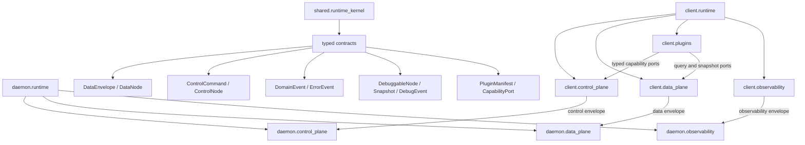

# ZTerm Runtime Architecture v2

- Design ID: `ZTERM-ARCH-V2-DESIGN-001`
- Status: confirmed; implementation is complete. AppSDK active-version and
  lifecycle state are authoritative in `.appsdk/project.json`,
  `.appsdk/records/**`, and `active/lib/zterm-runtime-v2/current.json`.
- active-v2 status: implemented, DSH review R4 PASS, awaiting AppSDK
  promotion/freeze; see `.appsdk/records/**`
- Product verification status: L5 device/package/OTA verification remains open
- Confirmed by: Jason
- Confirmed at: `2026-08-15T00:45:30Z`
- AppSDK project root: `android/`
- Implementation plan: `docs/goals/zterm-runtime-architecture-v2-plan.md`

## 1. Objective

Preserve current ZTerm behavior and business payload semantics while restructuring the Android client and embedded daemon around:

1. explicit module ownership;
2. physically separated data, control, debug, and error planes;
3. typed foundation nodes and adjacent message edges;
4. a capability-scoped client plugin host;
5. independent buffer update, render-window, DOM render, UI shell, connection, and daemon services;
6. machine-enforced registries, call maps, and verification gates.

This is an ownership and dependency refactor. It is not a product feature or protocol-payload redesign.

## 2. Non-goals

- Do not change terminal request/response business semantics.
- Do not change tmux, Herdr, or WezTerm source truth.
- Do not introduce fallback, shadow writers, dual compilers, or dual production paths.
- Do not move renderer policy into daemon or buffer ownership.
- Do not make Cordis the terminal frame, mirror, buffer, renderer, transport, or input hot-path event bus.
- Do not refactor `mac/`, `win/`, or `../wterm/` in this migration.
- Do not publish from Playground, Generated, or Protected source.

## 3. Current Architecture Gaps

### 3.1 Logical modules without physical owners

`client.terminal_channel_mux`, `daemon.input_queue`, `daemon.control_gateway`, `daemon.control_center`, `daemon.channel_mux`, `daemon.buffer_publisher`, `daemon.session_catalog`, `daemon.attachment_delivery`, `daemon.mirror_writer`, `client.sparse_buffer`, `client.renderer_window`, `client.dom_renderer`, `client.terminal_shell`, and `client.input_normalizer` have production `owned_paths` with implementation moved out of the larger connection, message, buffer, render, and input runtimes. The v2 AppSDK maps mark these entries active; no runtime path depends on Playground, Generated, or Protected source.

### 3.2 Central service locators

`SessionContext` currently aggregates session lifecycle, transport, terminal channel, buffer, renderer, input, file, attachment, remote-window, schedule, and debug capabilities. The daemon `server.ts` and `terminal-message-runtime.ts` similarly combine composition, transport dispatch, control, data, and feature handling.

This creates implicit dependencies, cycles, raw store/socket access, and unclear cleanup ownership.

### 3.3 Debug shares business session transport

Client debug flush currently depends on the active session socket, and debug log/snapshot messages are classified inside the session message union. Debug therefore shares terminal lifecycle, routing, and backpressure. This violates the required control/business payload isolation.

### 3.4 Message mechanisms are not one semantic model

Production behavior currently mixes React callbacks, context methods, store subscriptions, DOM events, string debug scopes, and protocol switches. The problem is not the number of mechanisms alone; the missing contract is whether a message is data, command, committed fact, query, error, or observation.

### 3.5 Import allowlists do not prove an acyclic architecture

The current import gate checks registered edges, but registered edges can still permit cycles such as shell/renderer and buffer/connection back-references. v2 requires both edge registration and a production module DAG gate.

## 4. Top-level Architecture



The three runtime planes may share one physical mux transport only when they remain distinct typed channel resources. They must not share a business payload union, active-session owner, retry ledger, or backpressure queue.

## 5. Module Ownership

### 5.1 Shared runtime kernel

| module | owns | rejects |
| --- | --- | --- |
| `shared.node_contract` | node identity, lifecycle, disposal, subscription contract | business state, routing policy |
| `shared.data_contract` | typed data envelopes, adjacent data ports | control/debug metadata |
| `shared.control_contract` | command, result, correlation, deadline, idempotency contracts | terminal/file/media body truth |
| `shared.event_contract` | immutable committed domain facts and typed error facts | commands disguised as events |
| `shared.debug_contract` | versioned snapshots, debug events, filters, sensitivity classes | business mutations |
| `shared.plugin_contract` | manifests, capabilities, lifecycle, slots, permissions | raw runtime service lookup |
| `shared.protocol` | wire encode/decode and protocol validation | session, buffer, route, debug, or plugin state |

Shared modules define types and validation only. They do not start work, choose routes, repaint rows, or own runtime truth.

### 5.2 Client control plane

| module | unique ownership | forbidden ownership |
| --- | --- | --- |
| `client.target_directory` | confirmed daemon targets and target identity projection | session/body truth |
| `client.route_policy` | ordered explicit connection candidate plan and route health | socket lifecycle |
| `client.transport_lifecycle` | physical daemon-target transport and generation | active tab, renderer, buffer |
| `client.session_lifecycle` | client session/open-tab intent and active session projection | physical target socket internals |
| `client.terminal_channel` | one typed terminal channel per client session | physical target route selection |
| `client.feature_control_gateway` | typed file/schedule/remote-window control ports | feature business implementation |
| `client.control_center` | authorization, capability, deadline, idempotency, correlation, command routing, audit | business truth and data bodies |

### 5.3 Client data plane

| module | unique ownership | forbidden ownership |
| --- | --- | --- |
| `client.wire_ingress` | validated channel frame ingress and typed dispatch | feature decisions |
| `client.buffer_frame_assembly` | complete authoritative frame assembly and exact repair range | sparse buffer publication before completion |
| `client.sparse_buffer` | absolute-row local terminal truth | follow/reading/render bottom |
| `client.render_window` | follow, reading, render bottom, visible range | transport and buffer mutation |
| `client.dom_renderer` | immutable render snapshot to DOM projection | buffer/request policy |
| `client.input_normalizer` | IME, hardware, paste, quick-action normalization | transport retry |
| `client.reliable_input` | sequence, ACK, bounded retry, pending input queue | reconnect/open intent |

Production truth for `client.reliable_input` lives in
`src/lib/reliable-input/reliable-input-queue.ts`;
`src/contexts/session-context-input-runtime.ts` is a thin bridge and
re-export shell only.

### 5.4 Client plugins

| plugin | permitted capabilities | forbidden capabilities |
| --- | --- | --- |
| `terminal-shell` | render snapshot, terminal input intent, session projection | raw socket/store/backend |
| `session-drawer-preview` | session query, immutable render projection | parser, reconnect, buffer mutation |
| `quickbar` | input-normalizer port and feature command ports | terminal transport |
| `file-browser` | file command/query/stream ports | daemon file state |
| `remote-window` | remote-window command/media projection ports | mirror and terminal renderer truth |
| `settings-update` | settings/update capabilities | session/terminal truth |
| `debug-console` | debug read/subscribe capabilities | business mutation and raw owner stores |

### 5.5 Daemon control plane

| module | unique ownership | forbidden ownership |
| --- | --- | --- |
| `daemon.control_gateway` | authenticated typed control ingress | terminal frame storage |
| `daemon.control_center` | command routing, deadline, idempotency, correlation, audit | business decisions and data bodies |
| `daemon.session_catalog` | backend session catalog operations | client active/session state |
| `daemon.schedule_control` | schedule commands to schedule owner | UI projection |
| `daemon.file_control` | file commands to file owner | client/native file bytes |
| `daemon.remote_window_control` | catalog/start/stop/input commands | terminal mirror truth |
| `daemon.admin_control` | explicit administrative commands | debug read capability |

### 5.6 Daemon data plane

| module | unique ownership | forbidden ownership |
| --- | --- | --- |
| `daemon.transport_ingress` | physical server transport ingress | client policy |
| `daemon.channel_mux` | channel registry and typed channel framing | session business truth |
| `daemon.source_adapter` | tmux/Herdr/WezTerm authoritative source readback normalization | mirror revision ownership |
| `daemon.mirror_writer` | validated source snapshot to mirror commit | client viewport/follow state |
| `daemon.mirror_store` | canonical daemon terminal mirror truth | renderer/client state |
| `daemon.buffer_publisher` | mirror revision/range to subscriber data frames | source capture and client gap policy |
| `daemon.input_queue` | ordered input receive/write queue | client retry/open state |
| `daemon.file_stream` | bounded file stream data | file UI state |
| `daemon.remote_window_media` | remote-window media frames | terminal mirror rows |

### 5.7 Daemon session catalog physical owner

`daemon.session_catalog` is the active physical owner of backend session
catalog construction and `list-sessions` control dispatch in
`src/server/daemon-session-catalog-runtime.ts`. It builds
backend-qualified `sessionCatalog` rows from `resource.backend_session`
enumeration, publishes the legacy `sessions` payload plus list-time
`session-activity` facts, and keeps the existing wire success/error semantics.
`daemon.control_gateway` delegates `list-sessions` to this owner;
`daemon.schedule_runtime` consumes the shared catalog builder for republish
without owning catalog truth. The catalog owner must not hold client
active/session, mirror, transport subscriber, renderer, or UI truth.

### 5.8 Daemon attachment message delivery physical owner

`daemon.attachment_delivery` is the active physical owner of the four attachment
transport-message projections in `src/server/terminal-attachment-message-runtime.ts`:
`pending-attachments-query`, `attachment-history-query`,
`attachment-asset-request`, and `attachment-receipt`.
`terminal-message-runtime.ts` remains the physical receiving router and delegates
only these types to `terminal-attachment-message-runtime.ts`; it no longer owns
attachment delivery business state or wire projection code. The owner preserves
the existing wire payload/error semantics and never emits a success frame for a
receipt. This slice is active in the current production source and included in
the AppSDK `active-v1` freeze.

### 5.9 Daemon file transfer message route physical owner

`daemon.file_transfer` is the active physical owner of the file-transfer
transport-message projections in
`src/server/terminal-file-transfer-message-runtime.ts`:
`paste-image-start`, `attach-file-start`, `paste-image`,
`file-list-request`, `file-create-directory-request`,
`file-download-request`, `remote-screenshot-request`,
`file-upload-start`, `file-upload-chunk`, `file-upload-end`, and raw binary
payloads.
`terminal-message-runtime.ts` remains the physical receiving router and
delegates only these types and binary chunks to
`terminal-file-transfer-message-runtime.ts`; it no longer imports or invokes the
file-transfer facade directly and no longer mutates
`session.pendingPasteImage` / `session.pendingAttachFile`.
The message route owner projects pending paste/attach start state and delegates
exact file/screenshot handling to the existing
`TerminalFileTransferRuntime` facade, preserving `session_required`, legacy wire
semantics, and no fallback path. This slice is active in the current production
source and included in the AppSDK `active-v1` freeze.

### 5.10 Daemon source adapter contract physical owner

`daemon.source_adapter` is the active physical owner of the shared terminal
source adapter contract in `src/server/terminal-source-adapter.ts`. It defines
the tmux/Herdr/WezTerm source kind normalization, source session shape, mirror
readback snapshot shape, and adapter boundary shared by
`daemon.terminal_backend` backends and `daemon.mirror_writer` readback
normalization. It owns no mirror revision, backend session truth, or client
policy; `resource.mirror_store`, `resource.active_session`,
`resource.renderer_window`, and `resource.ui_projection` remain forbidden.
This slice is active in the current production source and included in the
AppSDK `active-v1` freeze.

### 5.11 Daemon mirror writer physical owner

`daemon.mirror_writer` is the active physical owner of validated terminal
source capture and authoritative mirror snapshot commit writes in
`src/server/terminal-mirror-capture.ts`. It reads the unified
`TerminalSourceAdapter` contract from `daemon.source_adapter`, canonicalizes
source-neutral absolute rows/geometry/cursor, and applies the authoritative
snapshot to the canonical mirror object. `daemon.mirror_store` remains the
owner of `resource.mirror_store`, revision, and runtime capture scheduling;
`daemon.buffer_publisher` remains the owner of per-subscriber publication.
The writer never owns revision, subscriber state, backend session truth,
renderer, or client UI truth. This slice is active in the current production
source and included in the AppSDK `active-v1` freeze.

### 5.12 Shared node/debug contract and observability physical owners

`shared.node_contract` is the active physical owner of
`packages/shared/src/terminal/node-contract.ts` and
`resource.runtime_node_registry`: node identity, lifecycle, disposal,
subscription, and adjacent typed `DataNode` / `ControlNode` base contracts. It
reuses the shared `ControlCommand` contract and never carries business state,
terminal/file/media body, routing policy, or client/daemon runtime truth.

`shared.debug_contract` is the active physical owner of
`packages/shared/src/terminal/debug-contract.ts` and
`resource.debug_snapshot_registry`: `DebugRegistry`, `SnapshotCoordinator`,
`DebugHub`, `BoundedDebugEventStore`, `DebugPermissionService`, and strict
`DebugSensitivity`. Debug snapshots and events are versioned, immutable, and
metadata-only; business request/response payload and terminal text are
forbidden.

`client.observability` owns `resource.client_debug_hub` through
`src/lib/client-debug-snapshot.ts` and
`src/lib/runtime-debug-http-exporter.ts`. The client registry owns local debug
snapshot producers and exports only through the dedicated observability
channel; it never depends on active session, session transport, terminal
channel, transport subscriber, mirror, frame assembly, sparse buffer, renderer,
or UI projection.

`daemon.observability` owns `resource.daemon_debug_hub` through
`src/server/runtime-debug-store.ts` and
`src/server/terminal-debug-runtime.ts`. The daemon hub owns bounded client and
daemon debug entries, snapshots, typed event projection, and default-deny
expiring `debug:control` permission; it never owns active session, transport,
mirror, buffer assembly, sparse buffer, renderer, UI projection, backend
session, tmux/WezTerm pane, file transfer, remote window, or native store truth.

All four resources are active in the current production source and included in
the AppSDK `active-v1` freeze; product L5 device/package verification remains
open.

## 6. Foundation Node Contracts

The runtime shares lifecycle and debug hooks, but data and control nodes remain physically different types.

```ts
interface NodeIdentity {
  readonly nodeId: string
  readonly moduleId: string
  readonly featureId: string
  readonly resources: readonly string[]
}

interface Subscription {
  dispose(reason: string): void
}

interface DebuggableNode<S, E> {
  debugSnapshot(request: DebugSnapshotRequest): Readonly<S>
  subscribeDebug(
    filter: DebugFilter,
    listener: (event: Readonly<E>) => void,
  ): Subscription
}

abstract class FoundationNode<S, DE> implements DebuggableNode<S, DE> {
  abstract readonly identity: NodeIdentity
  abstract start(): void | Promise<void>
  abstract stop(reason: string): void | Promise<void>
  abstract debugSnapshot(request: DebugSnapshotRequest): Readonly<S>
  abstract subscribeDebug(
    filter: DebugFilter,
    listener: (event: Readonly<DE>) => void,
  ): Subscription
}

abstract class DataNode<I, O, E, S, DE> extends FoundationNode<S, DE> {
  abstract accept(
    input: Readonly<I>,
  ): Result<Readonly<O>, Readonly<E>>
    | Promise<Result<Readonly<O>, Readonly<E>>>
}

abstract class ControlNode<C, R, E, EV, S, DE> extends FoundationNode<S, DE> {
  abstract execute(
    command: Readonly<C>,
  ): Promise<Result<Readonly<R>, Readonly<E>>>
  abstract subscribeEvents(
    listener: (event: Readonly<EV>) => void,
  ): Subscription
}
```

Rules:

- `DataNode` cannot accept `ControlCommand`.
- `ControlNode` cannot transport terminal frames, file chunks, or media bodies through command metadata.
- Debug data never appears in `accept()` or `execute()` business results.
- Every node maps to one module, one feature, and declared resources.
- Every edge is adjacent and registered; non-adjacent conversions are forbidden.
- `stop()` revokes owned subscriptions and timers.
- Snapshot and event output is immutable.
- One resource has one writer node.

## 7. Message Semantics

| semantic kind | mechanism | examples |
| --- | --- | --- |
| high-frequency business data | adjacent `DataPort` | terminal frame, file chunk, media frame |
| requested state change | `ControlCommand` | connect, resize, subscribe, schedule |
| committed owner fact | `DomainEvent` | transport connected, buffer applied |
| current state read | query/snapshot port | visible rows, session catalog |
| failure | typed error chain | frame rejected, channel open failed |
| observation | `DebugEvent` or debug snapshot | queue depth, revision, duration |

The architecture does not use one global event bus for all traffic. Authoritative bodies remain in their owner stores or direct streams. A lightweight domain event may tell consumers that the owner committed a change; consumers then read an immutable snapshot from that owner.

## 8. Canonical Data Chains

### 8.1 Terminal output

```text
DaemonSourceIn01Readback
-> DaemonMirrorIn02ValidatedSnapshot
-> DaemonMirrorIn03Commit
-> DaemonBufferOut01Publish
-> ClientWireIn01ValidatedFrame
-> BufferSyncIn02FrameAssembly
-> BufferSyncIn03SparseApply
-> RenderIn01SparseRows
-> RenderIn02VisibleCommit
-> RenderOut01DomRows
-> UiProjectionIn01TerminalSurface
```

The existing terminal truth remains:

```text
source adapter -> daemon mirror -> client sparse buffer
-> renderer window -> DOM renderer -> UI shell
```

`buffer-sync apply` remains the only terminal body repaint trigger. Head/cursor metadata cannot repaint old body content.

### 8.2 Terminal input

```text
UiInputOut01Intent
-> ClientInputOut02Normalized
-> ClientInputOut03ReliableFrame
-> ClientChannelOut04TerminalData
-> DaemonChannelIn01Demux
-> DaemonInputIn02Queue
-> DaemonSourceOut03Write
```

Input stays string-only until an explicit protocol version migration is separately admitted and tested. Retry/control facts remain outside the input payload.

### 8.3 Control

```text
UI or plugin intent
-> client.control_center
-> owning client ControlNode
-> typed terminal/target control port
-> daemon.control_gateway
-> daemon.control_center
-> owning daemon ControlNode
-> ControlResult or ControlError
-> committed DomainEvent when state changed
```

### 8.4 Debug

```text
RuntimeNode.debugSnapshot()/subscribeDebug()
-> local DebugHub
-> bounded DebugEventStore
-> dedicated target-level observability channel
-> remote DebugHub/debug-console
```

Debug is not keyed by active session and cannot use the terminal channel or terminal retry ledger.

## 9. Control Center

`control_center` is a router and policy boundary, not a new god object.

It owns:

- capability and authorization checks;
- command ID and correlation ID validation;
- deadline and cancellation propagation;
- idempotency lookup;
- unique handler routing;
- audit ledger entries;
- typed result/error return.

It rejects:

- business decisions that belong to feature owners;
- mirror/buffer/file/media body storage;
- debug snapshot collection;
- catch-and-success behavior;
- multiple handlers for one command type.

Debug control and product control use separate capabilities even when exposed by one authenticated administrative API.

## 10. Debug Center

```text
observability.debug_center
├── DebugRegistry
├── DebugHub
├── SnapshotCoordinator
├── BoundedDebugEventStore
├── DebugPermissionService
└── DebugExporter
```

### 10.1 Responsibilities

- `DebugRegistry`: unique node producer registration, schema, version, resources, sensitivity.
- `DebugHub`: filtered subscriptions, bounded fan-out, backpressure, drop counters.
- `SnapshotCoordinator`: collects node snapshots within size/time budgets.
- `BoundedDebugEventStore`: bounded metadata history only.
- `DebugPermissionService`: separates `debug:read`, `debug:subscribe`, and `debug:control`.
- `DebugExporter`: exports through a dedicated observability channel.

### 10.2 Snapshot contract

```ts
interface DebugSnapshotEnvelope<S> {
  schemaVersion: number
  snapshotId: string
  nodeId: string
  moduleId: string
  featureId: string
  resources: readonly string[]
  generation: number
  sequence: number
  capturedAt: string
  lifecycle: 'created' | 'running' | 'stopping' | 'stopped'
  sensitivity: 'public' | 'internal' | 'restricted'
  payload: Readonly<S>
}
```

Required constraints:

- duplicate producer IDs fail fast;
- subscriptions are revoked on node disposal;
- snapshots have schema/version, sequence, generation, TTL, size, and time budgets;
- hot-path snapshots contain counters, bytes, ranges, revisions, timestamps, lifecycle, and errors only;
- terminal text, cells, credentials, tokens, and business request/response bodies are excluded by default;
- debug queue overflow may drop debug events but must increment a drop counter;
- debug failure never blocks or changes data/control results;
- debug mutation is an authenticated, expiring lease; default is deny.

## 11. Client Plugin Host and Cordis Boundary

The client plugin system uses a local `PluginHost` contract. Cordis, if adopted after Playground validation, is hidden behind `CordisAdapter`.

```text
CordisAdapter
-> PluginHost
-> PluginManifest
-> capability dependency resolution
-> lifecycle and disposal
-> UI slot registration
```

Allowed dynamic plugins:

- debug console;
- session drawer preview;
- file browser;
- settings/update;
- remote-window projection;
- quickbar;
- terminal shell projection.

Fixed runtime nodes, not hot-unloadable plugins:

- terminal channel;
- buffer frame assembly;
- sparse buffer;
- render window;
- reliable input;
- daemon mirror writer/store;
- daemon input queue.

Plugin rules:

- declared capabilities only; no global context lookup;
- no wildcard production subscriptions;
- no raw socket/store/backend injection;
- no terminal/file/media body through Cordis events;
- start/stop/dispose is deterministic and tested;
- missing dependency fails before plugin activation;
- debug registration and subscription cleanup follow plugin lifecycle;
- no dual production implementation while migrating a plugin.

## 12. Required Resource and Edge Additions

The target registries must add design/pending entries before code:

### Resources

- `resource.runtime_node_registry`
- `resource.client_control_center`
- `resource.daemon_control_center`
- `resource.client_debug_hub`
- `resource.daemon_debug_hub`
- `resource.debug_snapshot_registry`
- `resource.observability_channel`
- `resource.client_plugin_host`
- `resource.plugin_capability_registry`
- `resource.file_browser_ui_contract`
- `resource.settings_update_ui_contract`
- `resource.remote_window_ui_contract`

### Required direct edges

- runtime node -> local debug hub through `DebugProbePort`;
- control gateway -> control center;
- control center -> exactly one owning control node;
- plugin host -> declared capability registry;
- plugin -> declared query/command/debug port;
- debug hub -> observability channel;
- existing mirror -> frame assembly -> sparse buffer -> renderer -> DOM renderer -> terminal shell -> UI projection chain.

### Forbidden direct edges

- debug hub -> active session;
- debug hub -> session transport;
- debug hub -> mirror/sparse-buffer writer APIs;
- UI/plugin -> raw socket, raw store, backend, or daemon handler;
- renderer -> transport, reconnect, or buffer mutation;
- sparse buffer -> follow/reading/render-bottom state;
- control command -> terminal/file/media body metadata;
- debug event -> business request/response payload;
- non-adjacent DataNode -> DataNode;
- Cordis/global emitter -> terminal frame/file chunk/media body;
- active module with resources but no owned paths.

## 13. Machine Gates

Before runtime cutover, CI and prebuild must enforce:

1. every production source file belongs to exactly one active module;
2. active resource-owning modules have non-empty owned paths;
3. the production module import graph is acyclic;
4. every cross-module import and call edge is registered;
5. every critical node name maps to a function-map/mainline node;
6. only adjacent data-node edges compile;
7. control/debug contracts cannot contain business body fields;
8. debug cannot depend on active session, session transport, mirror writer, sparse-buffer writer, or UI projection;
9. UI plugins cannot import raw socket/store/backend paths;
10. no new raw `sendMessageRaw` or global SessionContext capability is introduced;
11. Cordis/global events cannot carry terminal/file/media body types;
12. target-state registry entries remain `design`/`pending` until physical paths and gates exist;
13. docs, registries, function map, mainline map, tests, and source symbols remain lockstep.

## 14. AppSDK Lifecycle

Each implementation slice follows:

```text
confirmed goal
-> registered owner/scope/gates
-> Playground experiment
-> EvidenceRecord
-> ReviewRecord PASS
-> compile candidate
-> PromotionRecord
-> immutable Active artifact
-> Protected source/contracts/history
-> RegressionReport
-> FreezeRecord
-> appsdk verify
```

Forbidden transitions:

- Playground -> Active;
- Playground -> Protected;
- Generated -> runtime;
- source -> Active consumer;
- direct edits to Active, Protected source/history, Generated, `sdk.lock`, or `sdk-resources.json`.

## 15. Migration Order

1. Replace AppSDK template identity/goal/maps with ZTerm v2 governance truth.
2. Register foundation, control, debug, and plugin resources as `design`/`pending`; add failing architecture gates.
3. Implement foundation node and typed envelope contracts without runtime behavior changes.
4. Remove debug messages from business session/channel classification and introduce the dedicated observability channel.
5. Split `SessionContext` into capability-scoped owners; forbid new raw facade consumers.
6. Physically implement `client.terminal_channel` and `daemon.input_queue` owned paths.
7. Migrate buffer assembly -> sparse buffer -> render window -> DOM renderer with existing truth semantics.
8. Split daemon ingress into typed per-domain data/control handlers.
9. Validate `PluginHost` and `CordisAdapter` in Playground.
10. Migrate UI plugins from lowest risk to terminal shell.
11. Delete old route/facade/import edge after each unique cutover; never retain dual production paths.
12. Compile, review, promote, publish Active, archive Protected, regress, and freeze only after the exact slice is green.

## 16. Compatibility and Behavior Preservation

Compatibility means identical externally observable product behavior while ownership changes. It does not authorize fallback or two active internal paths.

Each slice must prove:

- unchanged request/response business payload semantics;
- identical terminal source-to-DOM body and style truth;
- unchanged input bytes and explicit control results;
- unchanged session/tab/foreground behavior;
- unchanged file/schedule/remote-window semantics for touched paths;
- debug disabled has no data/control timing or result effect;
- failure remains explicit and follows the typed error chain.
