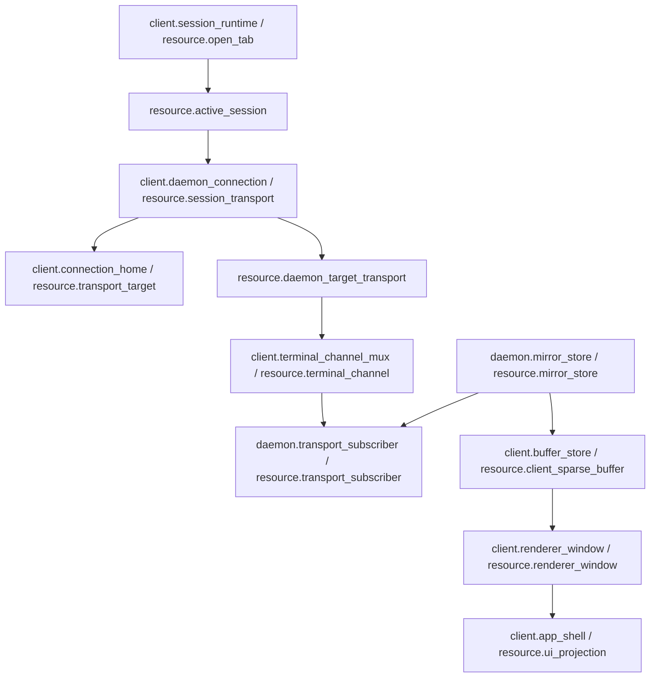
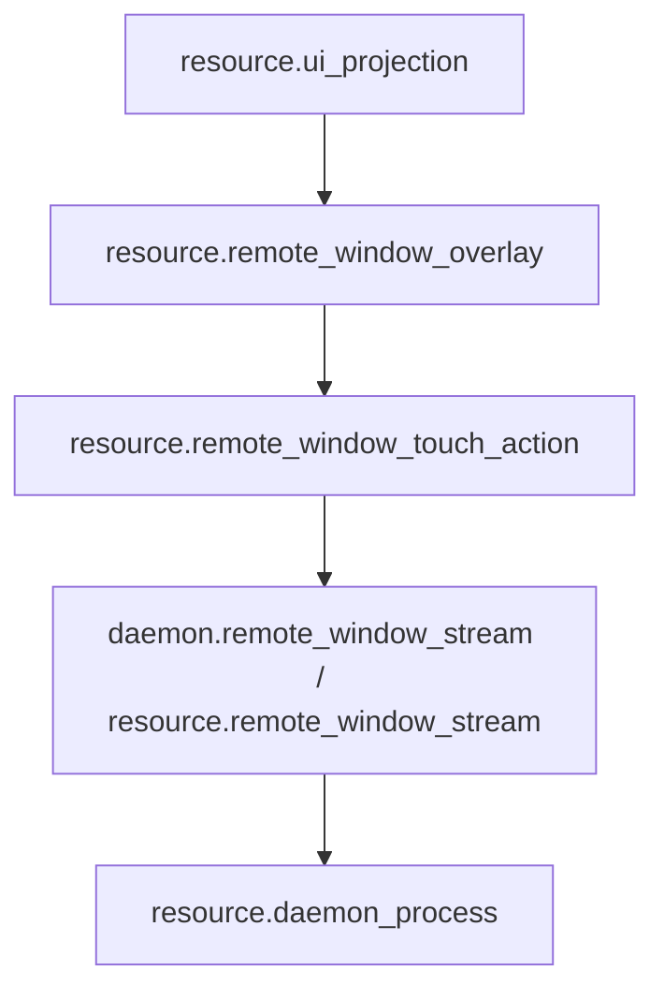
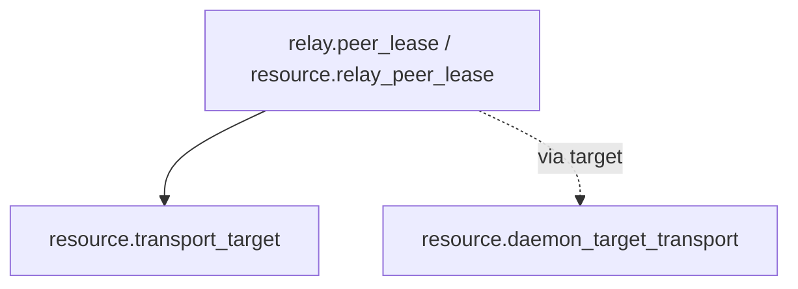

# Project Module Map

Date: 2026-07-26

Machine truth:

- `docs/module-registry.json`
- `docs/edge-registry.json`
- `docs/resource-registry.json`

This page is the human review surface. It exists so resource ownership, module ownership, and allowed edges are decided before function-map or runtime refactor work.

## Rule

Resource registry owns truth resources. Module registry groups resources into runtime boundaries. Edge registry is the only allowed cross-module connection list. Function map binds feature-local code after the resource/module/edge graph is explicit.

Implementation order:

```text
resource registry
-> module registry
-> edge registry
-> function map
-> mainline call map
-> tests/gates
-> runtime refactor
```

No application feature may open a transport directly. All application features must use the declared module interface and the declared edge.

## Owned Paths And Import Graph

`docs/module-registry.json` `owned_paths` maps every non-test source file under `src/` to exactly one module. `docs/edge-registry.json` `import_edges` is the module-level import allowlist derived from the real source import graph. Gate: `src/lib/module-import-graph-truth.test.ts` (wired into `test:feature-registry`, CI, and `prebuild`).

Rules:

- A new source file must land inside an existing `owned_paths` pattern, or the same change must extend `owned_paths`. Unowned files are red.
- A new cross-module import must match an `import_edges` entry, or the same change must declare the edge. Undeclared edges are red.
- Declaring a new edge is an architecture decision, not a formality: check the target module's `forbidden_resources` and this page's boundary sections first.
- `status: pending_removal` marks a known violation kept visible on purpose. The count may only go down; fixing the import removes the entry.
- Module `status: design` means the module is a target-state boundary. For `shared.terminal_types` / `shared.connection_types` the `owned_paths` list the current stand-in files under `android/src/lib`; their target home is `packages/shared`, and status stays `design` until that migration lands. Do not report design modules as active truth.

## Level 0 Modules

| module_id | side | role |
| --- | --- | --- |
| `project.product_runtime` | project | Top-level product boundary across daemon, client, shared protocol, relay, release, and observability. |
| `daemon.runtime` | daemon | Process-local daemon runtime: backend, mirror, subscriber, input, file, schedule, remote-window stream. |
| `client.runtime` | client | Android client runtime: app shell, connection, session, mux channel, buffer, renderer, input, drawer, preview, remote-window overlay, settings. |
| `shared.contract` | shared | Wire protocol, resource contracts, terminal types, connection types, test contracts. |
| `relay.runtime` | relay | Relay account directory, signaling, public update route, and bounded peer lease. |
| `release.runtime` | release | Build, package, promote, update, installed runtime artifacts. |
| `observability.governance` | observability | Debug side channel, registry gates, loop/architecture governance. |

## Daemon Modules

| module_id | owns | consumes | forbidden |
| --- | --- | --- | --- |
| `daemon.runtime_entry` | `resource.daemon_process` | runtime artifact, backend, debug | client active/session/UI/renderer truth |
| `daemon.connection_gateway` | `resource.daemon_connection_gateway` | daemon process, daemon-target transport, terminal channel, subscriber, relay lease | open tab, active session, UI projection |
| `daemon.terminal_backend` | `resource.terminal_backend`, `resource.backend_session`, `resource.tmux_session`, `resource.wezterm_pane` | daemon process | UI, renderer, open tabs |
| `daemon.mirror_store` | `resource.mirror_store` | tmux/wezterm truth, subscriber | active session, renderer, UI |
| `daemon.transport_subscriber` | `resource.transport_subscriber` | terminal channel, mirror store | client active/foreground/viewport/follow truth |
| `daemon.input_queue` | `resource.daemon_input_queue` | backend session, tmux session | UI/renderer direct writes |
| `daemon.schedule_runtime` | `resource.schedule_job` | backend session | UI/renderer timers |
| `daemon.file_transfer` | `resource.file_transfer`, `resource.remote_screenshot` | backend session, transport subscriber | UI guesses, client window state |
| `daemon.remote_window_stream` | `resource.remote_window_stream` | daemon process, transport target, tmux reverse lookup | terminal mirror/buffer/render truth |

Daemon hard boundary:

- Daemon does not own logical client session, active tab, foreground/background, viewport, follow/reading, or renderer position.
- Daemon accepts multiple external transports and clients.
- Daemon exposes terminal-channel subscribers inward; it does not know which client UI is active.

## Client Modules

| module_id | owns | consumes | forbidden |
| --- | --- | --- | --- |
| `client.app_shell` | `resource.platform_terminal_surface`, `resource.ui_projection` | renderer, active session | tmux/mirror/input queue truth |
| `client.connection_home` | `resource.transport_target` | relay lease, UI projection | open tab ownership, tmux truth |
| `client.daemon_connection` | `resource.session_transport`, `resource.daemon_target_transport`, `resource.pending_open_intent` | transport target, terminal channel, relay lease | tmux/mirror/client buffer/renderer/UI ownership |
| `client.session_runtime` | `resource.open_tab`, `resource.active_session` | session transport | sockets, tmux, mirror |
| `client.terminal_channel_mux` | `resource.terminal_channel` | daemon-target transport, subscriber | mirror/buffer/renderer |
| `client.buffer_store` | `resource.client_sparse_buffer` | mirror store, renderer window | tmux/subscriber/UI truth |
| `client.renderer_window` | `resource.renderer_window` | sparse buffer, UI projection | tmux/subscriber/mirror ownership |
| `client.input_runtime` | `resource.platform_input_channel` | session transport, remote-window overlay | backend/tmux direct write |
| `client.session_drawer_preview` | `resource.session_preview_selection`, `resource.session_preview_mode` | UI, open tabs, active session, renderer | transport/backend/mirror ownership |
| `client.remote_window_overlay` | `resource.remote_window_overlay`, `resource.remote_window_touch_action` | UI, remote-window stream, transport target | terminal mirror/buffer/tmux truth |
| `client.file_browser` | `resource.client_file_browser` | target mux request, native file store, file transfer, UI | tmux/mirror, new physical transport |
| `client.settings_update` | `resource.client_settings_update` | release artifact, runtime home, UI | open-tab/session/tmux truth |

Client connection boundary:

- Client owns exactly one physical connection per daemon target.
- `DaemonTargetId` is stable server identity. It must not include current session name or transient route.
- `RouteCandidateId` is route identity: LAN, Tailscale, WebRTC UDP, Relay/TURN.
- Terminal session is a mux channel over the daemon-target physical transport.
- Heartbeat is target-level, not session-level.
- Drawer, picker, remote-window catalog, file transfer, and terminal body all use the same daemon connection interface.

## Shared Modules

| module_id | role |
| --- | --- |
| `shared.protocol` | Request/response/error wire protocol contract. |
| `shared.resource_contract` | Machine-readable module/resource/edge contracts. |
| `shared.terminal_types` | Terminal geometry, rows, buffer, renderer-facing types. |
| `shared.connection_types` | Target, route candidate, route health, selected route metadata. |
| `shared.test_contracts` | Static gates for module, edge, resource, function, and mainline maps. |

Shared contract boundary:

- Shared code defines contracts only.
- Shared code must not become mirror, renderer, UI, or daemon runtime truth.
- Runtime capability changes must update protocol docs, module/edge registry, function map, mainline call map, and gates together.

## Relay Modules

| module_id | owns | forbidden |
| --- | --- | --- |
| `relay.account_directory` | account directory facts, daemon endpoint snapshots, public update route | open tabs, active session, mirror, UI |
| `relay.peer_lease` | bounded peer/signaling lease keyed by account + daemon target + concrete client device | terminal channel, subscriber, tmux, mirror, UI |

Relay boundary:

- Relay is route/signaling/account-directory truth only.
- Relay peer lease must not store terminal channel, subscriber, tmux, mirror, active tab, viewport, or UI truth.
- Tailscale/direct routes remain independent and must not depend on Relay success.

## Release And Observability Modules

| module_id | owns |
| --- | --- |
| `release.runtime_home` | `resource.runtime_home` |
| `release.update_artifact` | `resource.release_update_artifact` |
| `release.daemon_artifact` | `resource.daemon_runtime_artifact` |
| `observability.debug_channel` | `resource.debug_channel` |

Release boundary:

- Release/update artifact must promote through deterministic daemon runtime artifact.
- Runtime must not execute authoring source directly.
- Debug observes metadata only and cannot become business truth.

## Required Edges

Core connection and render edges:



Remote-window control edges:



Relay route edges:



## Refactor Implications

Connection refactor target:

- Move duplicated route/socket/channel decisions into `client.daemon_connection`.
- Expose one app-facing daemon connection interface.
- All feature callers send typed requests through that interface.
- Status UI reads connection-module snapshot directly.
- Manual route choice updates the connection module policy; it does not bypass it.

Daemon refactor target:

- Keep daemon client-agnostic.
- Keep physical transport and terminal subscriber detached from active UI/session concepts.
- Make app/window/video/input catalog a daemon-owned resource under `daemon.remote_window_stream`.

Buffer audit target after module split:

- `daemon.mirror_store` is one writer.
- `client.buffer_store` only merges absolute rows.
- `client.renderer_window` is the only visible-window truth.
- Header/head/timestamp checks belong to the declared buffer/render edges, not UI compensation.

## Detailed Module Contracts

### Daemon Runtime

| module_id | input | output | owns | rejects |
| --- | --- | --- | --- | --- |
| `daemon.runtime_entry` | CLI/service start, staged runtime artifact, config, HTTP/WS/RTC bootstrap | health, daemon module wiring, process-local runtime handles | process lifetime and module assembly | UI/session policy, client active truth, runtime source scanning |
| `daemon.connection_gateway` | direct WS, Tailscale WS, WebRTC data channel, Relay peer route | accepted physical peer, mux capability, terminal-channel open request | daemon-facing external connection ingress design | active tab, foreground/background, viewport, renderer state |
| `daemon.terminal_backend` | backend session request, tmux/WezTerm session name, control intent | backend session handle, tmux/WezTerm truth, explicit backend error | backend identity and lifecycle | UI fallback names, renderer geometry, client session policy |
| `daemon.mirror_store` | backend readback/capture tick, backend geometry, input/capture dirty signal | canonical rows, cols, cursor, revision, absolute index, changed spans | terminal mirror truth | client viewport/follow/reading truth, self-written geometry after resize request |
| `daemon.transport_subscriber` | terminal-channel subscriber attach, body-subscription intent, mirror changed spans | channel-scoped body frames, send accounting, backpressure state | body push eligibility and bounded pending-latest | session-level heartbeat, UI active state, sparse-buffer ownership |
| `daemon.input_queue` | input frames from terminal channel, reliable input seq/ack metadata | stale/drop/write result, backend write queue, ack/nack | daemon input ordering, dedupe, stale/drop policy | object-to-tmux coercion, UI filtering, renderer-side input compensation |
| `daemon.schedule_runtime` | schedule job definitions and ticks | nextFireAt, dispatch result, explicit job status | daemon timer execution truth | page-owned timers, hidden local retries |
| `daemon.file_transfer` | file upload/download/screenshot transfer request | cumulative contiguous upload ACK, file chunks, remote path facts, transfer error | daemon file-transfer and screenshot handoff state | local cwd guesses, UI fake preview success, duplicate/out-of-order ACK inflation |
| `daemon.remote_window_stream` | target catalog request, stream start/stop, window resize, action input, screenshot target manifest | app/window/iTerm2 target manifest, WebRTC sender state, capture metadata, input result | desktop media/capture/input truth | terminal mirror rows as video truth, Android coordinate guesses, client focus queue truth |

Daemon design rules:

- `daemon.connection_gateway` may accept many clients and many routes, but it must expose only physical transport and channel facts inward.
- `daemon.transport_subscriber` is channel-scoped body delivery. It does not decide which app tab is active.
- `daemon.mirror_store` may broadcast to subscribers; it must not know why a client wants a range.
- `daemon.remote_window_stream` may reverse-map iTerm2 tty to tmux metadata, but terminal mirror/buffer/render resources remain forbidden video/control truth.

### Client Runtime

| module_id | input | output | owns | rejects |
| --- | --- | --- | --- | --- |
| `client.app_shell` | page navigation, platform surface metrics, renderer projection, user high-level intent | Connections/Terminal/Settings projection, UI intents | Android presentation shell and UI projection | daemon/backend mutation, tmux direct access |
| `client.connection_home` | saved host, relay directory, route candidates, user server choice | named server rows, target identity, route candidate projection | server/daemon target projection | current tab ownership, session creation, socket open |
| `client.daemon_connection` | active daemon target, route policy, open/resume request, manual route override | physical transport snapshot, route health, target status, target request interface | one client physical connection per daemon target | per-session socket ownership, UI route bypass, buffer/renderer truth |
| `client.session_runtime` | explicit open/close/switch/resume intent | current-process open tabs, active session id | tab/session client truth | cold tab restore, daemon-driven auto close, socket lifecycle |
| `client.terminal_channel_mux` | daemon-target physical transport, tmux session id/name, channel open/close/body-subscription | terminal channel id, channel frames, channel error | per-session mux channel | physical route selection, mirror write, renderer repaint |
| `client.buffer_store` | daemon mirror patches and head/range responses | sparse rows by absolute index, missing ranges, repair demand | local sparse buffer truth | visible follow/reading state, tmux layout truth |
| `client.renderer_window` | sparse rows, visible demand, stage geometry, user scroll/pan | visible row projection, follow/reading/renderBottomIndex | visible-window truth | socket retry, daemon range policy, body repaint from metadata-only head |
| `client.input_runtime` | IME, QuickBar, hardware key, image/text paste, active input context | terminal input frame or remote-window action/text/key intent | platform input channel | backend direct write, terminal normalization for remote-window raw text |
| `client.session_drawer_preview` | drawer open, live sessions, selected preview ids, gestures | drawer projection, preview selection, preview mode layout | session list/preview projection | transport open, backend kill outside explicit owner, mirror mutation |
| `client.remote_window_overlay` | target catalog projection, stream state, touch/keyboard/screenshot/quality/fill UI | overlay state, action records, stream/screenshot/quality intents | remote-window UI/action classification | daemon focus truth, capture truth, terminal mirror reuse |
| `client.file_browser` | file-transfer catalog, preview/download/upload intent plus `contracts/file-transfer-throughput.json` | file browser rows, preview intent, selection intent, bounded upload window, bounded native write batches | client file browser projection and transfer flow-control policy; TypeScript and Android native limits bind to one machine contract | remote cwd guesses, direct daemon filesystem truth, per-chunk stop-and-wait, unbounded burst, independently edited TS/Java limits |
| `client.settings_update` | settings form, update route candidates, config import/export | settings projection, update check/install intent | Settings/config/update UI projection | tab/session restore, forced Relay gate |

Client design rules:

- `client.daemon_connection` is the only module allowed to choose and maintain a physical route.
- `client.terminal_channel_mux` may open or recover a channel, not the underlying physical connection unless `client.daemon_connection` declares it failed.
- `client.buffer_store` and `client.renderer_window` are deliberately split: body content freshness and visible-window position cannot become one state object.
- Drawer, preview, file browser, remote-window catalog, and settings must all call existing owner interfaces; they must not create separate sockets.

### Shared Contract

| module_id | input | output | owns | rejects |
| --- | --- | --- | --- | --- |
| `shared.protocol` | feature request/response/error semantics | typed wire frames and capability contracts | protocol shape | runtime state ownership |
| `shared.resource_contract` | resource/module/edge docs | machine-readable manifests and schema expectations | architecture contract authoring | hidden runtime discovery |
| `shared.terminal_types` | terminal rows, geometry, buffer metadata | shared terminal DTOs | type contract only | renderer/mirror business decisions |
| `shared.connection_types` | target identity, route candidates, route health | shared connection DTOs | type contract only | route selection runtime |
| `shared.test_contracts` | registry and black-box gate requirements | reusable test contract expectations | test contract surface | feature-specific runtime implementation |

Shared design rules:

- Shared modules define types and contracts. They cannot decide routes, repaint rows, or start daemon work.
- Protocol changes must update request, response, and error chains in `docs/edge-registry.json`.
- New shared types should map back to a resource/module/edge entry before implementation.

### Relay Runtime

| module_id | input | output | owns | rejects |
| --- | --- | --- | --- | --- |
| `relay.account_directory` | daemon registration, account auth, endpoint/session directory updates | account-scoped daemon/device/endpoint/session directory, public update route | relay directory truth | open tabs, UI current session, mirror rows |
| `relay.peer_lease` | concrete client device id, daemon target id, route/signaling peer state | idle-timeout bounded reusable peer/signaling lease | route/signaling lease | terminal channel, subscriber, tmux, mirror, active tab, UI truth |

Relay design rules:

- Directory can help discover daemon targets and route candidates; it cannot create app tabs.
- Peer lease may speed resume for the same concrete client device; another phone must get a separate lease.
- Relay failure must not invalidate direct/Tailscale route candidates.

### Release / Observability

| module_id | input | output | owns | rejects |
| --- | --- | --- | --- | --- |
| `release.runtime_home` | configured runtime root | staged state root and runtime home facts | runtime home truth | UI/session policy |
| `release.update_artifact` | build outputs and release verifiers | APK/update/daemon release artifacts | release artifact source | direct daemon start |
| `release.daemon_artifact` | verified staged daemon bundle | deterministic runtime artifact consumed by process start | executable artifact truth | authoring source execution |
| `observability.debug_channel` | bounded metadata, trace, logs, diagnostics | debug snapshot, trace summary, evidence metadata | observe-only diagnostics | business payload truth, terminal text ownership |

Release / observability design rules:

- Release artifact must promote to daemon artifact before runtime start.
- Observability can explain a failure; it cannot make a request successful or alter business payload.

## Current Feature To Module Map

| feature_id | primary modules | notes |
| --- | --- | --- |
| `terminal.transport_lifecycle` | `client.daemon_connection`, `client.terminal_channel_mux`, `daemon.connection_gateway`, `daemon.transport_subscriber`, `relay.peer_lease`, `shared.connection_types` | next refactor target for one physical connection per daemon target. |
| `terminal.buffer_render` | `daemon.mirror_store`, `daemon.transport_subscriber`, `client.buffer_store`, `client.renderer_window`, `shared.terminal_types` | next audit target for row freshness and source-to-DOM truth. |
| `terminal.daemon_input` | `client.input_runtime`, `client.terminal_channel_mux`, `daemon.input_queue`, `daemon.terminal_backend`, `shared.protocol` | input retry/stale/drop stays outside renderer/UI. |
| `desktop.remote_window_stream` | `client.remote_window_overlay`, `daemon.remote_window_stream`, `client.daemon_connection`, `shared.protocol` | video/control uses terminal transport as control plane but not terminal mirror truth. |
| `terminal.session_preview` | `client.session_drawer_preview`, `client.renderer_window`, `client.session_runtime` | preview uses existing open sessions and render truth only. |
| `relay.account_directory` | `relay.account_directory`, `client.connection_home`, `client.daemon_connection` | directory enriches target candidates; it does not own saved hosts or tabs. |
| `relay.route_selection` | `client.daemon_connection`, `client.connection_home`, `relay.peer_lease`, `shared.connection_types` | route choice owned by connection module. |
| `settings.config_transfer` | `client.settings_update`, `release.update_artifact`, `client.connection_home` | update route projection belongs to Settings/update owner. |
| `daemon.file_transfer` | `daemon.file_transfer`, `client.file_browser`, `client.input_runtime` | file/image transfer must use daemon file-transfer owner. |

## Refactor Acceptance Shape

When implementing a future refactor:

1. Pick `feature_id`.
2. Pick `module_id` owners from `docs/module-registry.json`.
3. Pick `edge_id` paths from `docs/edge-registry.json`.
4. Update function map and mainline call map with real symbols.
5. Add positive and negative gates from `docs/testing/module-edge-registry-test-design.md`.
6. Only then change runtime code.

For the connection refactor, the expected black-box shape is:

- opening N sessions on one daemon target uses one physical connection.
- switching sessions changes active channel/body subscription only.
- foreground/background within idle timeout does not rebuild physical transport.
- drawer/session picker/remote-window catalog all use target request interface.
- target-level heartbeat remains one timer.
- killing a channel does not kill the physical connection.
- physical route failure records route health and rebuilds only through `client.daemon_connection`.

## Verification

Static gates:

- `src/lib/module-registry-truth.test.ts`
- `src/lib/edge-registry-truth.test.ts`
- `src/lib/resource-registry-truth.test.ts`
- `src/lib/function-map-resource-truth.test.ts`
- `src/lib/mainline-resource-call-map.test.ts`

Design gate:

- `docs/testing/module-edge-registry-test-design.md`

Runtime gates are not implied by this document. Runtime refactor requires feature-specific black-box and live tests from each feature map.
