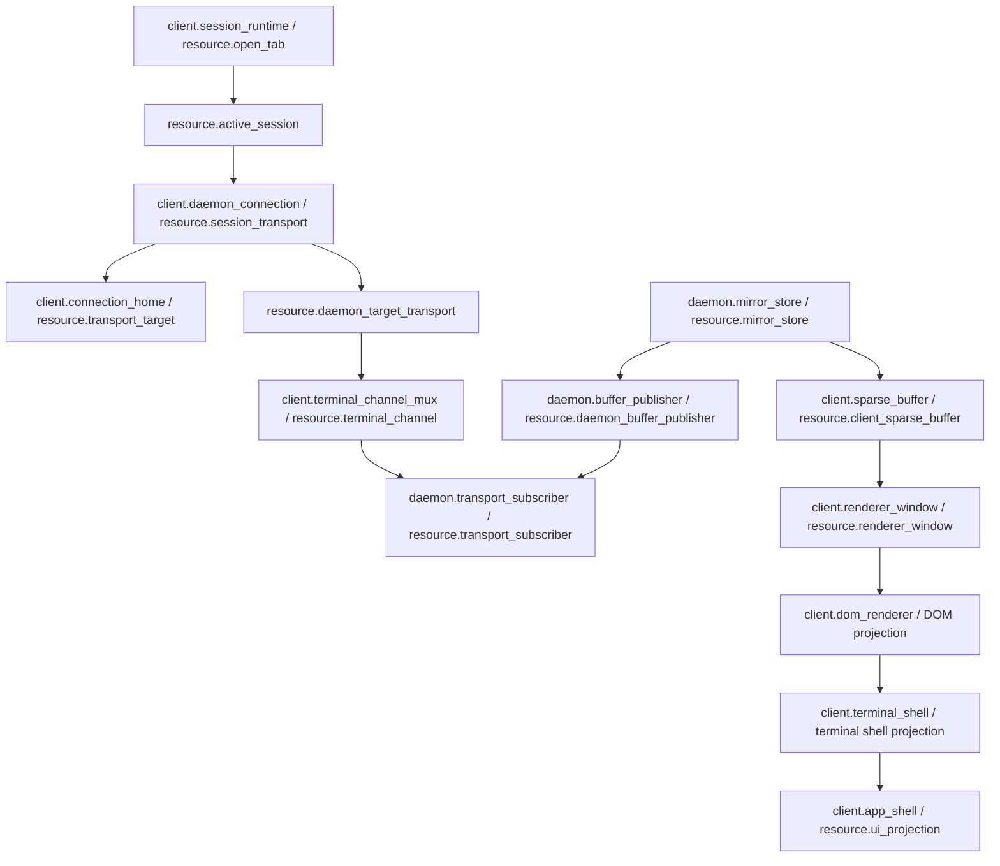
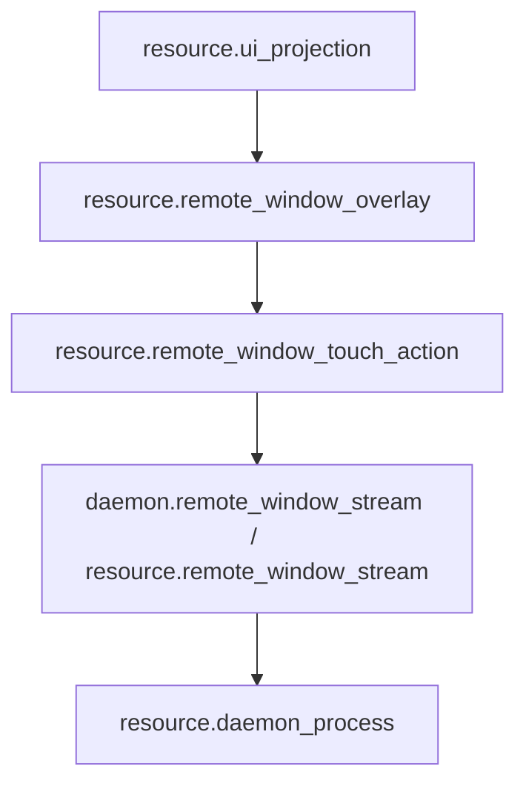
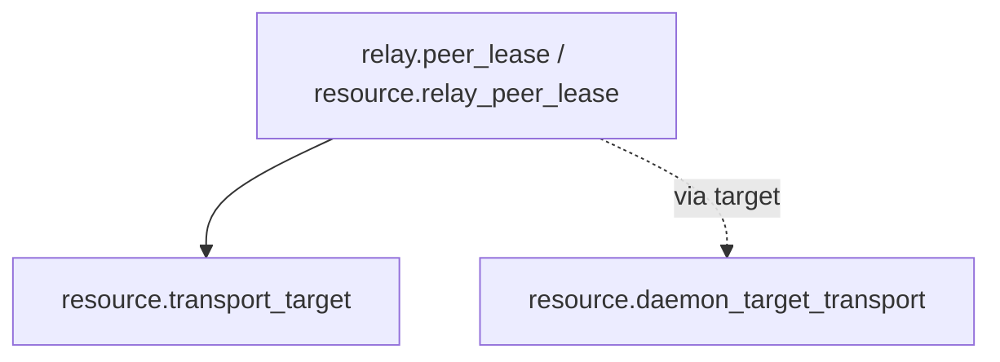

# Project Module Map

Date: 2026-07-26

Machine truth:

- `docs/module-registry.json`
- `docs/edge-registry.json`
- `docs/resource-registry.json`

This page is the human review surface. It exists so resource ownership, module ownership, and allowed edges are decided before function-map or runtime refactor work.

## Rule

Resource registry owns truth resources. Module registry groups resources into runtime boundaries. Edge registry is the only allowed cross-module connection list. Function map binds feature-local code after the resource/module/edge graph is explicit.

Implementation order:

```text
resource registry
-> module registry
-> edge registry
-> function map
-> mainline call map
-> tests/gates
-> runtime refactor
```

No application feature may open a transport directly. All application features must use the declared module interface and the declared edge.

## Owned Paths And Import Graph

`docs/module-registry.json` `owned_paths` maps every non-test source file under `src/` to exactly one module. `docs/edge-registry.json` `import_edges` is the module-level import allowlist derived from the real source import graph. Gate: `src/lib/module-import-graph-truth.test.ts` (wired into `test:feature-registry`, CI, and `prebuild`).

Rules:

- A new source file must land inside an existing `owned_paths` pattern, or the same change must extend `owned_paths`. Unowned files are red.
- A new cross-module import must match an `import_edges` entry, or the same change must declare the edge. Undeclared edges are red.
- Declaring a new edge is an architecture decision, not a formality: check the target module's `forbidden_resources` and this page's boundary sections first.
- `status: pending_removal` marks a known violation kept visible on purpose. The count may only go down; fixing the import removes the entry.
- Module `status: design` means the module is a target-state boundary. Do not report design modules as active truth.
- `shared.terminal_types` / `shared.connection_types` are active modules. Their `owned_paths` bind the current Android stand-in files under `android/src/lib` together with their packages/shared homes, and the import-graph gate treats both sides as owned source.
- Registry-level `promotion_status: pending_review` records that architecture modules are active current truth but production promotion/AppSDK review is not complete. A `promoted` value means the project-level promotion record exists; module `status` remains independent because an active architecture module can still be pending production review. The v2 module registry is currently `promoted`; AppSDK active-version and lifecycle state are authoritative in `.appsdk/project.json`, `.appsdk/records/**`, and `active/lib/zterm-runtime-v2/current.json`; product L5 device/OTA verification remains `pending_review`.
- `module_dag` is active: the real cross-module import graph must stay acyclic. Ownership and import edges are the physical fix, not weakening the gate.

## Module DAG Ownership Baseline

The v2 client DAG baseline physically separates composition from transport primitives:

- `client.session_runtime` owns session transport orchestration/open, socket frame demux, and message dispatch files; `client.daemon_connection` owns the physical transport primitives and `session-context-open-intent-store.ts`.
- `client.connection_home` owns session picker and tmux session list/catalog helpers; `client.runtime` owns app version constants and pure viewport/non-normalizer input helper modules.
- `client.renderer_window` owns preview gesture admission and mirror-fixed zoom; `shared.pane_layout` owns the shared session group/layout re-export helpers.

## Level 0 Modules

| module_id | side | role |
| --- | --- | --- |
| `project.product_runtime` | project | Top-level product boundary across daemon, client, shared protocol, relay, release, and observability. |
| `daemon.runtime` | daemon | Process-local daemon runtime: backend, mirror, subscriber, input, file, schedule, remote-window stream. |
| `client.runtime` | client | Android client runtime: app shell, connection, session, mux channel, buffer, renderer, input, drawer, preview, remote-window overlay, settings. |
| `shared.contract` | shared | Wire protocol, resource contracts, terminal types, connection types, test contracts. |
| `relay.runtime` | relay | Relay account directory, signaling, public update route, and bounded peer lease. |
| `release.runtime` | release | Build, package, promote, update, installed runtime artifacts. |
| `observability.governance` | observability | Debug side channel, registry gates, loop/architecture governance. |

## Daemon Modules

| module_id | owns | consumes | forbidden |
| --- | --- | --- | --- |
| `daemon.runtime_entry` | `resource.daemon_process` | runtime artifact, backend, debug | client active/session/UI/renderer truth |
| `daemon.connection_gateway` | `resource.daemon_connection_gateway` | daemon process, daemon-target transport, terminal channel, subscriber, backend session, relay lease | open tab, active session, UI projection |
| `daemon.terminal_backend` | `resource.terminal_backend`, `resource.backend_session`, `resource.tmux_session`, `resource.wezterm_pane`, `resource.herdr_terminal_session` | daemon process | UI, renderer, open tabs |
| `daemon.source_adapter` | shared terminal source adapter contract | backend and mirror readback contract consumers | mirror revision ownership, backend session truth, client policy |
| `daemon.mirror_writer` | validated source capture and authoritative mirror snapshot commit writes | terminal backend, source adapter | mirror revision, subscriber publication, backend session truth, client policy |
| `daemon.mirror_store` | `resource.mirror_store` | terminal backend, subscriber | active session, renderer, UI |
| `daemon.buffer_publisher` | `resource.daemon_buffer_publisher` | mirror store, subscriber | active session, renderer, UI |
| `daemon.channel_mux` | `resource.daemon_channel_mux` | terminal channel, subscriber | mirror/buffer/renderer/UI truth |
| `daemon.control_gateway` | `resource.daemon_control_gateway` | daemon control center, schedule job, backend session | mirror/transport/file/remote-window/UI truth |
| `daemon.control_center` | `resource.daemon_control_center` | schedule job, backend session | mirror/transport/file/remote-window/UI truth |
| `daemon.session_catalog` | `resource.daemon_session_catalog` | backend session, session idle facts | client active/session, mirror/transport/renderer/UI truth |
| `daemon.transport_subscriber` | `resource.transport_subscriber` | terminal channel, mirror store, daemon input queue | client active/foreground/viewport/follow truth |
| `daemon.input_queue` | `resource.daemon_input_queue` | backend session, tmux session | UI/renderer direct writes |
| `daemon.attachment_delivery` | `resource.attachment_store`, `resource.attachment_delivery` | daemon process | client active/session, mirror, UI projection |
| `daemon.schedule_runtime` | `resource.schedule_job` | backend session | UI/renderer timers |
| `daemon.file_transfer` | `resource.file_transfer`, `resource.remote_screenshot` | backend session, transport subscriber | UI guesses, client window state |
| `daemon.remote_window_stream` | `resource.remote_window_stream`, `resource.remote_window_canvas_layout`, `resource.remote_window_focus_stream`, `resource.remote_window_overview_stream`; pending resources (design): `resource.remote_window_canvas_raw`, `resource.remote_window_canvas_encode`, `resource.remote_window_capture_backpressure`, `resource.remote_window_input_delivery_daemon` | daemon process, transport target, tmux reverse lookup | terminal mirror/buffer/render/UI truth |

Daemon hard boundary:

- Daemon does not own logical client session, active tab, foreground/background, viewport, follow/reading, or renderer position.
- Daemon accepts multiple external transports and clients.
- Daemon exposes terminal-channel subscribers inward; it does not know which client UI is active.
- Daemon channel registry mutations belong to `daemon.channel_mux`; bridge/heartbeat/mux routing must use its list/release APIs instead of directly clearing or deleting `connection.muxChannels`.
- Daemon control ingress belongs to `daemon.control_gateway`; capability, deadline, idempotency, correlation, unique command routing, and bounded audit belong to `daemon.control_center`. Schedule and tmux control commands must not retain a second routing path in `terminal-message-runtime.ts`.
- Daemon backend session catalog and `list-sessions` dispatch belong to `daemon.session_catalog`; `daemon.control_gateway` delegates list-sessions to it and `daemon.schedule_runtime` consumes only the shared catalog builder. No other daemon module owns catalog construction or session idle list-time publication.
- Daemon mirror capture, mirror truth, and subscriber publication are separate owners: `daemon.mirror_writer` commits validated source snapshots; `daemon.mirror_store` owns canonical rows/revision/runtime scheduling; `daemon.buffer_publisher` owns per-subscriber pending/backpressure/head/frame-split delivery and must not own mirror truth or client policy.
- Daemon attachment delivery owns durable outbox files, per-device receipts, HTTP enqueue/read, and transport-message pending/history/asset/receipt projection. `terminal-message-runtime.ts` routes the four attachment message types only; it must not reimplement query/read/receipt logic.
- Daemon file transfer transport-message projection belongs to `daemon.file_transfer`; `terminal-message-runtime.ts` routes paste/attach/list/download/screenshot/upload messages and raw binary chunks only to `src/server/terminal-file-transfer-message-runtime.ts`, which owns paste/attach pending start projection and delegates exact file/screenshot handling to the file transfer facade.
- Daemon terminal source adapter contract ownership belongs to `daemon.source_adapter`; tmux/Herdr/WezTerm backend and mirror-capture readback consumers import the shared adapter contract from `src/server/terminal-source-adapter.ts` without re-owning kind normalization, source session shape, or readback snapshot shape.

## Client Modules

| module_id | owns | consumes | forbidden |
| --- | --- | --- | --- |
| `client.app_shell` | `resource.platform_terminal_surface`, `resource.ui_projection` | renderer, active session | tmux/mirror/input queue truth |
| `client.composition_root` | `resource.client_composition_root` | plugin host | transport/session/buffer/renderer/plugin implementation/UI truth |
| `client.control_center` | `resource.client_control_center` | plugin host command owner | transport/session/buffer/renderer/plugin implementation/terminal/file/media body truth |
| `client.plugin_host` | `resource.client_plugin_host` | plugin capability registry, plugin UI slot registry | raw socket/store/backend/UI truth |
| `client.debug_console` | `resource.debug_console_ui_contract` | shared terminal types | transport/session/mirror/sparse/renderer/UI projection truth |
| `client.session_drawer_ui` | `resource.session_drawer_ui_contract` | none | transport/session/mirror/sparse/renderer/UI projection truth |
| `client.connection_home` | `resource.transport_target` | relay lease, daemon target transport, UI projection | open tab ownership, tmux truth |
| `client.daemon_connection` | `resource.session_transport`, `resource.daemon_target_transport`, `resource.pending_open_intent` | transport target, terminal channel, relay lease | tmux/mirror/client buffer/renderer/UI ownership |
| `client.session_runtime` | `resource.open_tab`, `resource.active_session` | session transport | sockets, tmux, mirror |
| `client.terminal_channel_mux` | `resource.terminal_channel` | daemon-target transport, subscriber | mirror/buffer/renderer |
| `client.buffer_frame_assembly` | `resource.client_buffer_frame_assembly` | mirror store, sparse buffer | backend/renderer/UI truth |
| `client.sparse_buffer` | `resource.client_sparse_buffer` | shared terminal types | follow/reading/render bottom/UI truth |
| `client.buffer_store` | buffer orchestration runtime | mirror store, sparse buffer, renderer window | tmux/subscriber/UI truth, sparse body truth |
| `client.renderer_window` | `resource.renderer_window` | sparse buffer, UI projection | tmux/subscriber/mirror ownership |
| `client.dom_renderer` | DOM projection | renderer window, UI projection, shared terminal types | request policy, follow/reading/render bottom, sparse/backend truth |
| `client.input_normalizer` | `resource.client_input_normalizer` | committed terminal text from app shell/DOM renderer | session transport, daemon target transport, backend session, tmux, mirror truth |
| `client.reliable_input` | `resource.client_reliable_input_queue` | session transport, daemon target transport | reconnect/open intent, backend/tmux/mirror/renderer/UI truth |
| `client.terminal_shell` | Android terminal shell projection | platform terminal surface, UI projection, renderer window, active session | daemon/backend mutation, sparse/render truth |
| `client.input_runtime` | `resource.platform_input_channel` | session transport, remote-window overlay | backend/tmux direct write |
| `client.session_drawer_preview` | `resource.session_preview_selection`, `resource.session_preview_mode` | UI, open tabs, active session, renderer | transport/backend/mirror ownership |
| `client.remote_window_overlay` | `resource.remote_window_overlay`, `resource.remote_window_touch_action`; pending resources (design): `resource.remote_window_quality_control`, `resource.remote_window_input_delivery_client`, `resource.remote_window_frame_projection`, `resource.remote_window_canvas_encode` | UI, remote-window stream, transport target | terminal mirror/buffer/tmux/daemon capture truth |
| `client.file_browser` | `resource.client_file_browser`, `resource.file_browser_ui_contract` | target mux request, native file store, file transfer, UI | tmux/mirror, new physical transport |
| `client.settings_update` | `resource.client_settings_update`, `resource.settings_update_ui_contract` | release artifact, runtime home, UI | open-tab/session/tmux truth |
| `client.remote_window_ui` | `resource.remote_window_ui_contract` | remote-window overlay projection types | transport/session/mirror/sparse/renderer/UI projection/remote-window media/capture truth |
| `client.quickbar_ui` | `resource.quickbar_ui_contract` | platform input channel contract types | transport/session/mirror/sparse/renderer/UI projection truth |
| `client.terminal_shell_ui` | `resource.terminal_shell_ui_contract` | typed terminal shell slot render contract | transport/session/mirror/sparse/renderer/UI projection/terminal shell truth |

Client connection boundary:

- Client owns exactly one physical connection per daemon target.
- `DaemonTargetId` is stable server identity. It must not include current session name or transient route.
- `RouteCandidateId` is route identity: LAN, Tailscale, WebRTC UDP, Relay/TURN.
- Terminal session is a mux channel over the daemon-target physical transport.
- Heartbeat is target-level, not session-level.
- Drawer, picker, remote-window catalog, file transfer, and terminal body all use the same daemon connection interface.

## Shared Modules

| module_id | role |
| --- | --- |
| `shared.protocol` | Request/response/error wire protocol contract. |
| `shared.resource_contract` | Machine-readable module/resource/edge contracts. |
| `shared.terminal_types` | Terminal geometry, rows, buffer, renderer-facing types. |
| `shared.connection_types` | Target, route candidate, route health, selected route metadata. |
| `shared.plugin_contract` | Plugin manifests, capability ports, lifecycle, unique capability registry, and typed UI slot registry. |
| `shared.control_contract` | Branded control command, result, correlation, deadline, idempotency, and audit contracts. |
| `shared.node_contract` | Runtime node identity, lifecycle, disposal, subscription, and typed adjacent node contracts. |
| `shared.debug_contract` | Versioned debug snapshots, debug events, filters, sensitivity classes, bounded stores, and expiring debug permission contracts. |
| `shared.test_contracts` | Static gates for module, edge, resource, function, and mainline maps. |
| `shared.test_environment` | Deterministic Vitest/jsdom browser Storage and environment bootstrap. |

Shared contract boundary:

- Shared code defines contracts only.
- Shared code must not become mirror, renderer, UI, or daemon runtime truth.
- Runtime capability changes must update protocol docs, module/edge registry, function map, mainline call map, and gates together.

## Relay Modules

| module_id | owns | forbidden |
| --- | --- | --- |
| `relay.account_directory` | account directory facts, daemon endpoint snapshots, public update route | open tabs, active session, mirror, UI |
| `relay.peer_lease` | bounded peer/signaling lease keyed by account + daemon target + concrete client device | terminal channel, subscriber, tmux, mirror, UI |

Relay boundary:

- Relay is route/signaling/account-directory truth only.
- Relay peer lease must not store terminal channel, subscriber, tmux, mirror, active tab, viewport, or UI truth.
- Tailscale/direct routes remain independent and must not depend on Relay success.

## Release And Observability Modules

| module_id | owns |
| --- | --- |
| `release.runtime_home` | `resource.runtime_home` |
| `release.update_artifact` | `resource.release_update_artifact` |
| `release.daemon_artifact` | `resource.daemon_runtime_artifact` |
| `observability.debug_channel` | `resource.debug_channel`, `resource.observability_channel`, `resource.client_debug_hub`, `resource.daemon_debug_hub` |

Release boundary:

- Release/update artifact must promote through deterministic daemon runtime artifact.
- Runtime must not execute authoring source directly.
- Debug observes metadata only and cannot become business truth.

## Required Edges

Core connection and render edges:



Remote-window control edges:



Relay route edges:



## Refactor Implications

Connection refactor target:

- Move duplicated route/socket/channel decisions into `client.daemon_connection`.
- Expose one app-facing daemon connection interface.
- All feature callers send typed requests through that interface.
- Status UI reads connection-module snapshot directly.
- Manual route choice updates the connection module policy; it does not bypass it.

Daemon refactor target:

- Keep daemon client-agnostic.
- Keep physical transport and terminal subscriber detached from active UI/session concepts.
- Make app/window/video/input catalog a daemon-owned resource under `daemon.remote_window_stream`.

Buffer audit target after module split:

- `daemon.mirror_writer` is the one snapshot writer; `daemon.mirror_store` is the one canonical revision/runtime scheduling owner.
- `daemon.buffer_publisher` is the only subscriber publication owner for pending-latest, backpressure, head fanout, and buffer-sync frame split; its per-subscriber backpressure must not lower mirror capture cadence.
- `client.sparse_buffer` only merges absolute rows.
- `client.renderer_window` is the only visible-window truth.
- `client.dom_renderer` owns immutable render snapshot to DOM projection; it cannot request transport or mutate renderer-window truth.
- `client.terminal_shell` owns Android terminal shell projection and shell intents; it consumes DOM/renderer projections but never owns terminal body or visible-window truth.
- Header/head/timestamp checks belong to the declared buffer/render edges, not UI compensation.

## Detailed Module Contracts

### Daemon Runtime

| module_id | input | output | owns | rejects |
| --- | --- | --- | --- | --- |
| `daemon.runtime_entry` | CLI/service start, staged runtime artifact, config, HTTP/WS/RTC bootstrap | health, daemon module wiring, process-local runtime handles | process lifetime and module assembly | UI/session policy, client active truth, runtime source scanning |
| `daemon.connection_gateway` | direct WS, Tailscale WS, WebRTC data channel, Relay peer route | accepted physical peer, mux capability, terminal-channel open request | daemon-facing external connection ingress design | active tab, foreground/background, viewport, renderer state |
| `daemon.terminal_backend` | backend session request, tmux/WezTerm/Herdr session name, control intent | backend session handle, source truth via unified adapter including Herdr recent-tail history/live overlay, explicit backend error | backend identity and lifecycle | UI fallback names, renderer geometry, client session policy |
| `daemon.source_adapter` | backend/mirror source kind and readback contract usage | normalized terminal source kind, source session shape, mirror readback snapshot shape | terminal source adapter contract normalization and boundary in `src/server/terminal-source-adapter.ts` | mirror revision ownership, backend session truth, client viewport/follow/render/UI truth |
| `daemon.mirror_writer` | validated source adapter readback/capture tick | authoritative mirror snapshot commit writes with source-neutral absolute rows, geometry, and cursor | validated source capture, canonicalization, and snapshot commit in `src/server/terminal-mirror-capture.ts` | mirror revision, subscriber publication, backend session truth, client viewport/follow/render/UI truth |
| `daemon.mirror_store` | unified backend adapter readback/capture tick, adapter geometry, input/capture dirty signal | canonical rows, cols, cursor, revision, absolute index, changed spans | terminal mirror truth | client viewport/follow/reading truth, self-written geometry after resize request |
| `daemon.buffer_publisher` | mirror revision, authoritative changed ranges, body-subscription eligibility, physical transport backpressure | per-subscriber bounded pending-latest, merged absolute ranges, explicit flush status, head cache, contiguous same-revision frame split | subscriber buffer-sync publication | mirror truth, source capture, client gap/viewport/follow policy |
| `daemon.control_gateway` | legacy wire control ingress, typed daemon command owner adapters | typed control dispatch through `DaemonControlCenter`, existing wire response/error semantics | authenticated typed control ingress and owner registration | business decisions, terminal/file/media bodies, mirror/transport/UI truth |
| `daemon.control_center` | typed control command, subject, capability list, owner context | capability-gated owner execution, explicit ControlCenterError, bounded audit | capability gate, deadline, idempotency, correlation, unique routing, bounded audit | business truth, mirror/buffer/file/media bodies, transport/session state |
| `daemon.session_catalog` | backend session enumeration, backend-qualified session catalog rows, list-sessions control request | `sessions` payload, `sessionCatalog`, list-time idle facts, explicit `list_sessions_failed` | backend session catalog and `list-sessions` dispatch in `src/server/daemon-session-catalog-runtime.ts` | client active/session, open-tab, mirror, transport subscriber, renderer, UI truth |
| `daemon.transport_subscriber` | terminal-channel subscriber attach, body-subscription intent, physical transport send result/backpressure | channel-scoped body frames, send accounting, backpressure state | body push eligibility and physical send truth | pending-latest publication, mirror truth, session-level heartbeat, UI active state, sparse-buffer ownership |
| `daemon.input_queue` | input frames from terminal channel, reliable input seq/ack metadata | stale/drop/write result, backend write queue, ack/nack | daemon input receive/ack/dedupe/queue/write ordering in `src/server/daemon-input-queue-runtime.ts` plus `src/server/terminal-reliable-input-ack.ts` | object-to-tmux coercion, UI filtering, renderer-side input compensation |
| `daemon.schedule_runtime` | schedule job definitions and ticks | nextFireAt, dispatch result, explicit job status | daemon timer execution truth | page-owned timers, hidden local retries |
| `daemon.file_transfer` | file upload/download/screenshot transfer request | cumulative contiguous upload ACK, file chunks, remote path facts, transfer error | daemon file-transfer and screenshot handoff state | local cwd guesses, UI fake preview success, duplicate/out-of-order ACK inflation |
| `daemon.remote_window_stream` | target catalog request, stream start/stop, window resize, action input, screenshot target manifest | app/window/iTerm2 target manifest, WebRTC sender state, capture metadata, input result | desktop media/capture/input truth | terminal mirror rows as video truth, Android coordinate guesses, client focus queue truth |

Daemon design rules:

- `daemon.connection_gateway` may accept many clients and many routes, but it must expose only physical transport and channel facts inward.
- `daemon.control_center` is a router and policy boundary, not a god object; each daemon command has exactly one owning owner adapter and control params never carry terminal/file/media body truth.
- `daemon.session_catalog` is the only backend session catalog owner; list-sessions must arrive through `daemon.control_gateway`, and schedule republish must reuse the catalog builder rather than constructing a second catalog path.
- `daemon.transport_subscriber` is channel-scoped body delivery. It does not decide which app tab is active.
- `daemon.buffer_publisher` is the subscriber publication owner; `daemon.mirror_writer` commits validated snapshots, `daemon.mirror_store` owns canonical revision and runtime scheduling, and neither may know why a client wants a range.
- `daemon.remote_window_stream` may reverse-map iTerm2 tty to tmux metadata, but terminal mirror/buffer/render resources remain forbidden video/control truth.
- Remote-window canvas raw/layout/encode/focus are pending design resources in `docs/module-registry.json`; active modules must not list them as owned or consumed until their resource status is active.

### Client Runtime

| module_id | input | output | owns | rejects |
| --- | --- | --- | --- | --- |
| `client.app_shell` | page navigation, platform surface metrics, renderer projection, user high-level intent | Connections/Terminal/Settings projection, UI intents | Android presentation shell and UI projection | daemon/backend mutation, tmux direct access |
| `client.composition_root` | App composition, declared runtime port values | resolved declared runtime ports | port binding/validation and App-level plugin-host composition | transport/session/buffer/renderer ownership, plugin implementation, business truth |
| `client.control_center` | App/plugin control intents, declared capabilities | routed ControlResult/ControlError, bounded audit entries | control authorization, capability gate, deadline, idempotency, correlation, unique command routing, bounded audit | business decisions, terminal/file/media bodies, transport/session/buffer/renderer ownership, plugin implementation |
| `client.plugin_host` | App composition, declared plugin manifests, host-level capability injection | plugin lifecycle, declared capability binding, plugin-provided capabilities | client plugin host and capability registry consumption | raw socket/store/backend/UI projection truth |
| `client.debug_console` | typed debug console UI slot contract, terminal debug session projection, debug overlay render | plugin-provided `terminal.debug-console` slot render | `resource.debug_console_ui_contract`, shared terminal types | transport/session/mirror/sparse/renderer/UI projection truth |
| `client.session_drawer_ui` | typed session drawer UI slot contract | plugin-provided `terminal.session-drawer` slot render | `resource.session_drawer_ui_contract` | transport/session/mirror/sparse/renderer/UI projection truth |
| `client.connection_home` | saved host, relay directory, route candidates, user server choice | named server rows, target identity, route candidate projection | server/daemon target projection | current tab ownership, session creation, socket open |
| `client.daemon_connection` | active daemon target, route policy, open/resume request, manual route override | physical transport snapshot, route health, target status, target request interface | one client physical connection per daemon target | per-session socket ownership, UI route bypass, buffer/renderer truth |
| `client.session_runtime` | explicit open/close/switch/resume intent | current-process open tabs, active session id | tab/session client truth | cold tab restore, daemon-driven auto close, socket lifecycle |
| `client.terminal_channel_mux` | daemon-target physical transport, tmux session id/name, channel open/close/body-subscription | terminal channel id, channel frames, channel error | per-session mux channel | physical route selection, mirror write, renderer repaint |
| `client.buffer_frame_assembly` | validated authoritative wire frames and shared protocol frame bounds | complete continuous assembled frame, explicit rejection truth, exact repair range, one dispatched repair per retained revision | bounded authoritative frame assembly resource | sparse apply, renderer policy, wire ingress routing |
| `client.wire_ingress` | validated channel frame ingress normalization, frame identity decoding, terminal cursor normalization | normalized buffer payload and cursor state ready for frame assembly | client wire ingress normalization | feature decisions, sparse apply, renderer/UI policy |
| `client.sparse_buffer` | resolved absolute-row sparse commits | immutable sparse rows by absolute index, missing ranges | local sparse buffer truth | follow/reading state, tmux layout truth, transport/planner policy |
| `client.buffer_store` | daemon mirror patches and head/range responses | sparse rows by absolute index, missing ranges, repair demand | buffer orchestration runtime, head/tail refresh truth | sparse body truth, visible follow/reading state, tmux layout truth |
| `client.renderer_window` | sparse rows, visible demand, stage geometry, user scroll/pan | visible range demand, follow/reading/renderBottomIndex, immutable render snapshot projection | visible-window truth | socket retry, daemon range policy, DOM projection, body repaint from metadata-only head |
| `client.dom_renderer` | immutable render snapshots and visible row demand | DOM rows, preview rows, visual scale layer | DOM projection from immutable render snapshots | request policy, follow/reading/renderBottomIndex, sparse/backend truth |
| `client.terminal_shell` | renderer/DOM projections, shell/user intent | terminal stage shell, status, quickbar shell, copy menu, shell skin, keyboard lift | Android terminal shell projection and shell intents | daemon/backend mutation, sparse/render truth, raw transport access |
| `client.input_runtime` | IME, QuickBar, hardware key, image/text paste, active input context | terminal input frame or remote-window action/text/key intent | platform input channel | backend direct write, terminal normalization for remote-window raw text |
| `client.session_drawer_preview` | drawer open, live sessions, selected preview ids, gestures | drawer projection, preview selection, preview mode layout | session list/preview projection | transport open, backend kill outside explicit owner, mirror mutation |
| `client.remote_window_overlay` | target catalog projection, stream state, touch/keyboard/screenshot/quality/fill UI | overlay state, action records, stream/screenshot/quality intents | remote-window UI/action classification | daemon focus truth, capture truth, terminal mirror reuse |
| `client.file_browser` | file-transfer catalog, preview/download/upload intent plus `contracts/file-transfer-throughput.json`; typed `terminal.file-browser` slot render contract | file browser rows, preview intent, selection intent, bounded upload window, bounded native write batches, plugin-provided FileTransferSheet projection | client file browser projection, transfer flow-control policy, and typed file browser UI slot contract; TypeScript and Android native limits bind to one machine contract | remote cwd guesses, direct daemon filesystem truth, per-chunk stop-and-wait, unbounded burst, independently edited TS/Java limits |
| `client.settings_update` | config transfer form, update route candidates, shared Settings UI primitives; typed `settings.update` slot render contract | update/config projection, update check/install intent, plugin-provided AppUpdateSection projection | Settings config/update UI projection and typed settings update UI slot contract | connection target/server profile projection, tab/session restore, forced Relay gate |
| `client.remote_window_ui` | typed remote window UI slot contract | plugin-provided `terminal.remote-window` slot render | `resource.remote_window_ui_contract` | transport/session/mirror/sparse/renderer/UI projection/remote-window media/capture truth |
| `client.quickbar_ui` | typed quickbar UI slot contract | plugin-provided `terminal.quickbar` slot render | `resource.quickbar_ui_contract` | transport/session/mirror/sparse/renderer/UI projection truth |
| `client.terminal_shell_ui` | typed terminal shell UI slot contract | plugin-provided `terminal.shell` slot render | `resource.terminal_shell_ui_contract` | transport/session/mirror/sparse/renderer/UI projection/terminal shell truth |

Client design rules:

- `client.daemon_connection` is the only module allowed to choose and maintain a physical route.
- `client.composition_root` is the only App-level declared runtime port binding owner; duplicate/unbound/missing ports fail before use.
- `client.control_center` is the only client control command routing/policy owner; one command type has exactly one owner and control params never carry terminal/file/media body truth.
- `client.plugin_host` is the only client plugin host owner. Plugins receive declared capabilities only; they cannot read raw sockets, owner stores, daemon handlers, terminal body/render truth, or UI projection resources.
- `client.debug_console` owns the typed debug console UI contract and debug overlay renderer; it is provided through the plugin host UI slot registry and never owns transport, session, mirror, sparse, renderer, or UI projection truth.
- `client.session_drawer_ui` owns the typed session drawer UI slot contract; the plugin-provided drawer render is supplied through the plugin host UI slot registry and TerminalPage never imports or renders TerminalSessionDrawer directly. It never owns transport, session, mirror, sparse, renderer, or UI projection truth.
- `client.file_browser` owns the typed file browser UI slot contract through `src/lib/plugin-file-browser/file-browser-contract.ts`; the plugin-provided FileTransferSheet render is supplied through the plugin host UI slot registry and TerminalPage never imports or renders FileTransferSheet directly. It never owns transport, session, mirror, sparse, renderer, or UI projection truth.
- `client.settings_update` owns the typed settings update UI slot contract through `src/lib/plugin-settings-update/settings-update-contract.ts`; the plugin-provided AppUpdateSection render is supplied through the plugin host UI slot registry and SettingsPage never imports or renders AppUpdateSection directly. It never owns transport, session, mirror, sparse, renderer, open-tab, or UI projection truth.
- `client.remote_window_ui` owns the typed remote window UI slot contract through `src/lib/plugin-remote-window/remote-window-contract.ts`; the plugin-provided RemoteWindowOverlay render is supplied through the plugin host UI slot registry and TerminalPage never imports or renders RemoteWindowOverlay directly. It never owns transport, session, mirror, sparse, renderer, UI projection, remote-window media/capture, or touch dispatch truth.
- `client.quickbar_ui` owns the typed quickbar UI slot contract through `src/lib/plugin-quickbar/quickbar-contract.ts`; the plugin-provided TerminalQuickBar render is supplied through the plugin host UI slot registry and TerminalPage never imports or renders TerminalQuickBar directly. It consumes only `resource.platform_input_channel` contract types and never owns transport, session, mirror, sparse, renderer, UI projection, or input normalization truth.
- `client.terminal_shell_ui` owns the typed terminal shell UI slot contract through `src/lib/plugin-terminal-shell/terminal-shell-contract.ts`; the plugin-provided status/stage/copy/quickbar-shell/network-banner render is supplied through the plugin host UI slot registry and TerminalPage never imports or renders `TerminalConnectionStatusStrip`, `TerminalPageCopyMenu`, `TerminalPageStageShell`, `terminal-page-shell-ui`, `TerminalQuickBarShell`, or `TerminalNetworkBanner` directly. It never owns transport, session, mirror, sparse, renderer, UI projection, or terminal shell/status/copy/stage truth.
- `client.terminal_channel_mux` owns channel truth through `src/lib/terminal-channel-mux-runtime.ts` (`TerminalChannelMuxStore`) and may open or recover a channel, not the underlying physical connection unless `client.daemon_connection` declares it failed.
- `client.buffer_frame_assembly` owns `resource.client_buffer_frame_assembly` through `src/lib/buffer-frame-assembly/session-buffer-frame-assembly.ts`; incomplete frames must never reach `client.sparse_buffer` sparse apply.
- `client.wire_ingress` owns `src/lib/wire-ingress/buffer-wire-normalize.ts`; normalized wire payloads leave this owner only through `client.buffer_store` / `client.session_runtime` typed imports before frame assembly.
- `client.sparse_buffer` owns `resource.client_sparse_buffer` through `src/lib/session-buffer-store.ts`; `client.buffer_store` orchestrates planner/pull/repair and consumes sparse truth without owning it.
- `client.sparse_buffer`, `client.buffer_store`, and `client.renderer_window` are deliberately split: absolute body truth, request/repair orchestration, and visible-window position cannot become one state object.
- Drawer, preview, file browser, remote-window catalog, and settings must all call existing owner interfaces; they must not create separate sockets.

### Shared Contract

| module_id | input | output | owns | rejects |
| --- | --- | --- | --- | --- |
| `shared.protocol` | feature request/response/error semantics | typed wire frames and capability contracts | protocol shape | runtime state ownership |
| `shared.resource_contract` | resource/module/edge docs | machine-readable manifests and schema expectations | architecture contract authoring | hidden runtime discovery |
| `shared.terminal_types` | terminal rows, geometry, buffer metadata | shared terminal DTOs | type contract only | renderer/mirror business decisions |
| `shared.connection_types` | target identity, route candidates, route health | shared connection DTOs | type contract only | route selection runtime |
| `shared.plugin_contract` | plugin manifests, capability ports, lifecycle contracts | unique capability registry, typed UI slot registry, and plugin contract types | capability/UI slot contract only | plugin runtime state, raw business resource access |
| `shared.control_contract` | control commands, results, correlation ids, deadlines, idempotency keys, audit entries | branded control contract types | control contract only | runtime state, business routing, terminal/file/media body truth |
| `shared.test_contracts` | registry and black-box gate requirements | reusable test contract expectations | test contract surface | feature-specific runtime implementation |
| `shared.test_environment` | Vitest/jsdom bootstrap | in-memory browser Storage | test environment only | runtime state, terminal/buffer/renderer truth |

Shared design rules:

- Shared modules define types and contracts. They cannot decide routes, repaint rows, or start daemon work.
- Protocol changes must update request, response, and error chains in `docs/edge-registry.json`.
- New shared types should map back to a resource/module/edge entry before implementation.

### Relay Runtime

| module_id | input | output | owns | rejects |
| --- | --- | --- | --- | --- |
| `relay.account_directory` | daemon registration, account auth, endpoint/session directory updates | account-scoped daemon/device/endpoint/session directory, public update route | relay directory truth | open tabs, UI current session, mirror rows |
| `relay.peer_lease` | concrete client device id, daemon target id, route/signaling peer state | idle-timeout bounded reusable peer/signaling lease | route/signaling lease | terminal channel, subscriber, tmux, mirror, active tab, UI truth |

Relay design rules:

- Directory can help discover daemon targets and route candidates; it cannot create app tabs.
- Peer lease may speed resume for the same concrete client device; another phone must get a separate lease.
- Relay failure must not invalidate direct/Tailscale route candidates.

### Release / Observability

| module_id | input | output | owns | rejects |
| --- | --- | --- | --- | --- |
| `release.runtime_home` | configured runtime root | staged state root and runtime home facts | runtime home truth | UI/session policy |
| `release.update_artifact` | build outputs and release verifiers | APK/update/daemon release artifacts | release artifact source | direct daemon start |
| `release.daemon_artifact` | verified staged daemon bundle | deterministic runtime artifact consumed by process start | executable artifact truth | authoring source execution |
| `observability.debug_channel` | bounded metadata, trace, logs, diagnostics, HTTP observability ingestion | debug snapshot, trace summary, evidence metadata, accepted observability response | observe-only diagnostics; dedicated HTTP channel is default-deny and POST-only for mutation | business payload truth, terminal text ownership, terminal mux/session transport dependency |
| `observability.appsdk_governance` | package prebuild, CI, and release gate intent | exact locked AppSDK record-graph verification result | `resource.appsdk_compiler_identity` project-side preflight | product runtime truth, second compiler path, Active/Protected mutation |

Release / observability design rules:

- Release artifact must promote to daemon artifact before runtime start.
- Observability can explain a failure; it cannot make a request successful or alter business payload.
- `resource.observability_channel` is the dedicated target-level HTTP side channel for bounded client log/snapshot ingestion and expiring debug control. It must not depend on active session, terminal channel, transport subscriber, mirror, sparse buffer, renderer, or UI truth.
- `observability.appsdk_governance` resolves and validates one AppSDK executable, then uses that same absolute path for record verification. AppSDK remains the compiler/record owner; the project module cannot duplicate compiler or lifecycle implementation.

## Current Feature To Module Map

| feature_id | primary modules | notes |
| --- | --- | --- |
| `terminal.transport_lifecycle` | `client.daemon_connection`, `client.terminal_channel_mux`, `daemon.connection_gateway`, `daemon.channel_mux`, `daemon.transport_subscriber`, `relay.peer_lease`, `shared.connection_types` | next refactor target for one physical connection per daemon target. |
| `terminal.buffer_render` | `daemon.mirror_store`, `daemon.buffer_publisher`, `daemon.transport_subscriber`, `client.sparse_buffer`, `client.buffer_store`, `client.renderer_window`, `client.dom_renderer`, `client.terminal_shell`, `shared.terminal_types` | source-to-DOM truth flows daemon mirror -> buffer publisher -> transport subscriber -> client sparse -> renderer window -> DOM renderer -> terminal shell; next audit target is row freshness and packaged device evidence. |
| `terminal.daemon_input` | `client.input_runtime`, `client.terminal_channel_mux`, `daemon.input_queue`, `daemon.terminal_backend`, `shared.protocol` | input retry/stale/drop stays outside renderer/UI. |
| `desktop.remote_window_stream` | `client.remote_window_overlay`, `daemon.remote_window_stream`, `client.daemon_connection`, `shared.protocol` | video/control uses terminal transport as control plane but not terminal mirror truth. |
| `terminal.session_preview` | `client.session_drawer_preview`, `client.renderer_window`, `client.session_runtime` | preview uses existing open sessions and render truth only. |
| `relay.account_directory` | `relay.account_directory`, `client.connection_home`, `client.daemon_connection` | directory enriches target candidates; it does not own saved hosts or tabs. |
| `relay.route_selection` | `client.daemon_connection`, `client.connection_home`, `relay.peer_lease`, `shared.connection_types` | route choice owned by connection module. |
| `settings.config_transfer` | `client.settings_update`, `release.update_artifact`, `client.connection_home` | update route projection belongs to Settings/update owner. |
| `daemon.file_transfer` | `daemon.file_transfer`, `client.file_browser`, `client.input_runtime` | file/image transfer must use daemon file-transfer owner. |
| `daemon.source_adapter` | `daemon.source_adapter`, `daemon.terminal_backend`, `daemon.mirror_store` | source adapter contract is one physical daemon contract owner shared by backend and mirror readback; it never owns mirror revision or client policy. |
| `daemon.mirror_writer` | `daemon.mirror_writer`, `daemon.source_adapter`, `daemon.mirror_store` | validated source capture and authoritative mirror snapshot commit writes are one physical owner; mirror store owns revision and canonical truth; writer never owns subscriber or client policy. |
| `shared.node_contract` | `shared.node_contract` | node identity/lifecycle/disposal/subscription contract truth is a shared physical owner; it never owns business or routing state. |
| `shared.debug_contract` | `shared.debug_contract`, `observability.debug_channel` | shared debug contract owns snapshot/event/filter/sensitivity/permission types; client and daemon observability hubs consume it without owning shared contract truth. |
| `client.observability` | `client.observability`, `observability.debug_channel`, `shared.debug_contract` | bounded client debug snapshot/event/export truth is a client observability owner; it never touches session/transport/mirror/buffer/renderer/UI truth. |
| `daemon.observability` | `daemon.observability`, `observability.debug_channel`, `shared.debug_contract` | bounded daemon debug event/snapshot/permission truth is a daemon observability owner; it never touches active session/transport/mirror/buffer/renderer/UI truth. |
| `client.debug_console` | `client.debug_console`, `client.plugin_host`, `shared.plugin_contract` | debug console UI is a plugin-provided typed slot; App/TerminalPage consume the render contract without a direct overlay import. |
| `client.session_drawer_ui` | `client.session_drawer_ui`, `client.plugin_host`, `shared.plugin_contract` | session drawer UI is a plugin-provided typed slot; App/TerminalPage consume the render contract without a direct TerminalSessionDrawer import. |
| `client.settings_update_ui` | `client.settings_update`, `client.plugin_host`, `shared.plugin_contract` | settings update UI is a plugin-provided typed slot; App/SettingsPage consume the render contract without a direct AppUpdateSection import. |
| `client.remote_window_ui` | `client.remote_window_ui`, `client.plugin_host`, `shared.plugin_contract` | remote window UI is a plugin-provided typed slot; App/TerminalPage consume the render contract without a direct RemoteWindowOverlay import. |
| `client.quickbar_ui` | `client.quickbar_ui`, `client.plugin_host`, `client.input_runtime`, `shared.plugin_contract` | quickbar UI is a plugin-provided typed slot; App/TerminalPage consume the render contract without a direct TerminalQuickBar import. |
| `client.terminal_shell_ui` | `client.terminal_shell_ui`, `client.plugin_host`, `shared.plugin_contract` | terminal shell UI is a plugin-provided typed slot; App/TerminalPage consume the render contract without a direct status/stage/copy/quickbar-shell/network-banner import. |

## Refactor Acceptance Shape

When implementing a future refactor:

1. Pick `feature_id`.
2. Pick `module_id` owners from `docs/module-registry.json`.
3. Pick `edge_id` paths from `docs/edge-registry.json`.
4. Update function map and mainline call map with real symbols.
5. Add positive and negative gates from `docs/testing/module-edge-registry-test-design.md`.
6. Only then change runtime code.

For the connection refactor, the expected black-box shape is:

- opening N sessions on one daemon target uses one physical connection.
- switching sessions changes active channel/body subscription only.
- foreground/background within idle timeout does not rebuild physical transport.
- drawer/session picker/remote-window catalog all use target request interface.
- target-level heartbeat remains one timer.
- killing a channel does not kill the physical connection.
- physical route failure records route health and rebuilds only through `client.daemon_connection`.

## Verification

Static gates:

- `src/lib/module-registry-truth.test.ts`
- `src/lib/edge-registry-truth.test.ts`
- `src/lib/resource-registry-truth.test.ts`
- `src/lib/function-map-resource-truth.test.ts`
- `src/lib/mainline-resource-call-map.test.ts`

Design gate:

- `docs/testing/module-edge-registry-test-design.md`

Runtime gates are not implied by this document. Runtime refactor requires feature-specific black-box and live tests from each feature map.
