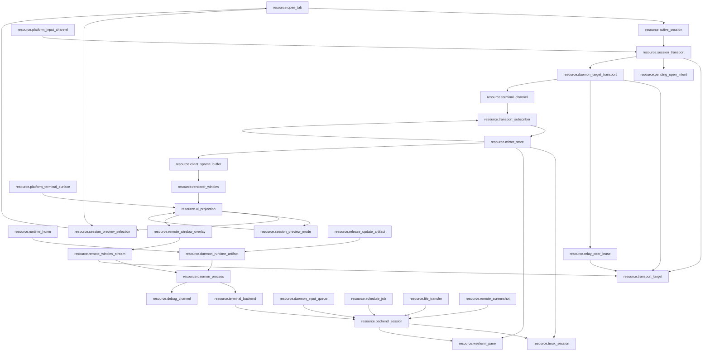

# Global Resource Map

Date: 2026-07-12

`docs/resource-registry.json` is the top-level machine-readable truth for global zterm resources. This file is the human review surface for the same graph.

## Scope

Global scope includes:

- daemon process, daemon runtime artifact, runtime home, release/update artifacts, and debug channels.
- Android, Mac, and Windows platform terminal surfaces.
- terminal backend resources, including tmux and Windows WezTerm.
- client session, transport, input, buffer, renderer, and UI projection resources.
- CLI, release, update, debug, file transfer, schedule, screenshot, and remote window stream side resources.

## Resource Families

| family | resource ids | owner rule |
| --- | --- | --- |
| Global runtime | `resource.runtime_home`, `resource.daemon_runtime_artifact`, `resource.daemon_process`, `resource.release_update_artifact`, `resource.debug_channel` | Runtime consumes compiled/staged artifacts and explicit runtime home truth. Debug observes only. |
| Platform client | `resource.open_tab`, `resource.active_session`, `resource.session_transport`, `resource.daemon_target_transport`, `resource.terminal_channel`, `resource.transport_target`, `resource.pending_open_intent`, `resource.platform_terminal_surface`, `resource.platform_input_channel` | Platform clients own user intent, daemon-target physical transport identity, and terminal channel identity, not backend resources. |
| Relay runtime | `resource.relay_peer_lease` | Relay may preserve an idle-timeout bounded peer/signaling lease per concrete client device and daemon target route for 30 minutes. It must not preserve tmux/session/UI truth, and clients without a concrete device id are rejected. |
| Daemon/backend | `resource.terminal_backend`, `resource.backend_session`, `resource.tmux_session`, `resource.wezterm_pane`, `resource.mirror_store`, `resource.transport_subscriber`, `resource.daemon_input_queue`, `resource.schedule_job`, `resource.file_transfer`, `resource.remote_screenshot`, `resource.remote_window_stream` | Daemon owns backend sessions, physical subscribers, mirror truth, input queues, and daemon side jobs. It does not own client active/foreground/viewport/follow truth. Remote window stream owns desktop media capture/input truth, not terminal buffer truth. |
| Client buffer/render | `resource.client_sparse_buffer`, `resource.renderer_window`, `resource.ui_projection`, `resource.session_preview_selection`, `resource.session_preview_mode`, `resource.remote_window_overlay` | Client buffer consumes daemon mirror patches. Renderer declares visible demand. UI, preview, and remote-window overlay resources project state and emit intent only. |

## Allowed Direct Relations

## Required Indirect Relations

| source | target | required path |
| --- | --- | --- |
| `resource.ui_projection` | `resource.session_transport` | via `resource.active_session` |
| `resource.renderer_window` | `resource.tmux_session` | via `resource.client_sparse_buffer -> resource.mirror_store` |
| `resource.renderer_window` | `resource.wezterm_pane` | via `resource.client_sparse_buffer -> resource.mirror_store` |
| `resource.platform_input_channel` | `resource.tmux_session` | via `resource.session_transport -> resource.daemon_target_transport -> resource.terminal_channel -> resource.transport_subscriber -> resource.daemon_input_queue -> resource.backend_session` |
| `resource.platform_input_channel` | `resource.wezterm_pane` | via `resource.session_transport -> resource.daemon_target_transport -> resource.terminal_channel -> resource.transport_subscriber -> resource.daemon_input_queue -> resource.backend_session` |
| `resource.platform_terminal_surface` | `resource.backend_session` | via `resource.active_session -> resource.session_transport -> resource.daemon_target_transport -> resource.terminal_channel -> resource.transport_subscriber -> resource.mirror_store` |
| `resource.release_update_artifact` | `resource.daemon_process` | via `resource.daemon_runtime_artifact` |
| `resource.session_transport` | `resource.transport_subscriber` | via `resource.daemon_target_transport -> resource.terminal_channel` |
| `resource.session_transport` | `resource.client_sparse_buffer` | via `resource.daemon_target_transport -> resource.terminal_channel -> resource.transport_subscriber -> resource.mirror_store` |
| `resource.daemon_target_transport` | `resource.transport_subscriber` | via `resource.terminal_channel` |
| `resource.relay_peer_lease` | `resource.daemon_target_transport` | via `resource.transport_target` |
| `resource.remote_window_overlay` | `resource.transport_target` | via `resource.active_session -> resource.session_transport -> resource.daemon_target_transport` |
| `resource.remote_window_stream` | `resource.tmux_session` | via `resource.daemon_input_queue -> resource.backend_session` |

## Forbidden Direct Relations

| forbidden edge | reason |
| --- | --- |
| `resource.ui_projection -> resource.session_transport` | UI and drawer emit intent only through active-session/session-transport owner. |
| `resource.session_transport -> resource.transport_subscriber` | New multiplex path must reach daemon subscribers through `daemon_target_transport -> terminal_channel`. |
| `resource.daemon_target_transport -> resource.mirror_store` | Physical target transport must demux through terminal channels and subscribers before mirror truth. |
| `resource.daemon_target_transport -> resource.client_sparse_buffer` | Physical target transport cannot write client buffer without channel demux and buffer runtime. |
| `resource.relay_peer_lease -> resource.terminal_channel` | Relay idle resume preserves route/signaling state only and cannot own terminal channel truth. |
| `resource.relay_peer_lease -> resource.transport_subscriber` | Relay peer lease cannot bind daemon terminal subscribers directly. |
| `resource.relay_peer_lease -> resource.tmux_session` | Relay idle resume cannot store or infer tmux/session business truth. |
| `resource.relay_peer_lease -> resource.mirror_store` | Relay peer lease is route truth only and cannot observe or write terminal mirror rows. |
| `resource.renderer_window -> resource.tmux_session` | Renderer never owns terminal content layout or backend geometry. |
| `resource.renderer_window -> resource.wezterm_pane` | Renderer never owns terminal content layout or backend geometry. |
| `resource.platform_input_channel -> resource.backend_session` | Input must go through current session transport and daemon input queue. |
| `resource.daemon_process -> resource.active_session` | Daemon must not store client active/session/foreground state. |
| `resource.debug_channel -> resource.mirror_store` | Debug side channels observe only and cannot become business truth. |
| `resource.release_update_artifact -> resource.daemon_process` | Runtime must consume promoted deterministic artifacts, not direct release/update outputs. |
| `resource.ui_projection -> resource.remote_window_stream` | UI may only project the overlay and emit intent; daemon/native stream truth owns catalog, coordinates, capture, WebRTC, and input injection. |
| `resource.remote_window_stream -> resource.mirror_store` | Remote window video is desktop media truth and must not reuse terminal mirror rows as video truth. |

## Owner Locks

- `resource.open_tab` is explicit current-process client truth; runtime sessions and daemon facts must not close or merge it, and cold launch must not restore it.
- `resource.session_transport` is the only platform-client path to daemon transport.
- `resource.session_transport` owns client-facing transport lifecycle and channel body-subscription intent. Physical socket truth moves to `resource.daemon_target_transport`; per-session wire identity moves to `resource.terminal_channel`.
- `resource.daemon_target_transport` owns one physical WebSocket/RTC data channel per daemon target route, mux capability negotiation, route diagnostics, and optional Relay peer lease consumption. It must not own active tab, renderer follow, tmux truth, mirror truth, or client sparse buffers.
- `resource.terminal_channel` owns transport-local channel identity for one terminal session and is the only path from daemon-target physical transport to daemon subscriber truth. Unknown, unwrapped, or mismatched channel frames must fail explicitly before reaching buffer/input/file/schedule truth.
- `resource.relay_peer_lease` owns only an idle-timeout bounded Relay peer/signaling lease for one concrete client device and daemon target route. It may rebind that same phone signaling socket identity for 30 minutes before timeout, but it must reject missing client device identity, must not share the lease across phones, and must not store terminal channel, subscriber, tmux, mirror, active-tab, foreground, viewport, or UI truth.
- Android native `BackgroundService` is notification-only platform execution support. It must not become a `resource.session_transport` keepalive owner, acquire CPU WakeLock, request battery-optimization bypass, or keep body/video streams alive while app foreground truth is false.
- `resource.transport_subscriber` owns only physical `bodySubscribed`, send accounting/backpressure, last-sent revision, and bounded pending-latest state. It must not store active tab, foreground, pane visibility, follow, reading, or viewport reasons.
- `resource.mirror_store` is the only daemon canonical terminal content, revision, absolute-index, and geometry truth. Hot-tail range patch and full reconciliation are two validated commit modes inside this one writer, not two truth paths.
- `resource.mirror_store -> resource.transport_subscriber` is the only unsolicited live body broadcast relation. Unsubscribe removes broadcast eligibility without closing the transport, detaching the mirror, or disabling explicit head/range reads.
- `resource.client_sparse_buffer` only merges daemon mirror patches by absolute row.
- `resource.renderer_window` owns follow/reading/render-bottom/visible demand and next-RAF commit only, not terminal content layout or network cadence.
- `resource.session_preview_selection` owns only an ordered 1-6 client preference resolved through current open-tab truth; remote drawer catalog rows must first materialize through the existing session-open owner and persist only the returned local session id; drawer checkbox and in-preview add both route to this owner, add/replacement candidates are every currently open unselected Session, reorder only changes preference order, and tile close removes only that preview target without closing a Session or transport.
- `resource.session_preview_mode` owns preview shell projection plus the captured entry-session projection used only by cancel. Entry does not mutate active session; tile activation emits one explicit switch; Back/right-swipe/close cancellation restores the captured entry session. Buffer, transport, and backend geometry remain untouched.
- `resource.remote_window_overlay` owns only the Android picker/floating/fullscreen projection, default-collapsed iTerm2 pane picker grouping, source-aspect floating resize with toolbar reachability bounds, daemon-frame-aspect receiver projection after stream start, fullscreen aspect-fit/aspect-fill display mode, fullscreen zoom/pan/minimap state, IME-aware fullscreen auto lift, projection-sized effective bitrate selection, Back shrink, minimize, close intent, remote-window screenshot intent, explicit input intent emission for supported app-window OS-event targets, and background close/stop of any active stream. Unzoomed floating/fullscreen single-finger touch stays remote input even when an IME bottom inset exists and is emitted as one recognized `gesture/swipe` command on release; local single-finger pan is reserved for zoomed fullscreen projection, and mouse/trackpad wheel remains pixel scroll input. Screenshot capture is not input and must go through `resource.remote_screenshot` with the selected remote-window target manifest; it must not focus or raise the desktop app. Unsupported `tmux-input` / `iterm2-api` routes are projected as read-only and must not publish a remote-window input context. Aspect-fill cover and daemon-frame-aspect display correction are Android projection only: drawing and pointer normalization use the same actual content rect, and the daemon capture/coordinate truth remains unchanged. It does not compute macOS coordinates, read iTerm2 split trees, perform input injection, or own capture lifecycle.
- `resource.remote_window_stream` owns daemon/native app/window/iTerm2 pane catalog, coordinate manifest, ScreenCaptureKit capture, WebRTC media negotiation/sender lifecycle, receiver attach status, frame metadata, cleanup, input target lease, gesture-to-OS-event simulation, and the client-side daemon-wide target-catalog cache. The cache is keyed by daemon identity (`daemonHostId + bridgeHost + bridgePort + authToken`), not by tmux/session id, so switching sessions on one daemon does not re-enumerate the same desktop app list. Cache expiry is an explicit 60-second projection refresh; a closed transport cannot be hidden by cached data. It may reverse-map iTerm2 `tty` to tmux client/session metadata, but terminal mirror/buffer/render resources are forbidden as video truth. Media negotiation still uses the existing session transport as the control plane; video frames must come only from the daemon capture source. Android derives video ICE servers from the current session traversal route, so Relay/cellular remote-window video does not start a separate no-ICE peer connection.
- `resource.debug_channel` can observe and diagnose through bounded metadata-only trace records, but cannot become request/response business truth or contain terminal text/cells.
- `resource.release_update_artifact` must promote through `resource.daemon_runtime_artifact`; runtime cannot scan authoring directories as capability truth.

## Gate Contract

- `src/lib/resource-registry-truth.test.ts` validates schema, resource id uniqueness, owner feature existence, doc/gate references, relation ids, and forbidden direct edges.
- `src/lib/function-map-resource-truth.test.ts` validates function map resource binding and prevents feature-local maps from inventing resource ids.
- `src/lib/mainline-resource-call-map.test.ts` validates resource metadata on mainline call-map edges and rejects direct forbidden edges.
