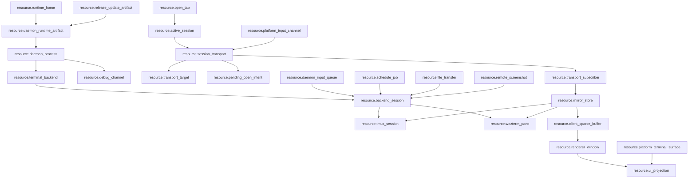

# Global Resource Map

Date: 2026-07-12

`docs/resource-registry.json` is the top-level machine-readable truth for global zterm resources. This file is the human review surface for the same graph.

## Scope

Global scope includes:

- daemon process, daemon runtime artifact, runtime home, release/update artifacts, and debug channels.
- Android, Mac, and Windows platform terminal surfaces.
- terminal backend resources, including tmux and Windows WezTerm.
- client session, transport, input, buffer, renderer, and UI projection resources.
- CLI, release, update, debug, file transfer, schedule, and screenshot side resources.

## Resource Families

| family | resource ids | owner rule |
| --- | --- | --- |
| Global runtime | `resource.runtime_home`, `resource.daemon_runtime_artifact`, `resource.daemon_process`, `resource.release_update_artifact`, `resource.debug_channel` | Runtime consumes compiled/staged artifacts and explicit runtime home truth. Debug observes only. |
| Platform client | `resource.open_tab`, `resource.active_session`, `resource.session_transport`, `resource.transport_target`, `resource.pending_open_intent`, `resource.platform_terminal_surface`, `resource.platform_input_channel` | Platform clients own user intent and transport identity, not backend resources. |
| Daemon/backend | `resource.terminal_backend`, `resource.backend_session`, `resource.tmux_session`, `resource.wezterm_pane`, `resource.mirror_store`, `resource.transport_subscriber`, `resource.daemon_input_queue`, `resource.schedule_job`, `resource.file_transfer`, `resource.remote_screenshot` | Daemon owns backend sessions, physical subscribers, mirror truth, input queues, and daemon side jobs. It does not own client active/foreground/viewport/follow truth. |
| Client buffer/render | `resource.client_sparse_buffer`, `resource.renderer_window`, `resource.ui_projection` | Client buffer consumes daemon mirror patches. Renderer declares visible demand. UI projects state and emits intent only. |

## Allowed Direct Relations

## Required Indirect Relations

| source | target | required path |
| --- | --- | --- |
| `resource.ui_projection` | `resource.session_transport` | via `resource.active_session` |
| `resource.renderer_window` | `resource.tmux_session` | via `resource.client_sparse_buffer -> resource.mirror_store` |
| `resource.renderer_window` | `resource.wezterm_pane` | via `resource.client_sparse_buffer -> resource.mirror_store` |
| `resource.platform_input_channel` | `resource.tmux_session` | via `resource.session_transport -> resource.transport_subscriber -> resource.daemon_input_queue -> resource.backend_session` |
| `resource.platform_input_channel` | `resource.wezterm_pane` | via `resource.session_transport -> resource.transport_subscriber -> resource.daemon_input_queue -> resource.backend_session` |
| `resource.platform_terminal_surface` | `resource.backend_session` | via `resource.active_session -> resource.session_transport -> resource.transport_subscriber -> resource.mirror_store` |
| `resource.release_update_artifact` | `resource.daemon_process` | via `resource.daemon_runtime_artifact` |

## Forbidden Direct Relations

| forbidden edge | reason |
| --- | --- |
| `resource.ui_projection -> resource.session_transport` | UI and drawer emit intent only through active-session/session-transport owner. |
| `resource.renderer_window -> resource.tmux_session` | Renderer never owns terminal content layout or backend geometry. |
| `resource.renderer_window -> resource.wezterm_pane` | Renderer never owns terminal content layout or backend geometry. |
| `resource.platform_input_channel -> resource.backend_session` | Input must go through current session transport and daemon input queue. |
| `resource.daemon_process -> resource.active_session` | Daemon must not store client active/session/foreground state. |
| `resource.debug_channel -> resource.mirror_store` | Debug side channels observe only and cannot become business truth. |
| `resource.release_update_artifact -> resource.daemon_process` | Runtime must consume promoted deterministic artifacts, not direct release/update outputs. |

## Owner Locks

- `resource.open_tab` is explicit persisted client truth; runtime sessions and daemon facts must not close or merge it.
- `resource.session_transport` is the only platform-client path to daemon transport.
- `resource.mirror_store` is the only daemon canonical terminal content and geometry truth.
- `resource.client_sparse_buffer` only merges daemon mirror patches by absolute row.
- `resource.renderer_window` owns follow/reading/render-bottom/visible demand, not terminal content layout.
- `resource.debug_channel` can observe and diagnose, but cannot become request/response business truth.
- `resource.release_update_artifact` must promote through `resource.daemon_runtime_artifact`; runtime cannot scan authoring directories as capability truth.

## Gate Contract

- `src/lib/resource-registry-truth.test.ts` validates schema, resource id uniqueness, owner feature existence, doc/gate references, relation ids, and forbidden direct edges.
- `src/lib/function-map-resource-truth.test.ts` validates function map resource binding and prevents feature-local maps from inventing resource ids.
- `src/lib/mainline-resource-call-map.test.ts` validates resource metadata on mainline call-map edges and rejects direct forbidden edges.
