# Global Resource Map

Date: 2026-07-12

`docs/resource-registry.json` is the top-level machine-readable truth for global zterm resources. This file is the human review surface for the same graph. `docs/module-registry.json` groups those resources into daemon/client/shared/relay/release/observability modules, and `docs/edge-registry.json` is the only machine-readable list of allowed cross-module resource edges.

## Scope

Global scope includes:

- daemon process, daemon runtime artifact, runtime home, release/update artifacts, and debug channels.
- Android, Mac, and Windows platform terminal surfaces.
- terminal backend resources, including tmux and Windows WezTerm.
- client session, transport, input, buffer, renderer, and UI projection resources.
- client composition, control center, plugin host, plugin capability registry, plugin UI slot registry, and typed UI contract resources (debug console, session drawer, file browser, settings update, remote window, quickbar, terminal shell).
- CLI, release, update, debug, file transfer, schedule, screenshot, remote window stream, and remote window canvas side resources.

## Resource Families

### Remote-window quality/gesture target resources

The 2026-08-30 amendment introduces five `design` resources. They are target
architecture, not current runtime truth, until implementation, owned paths,
call/import bindings, paired tests, and registry gates all pass:

| resource | target owner | relation | forbidden shortcut |
| --- | --- | --- | --- |
| `resource.remote_window_quality_control` | `client.remote_window_overlay` | overlay preference/stats -> one single-flight control envelope -> daemon stream quality transaction via active session transport | control/revision/retry/health in video or input payload metadata |
| `resource.remote_window_input_delivery_client` | `client.remote_window_overlay` | touch action -> reliable sequence or continuous latest/merge -> session transport | gesture owner opening sockets; UI claiming physical send success |
| `resource.remote_window_input_delivery_daemon` | `daemon.remote_window_stream` | transport envelope -> dedupe/ACK or continuous age/depth admission -> persistent OS helper | refreshing continuous receive time; dropping reliable release/key/click |
| `resource.remote_window_frame_projection` | `client.remote_window_overlay` | decoded frame callback -> one draw per frame id; overview has independent cadence | display-rAF production drawing path; terminal renderer truth |
| `resource.remote_window_capture_backpressure` | `daemon.remote_window_stream` | captured frame -> one pending latest per lane -> conversion/media | unbounded pipe/queue; increasing depth; Android UI state in daemon |

`resource.remote_window_canvas_raw` and
`resource.remote_window_canvas_encode` remain design-only and are not activated
by this amendment. A native media path can become active only after the bounded
raw path fails its live profile gates and the old production raw path is
physically removed.

| family | resource ids | owner rule |
| --- | --- | --- |
| Global runtime | `resource.runtime_home`, `resource.daemon_runtime_artifact`, `resource.daemon_process`, `resource.release_update_artifact`, `resource.debug_channel`, `resource.observability_channel` | Runtime consumes compiled/staged artifacts and explicit runtime home truth. Debug observes only through the dedicated HTTP observability channel. |
| Platform client | `resource.open_tab`, `resource.active_session`, `resource.visible_pane_session`, `resource.session_transport`, `resource.daemon_target_transport`, `resource.terminal_channel`, `resource.transport_target`, `resource.pending_open_intent`, `resource.platform_terminal_surface`, `resource.platform_input_channel` | Platform clients own user intent, daemon-target physical transport identity, visible pane session projection, and terminal channel identity, not backend resources. |
| Relay runtime | `resource.relay_control_connection`, `resource.relay_account_directory`, `resource.relay_peer_lease` | Relay control is a role-scoped persistent WebSocket carrying endpoint/presence/control truth only. The account directory owns independent account login tokens and projects confirmed daemon candidates; a new login never replaces another device token. Relay may preserve an idle-timeout bounded peer/signaling lease per concrete client device and daemon target route for 30 minutes. None may preserve terminal body, tmux, active-tab, or UI truth. |
| Daemon/backend | `resource.daemon_connection_gateway`, `resource.terminal_backend`, `resource.backend_session`, `resource.tmux_session`, `resource.wezterm_pane`, `resource.herdr_terminal_session`, `resource.mirror_store`, `resource.daemon_buffer_publisher`, `resource.transport_subscriber`, `resource.daemon_channel_mux`, `resource.daemon_input_queue`, `resource.schedule_job`, `resource.file_transfer`, `resource.remote_screenshot`, `resource.remote_window_stream`, `resource.remote_window_canvas_layout`, `resource.remote_window_focus_stream`, `resource.remote_window_overview_stream`; design-only: `resource.remote_window_canvas_raw`, `resource.remote_window_canvas_encode` | Daemon gateway owns endpoint discovery/publication and physical ingress. Daemon owns backend sessions, physical subscribers, mux channel registry, mirror truth, buffer publisher, input queues, and daemon side jobs. It does not own client active/foreground/viewport/follow truth. Herdr is an external single-terminal source; its adapter owns official recent-tail history plus canonical live-tail overlay, and its workspace/layout state never enters daemon truth. Remote window stream owns one typed layout generation, focus/overview capture and group quality budget, source-coordinate input mapping, and explicit cleanup. Active runtime cannot depend on design-only raw/encode resources or terminal buffer truth. |
| Daemon session catalog | `resource.daemon_session_catalog` | Daemon backend session catalog builds backend-qualified session rows and list-time idle facts; it consumes `resource.backend_session` and `resource.session_idle_facts`, and must not own client active/session, mirror, transport, renderer, or UI truth. |
| Daemon control | `resource.daemon_control_gateway`, `resource.daemon_control_center` | Daemon control gateway owns authenticated typed control ingress and owner registration; daemon control center owns capability gate, deadline, idempotency, correlation, unique routing, and bounded audit. Neither owns terminal/file/media body truth. |
| Client buffer/render | `resource.client_buffer_frame_assembly`, `resource.client_sparse_buffer`, `resource.renderer_window`, `resource.ui_projection`, `resource.session_preview_selection`, `resource.session_preview_mode`, `resource.remote_window_overlay` | Frame assembly validates and atomically resolves authoritative wire frames. Client sparse buffer consumes only resolved mirror patches. Renderer declares visible demand. DOM renderer projects immutable render snapshots; terminal shell projects shell/status/quickbar/copy surfaces. UI, preview, and remote-window overlay resources project state and emit intent only. |
| Client input | `resource.client_input_normalizer` | Client committed-text normalization owns only pure text normalization for IME/hardware/paste/quick-action input; it never reads or writes session transport, daemon target transport, backend session, tmux, or mirror truth. |
| Client plugin | `resource.client_composition_root`, `resource.client_plugin_host`, `resource.plugin_capability_registry`, `resource.plugin_ui_slot_registry`, `resource.debug_console_ui_contract`, `resource.session_drawer_ui_contract`, `resource.file_browser_ui_contract`, `resource.settings_update_ui_contract`, `resource.remote_window_ui_contract`, `resource.quickbar_ui_contract`, `resource.terminal_shell_ui_contract` | Client composition root owns declared runtime port binding/validation and App-level plugin-host composition. Plugin host owns one capability-scoped plugin lifecycle and consumes the typed UI slot registry. The shared capability registry owns unique declared capability bindings and rejects undeclared or duplicate providers. The UI slot registry owns unique typed plugin slots. Plugins cannot access raw socket/store/backend/UI truth. |
| Android notification projection | `resource.android_notification_projection` | `client.connection_service` projects at most three mux-open connected session actions with stable `targetKey + channelId` identity, zterm icon, exact session deep link, and bounded matching-session pulse. It consumes service/channel facts through typed IPC; it never owns terminal body, renderer, active-tab, tmux, or physical transport truth. |
| Client control | `resource.client_control_center` | Client control center owns command authorization, capability gating, deadline, idempotency, correlation, unique routing, and bounded audit. It routes to the owning client ControlNode through declared ports and never stores terminal/file/media body truth. |
| Shared foundation contracts | `resource.runtime_node_registry`, `resource.debug_snapshot_registry`, `resource.client_debug_hub`, `resource.daemon_debug_hub` | Shared node contract owns runtime node identity/lifecycle/disposal truth. Shared debug contract owns registered debug snapshot producers and versioned sequences. Client and daemon debug hubs own bounded local snapshot/event/permission truth and export only through `resource.observability_channel`; none owns session, transport, mirror, buffer, renderer, UI, backend, or business payload truth. |

## Allowed Direct Relations

```mermaid
flowchart TD
  RuntimeHome["resource.runtime_home"] --> DaemonArtifact["resource.daemon_runtime_artifact"]
  DaemonArtifact --> DaemonProcess["resource.daemon_process"]
  DaemonProcess --> TerminalBackend["resource.terminal_backend"]
  DaemonProcess --> DaemonConnectionGateway["resource.daemon_connection_gateway"]
  DaemonProcess --> DebugChannel["resource.debug_channel"]
  DaemonProcess --> ObservabilityChannel["resource.observability_channel"]
  RuntimeNodeRegistry["resource.runtime_node_registry"] --> DebugSnapshotRegistry["resource.debug_snapshot_registry"]
  DebugSnapshotRegistry --> ClientDebugHub["resource.client_debug_hub"]
  DebugSnapshotRegistry --> DaemonDebugHub["resource.daemon_debug_hub"]
  ClientDebugHub --> ObservabilityChannel
  DaemonDebugHub --> ObservabilityChannel
  DaemonConnectionGateway --> RelayControl["resource.relay_control_connection"]
  DaemonConnectionGateway --> BackendSession
  RelayControl --> RelayDirectory["resource.relay_account_directory"]
  RelayDirectory --> TransportTarget
  TerminalBackend --> BackendSession["resource.backend_session"]
  BackendSession --> TmuxSession["resource.tmux_session"]
  BackendSession --> WeztermPane["resource.wezterm_pane"]
  BackendSession --> HerdrTerminal["resource.herdr_terminal_session"]
  BackendSession --> SessionCatalog["resource.daemon_session_catalog"]
  OpenTab["resource.open_tab"] --> ActiveSession["resource.active_session"]
  OpenTab --> VisiblePaneSession["resource.visible_pane_session"]
  ActiveSession --> SessionTransport["resource.session_transport"]
  VisiblePaneSession --> SessionTransport
  SessionTransport --> TransportTarget["resource.transport_target"]
  SessionTransport --> PendingOpenIntent["resource.pending_open_intent"]
  SessionTransport --> DaemonTargetTransport["resource.daemon_target_transport"]
  DaemonTargetTransport --> TransportTarget
  DaemonTargetTransport --> RelayPeerLease["resource.relay_peer_lease"]
  RelayPeerLease --> TransportTarget
  DaemonTargetTransport --> TerminalChannel["resource.terminal_channel"]
  TerminalChannel --> TransportSubscriber["resource.transport_subscriber"]
  TransportSubscriber --> MirrorStore["resource.mirror_store"]
  TransportSubscriber --> DaemonInputQueue["resource.daemon_input_queue"]
  TransportSubscriber --> DaemonControlGateway["resource.daemon_control_gateway"]
  DaemonControlGateway --> DaemonControlCenter["resource.daemon_control_center"]
  DaemonControlGateway --> SessionCatalog
  SessionCatalog --> SessionIdleFacts["resource.session_idle_facts"]
  SessionIdleFacts --> TransportSubscriber
  DaemonControlCenter --> ScheduleJob
  DaemonControlCenter --> BackendSession
  MirrorStore --> BufferPublisher["resource.daemon_buffer_publisher"]
  BufferPublisher --> TransportSubscriber
  MirrorStore --> TerminalBackend
  MirrorStore --> ClientBufferFrameAssembly["resource.client_buffer_frame_assembly"]
  ClientBufferFrameAssembly --> ClientSparseBuffer["resource.client_sparse_buffer"]
  ClientSparseBuffer --> RendererWindow["resource.renderer_window"]
  RendererWindow --> DomRenderer["client.dom_renderer / DOM projection"]
  RendererWindow --> InputNormalizer["resource.client_input_normalizer"]
  PlatformSurface["resource.platform_terminal_surface"] --> InputNormalizer
  DomRenderer --> TerminalShell["client.terminal_shell / terminal shell projection"]
  TerminalShell --> UiProjection["resource.ui_projection"]
  UiProjection --> PreviewSelection["resource.session_preview_selection"]
  UiProjection --> PreviewMode["resource.session_preview_mode"]
  UiProjection --> RemoteWindowOverlay["resource.remote_window_overlay"]
  UiProjection --> QuickBarContract["resource.quickbar_ui_contract"]
  QuickBarContract --> PlatformInput["resource.platform_input_channel"]
  PlatformSurface --> TerminalShellUiContract["resource.terminal_shell_ui_contract"]
  PluginHost --> TerminalShellUiContract
  TerminalShellUiContract --> UiProjection
  RemoteWindowOverlay --> RemoteWindowTouchAction["resource.remote_window_touch_action"]
  RemoteWindowTouchAction --> RemoteWindowStream["resource.remote_window_stream"]
  RemoteWindowStream --> DaemonProcess
  RemoteWindowStream --> TransportTarget
  RemoteWindowStream --> RemoteWindowCanvasLayout["resource.remote_window_canvas_layout"]
  RemoteWindowStream --> RemoteWindowFocusStream["resource.remote_window_focus_stream"]
  RemoteWindowStream --> RemoteWindowOverviewStream["resource.remote_window_overview_stream"]
  RemoteWindowFocusStream --> TransportTarget
  RemoteWindowOverviewStream --> TransportTarget
  RemoteWindowOverviewStream --> RemoteWindowCanvasLayout
  RemoteWindowOverviewStream --> RemoteWindowFocusStream
  PreviewSelection --> OpenTab
  PreviewMode --> UiProjection
  PlatformSurface["resource.platform_terminal_surface"] --> UiProjection
  PlatformSurface --> PluginHost["resource.client_plugin_host"]
  PlatformSurface --> CompositionRoot["resource.client_composition_root"]
  PlatformSurface --> ControlCenter["resource.client_control_center"]
  CompositionRoot --> PluginHost
  ControlCenter --> PluginHost
  PluginHost --> PluginCapabilityRegistry["resource.plugin_capability_registry"]
  PluginHost --> UiSlotRegistry["resource.plugin_ui_slot_registry"]
  PlatformSurface --> DebugConsoleContract["resource.debug_console_ui_contract"]
  PluginHost --> DebugConsoleContract
  PlatformSurface --> SessionDrawerContract["resource.session_drawer_ui_contract"]
  PluginHost --> SessionDrawerContract
  PlatformSurface --> FileBrowserContract["resource.file_browser_ui_contract"]
  PluginHost --> FileBrowserContract
  PlatformSurface --> SettingsUpdateContract["resource.settings_update_ui_contract"]
  PluginHost --> SettingsUpdateContract
  PlatformSurface --> RemoteWindowContract["resource.remote_window_ui_contract"]
  PluginHost --> RemoteWindowContract
  RemoteWindowContract --> RemoteWindowOverlay
  PlatformInput["resource.platform_input_channel"] --> SessionTransport
  ClientFileBrowser["resource.client_file_browser"] --> TargetMuxRequest["resource.target_mux_request"]
  ClientFileBrowser --> ClientNativeFileStore["resource.client_native_file_store"]
  TargetMuxRequest --> DaemonTargetTransport
  TransportSubscriber --> FileTransfer
  DaemonInputQueue --> BackendSession
  ScheduleJob["resource.schedule_job"] --> BackendSession
  FileTransfer["resource.file_transfer"] --> BackendSession
  RemoteScreenshot["resource.remote_screenshot"] --> BackendSession
  ReleaseArtifact["resource.release_update_artifact"] --> DaemonArtifact
  OpenTab --> PreviewSelection
```

## Required Indirect Relations

| source | target | required path |
| --- | --- | --- |
| `resource.ui_projection` | `resource.session_transport` | via `resource.active_session` |
| `resource.visible_pane_session` | `resource.session_transport` | direct; visible split panes may refresh their existing session transport without becoming active-session truth |
| `resource.renderer_window` | `resource.tmux_session` | via `resource.client_sparse_buffer -> resource.client_buffer_frame_assembly -> resource.mirror_store -> resource.terminal_backend -> resource.backend_session` |
| `resource.renderer_window` | `resource.wezterm_pane` | via `resource.client_sparse_buffer -> resource.client_buffer_frame_assembly -> resource.mirror_store -> resource.terminal_backend -> resource.backend_session` |
| `resource.renderer_window` | `resource.herdr_terminal_session` | via `resource.client_sparse_buffer -> resource.client_buffer_frame_assembly -> resource.mirror_store -> resource.terminal_backend -> resource.backend_session` |
| `resource.platform_input_channel` | `resource.tmux_session` | via `resource.session_transport -> resource.daemon_target_transport -> resource.terminal_channel -> resource.transport_subscriber -> resource.daemon_input_queue -> resource.backend_session` |
| `resource.platform_input_channel` | `resource.wezterm_pane` | via `resource.session_transport -> resource.daemon_target_transport -> resource.terminal_channel -> resource.transport_subscriber -> resource.daemon_input_queue -> resource.backend_session` |
| `resource.platform_terminal_surface` | `resource.backend_session` | via `resource.active_session -> resource.session_transport -> resource.daemon_target_transport -> resource.terminal_channel -> resource.transport_subscriber -> resource.mirror_store` |
| `resource.release_update_artifact` | `resource.daemon_process` | via `resource.daemon_runtime_artifact` |
| `resource.session_transport` | `resource.transport_subscriber` | via `resource.daemon_target_transport -> resource.terminal_channel` |
| `resource.session_transport` | `resource.client_sparse_buffer` | via `resource.daemon_target_transport -> resource.terminal_channel -> resource.transport_subscriber -> resource.mirror_store -> resource.client_buffer_frame_assembly` |
| `resource.daemon_target_transport` | `resource.transport_subscriber` | via `resource.terminal_channel` |
| `resource.relay_peer_lease` | `resource.daemon_target_transport` | via `resource.transport_target` |
| `resource.relay_control_connection` | `resource.transport_target` | via `resource.relay_account_directory` |
| `resource.relay_control_connection` | `resource.daemon_target_transport` | via `resource.relay_account_directory -> resource.transport_target` |
| `resource.remote_window_overlay` | `resource.transport_target` | via `resource.active_session -> resource.session_transport -> resource.daemon_target_transport` |
| `resource.remote_window_overlay` | `resource.remote_window_stream` | via `resource.remote_window_touch_action` for input actions; via `resource.active_session -> resource.session_transport -> resource.daemon_target_transport` for catalog/stream/screenshot intents |
| `resource.remote_window_touch_action` | `resource.transport_target` | via `resource.active_session -> resource.session_transport -> resource.daemon_target_transport` |
| `resource.remote_window_stream` | `resource.tmux_session` | via `resource.daemon_input_queue -> resource.backend_session` |
| `resource.remote_window_canvas_layout` | `resource.remote_window_overlay` | published by `resource.remote_window_stream` over the existing `resource.transport_target -> resource.session_transport` control path; Android projects the typed generation and cannot recompute or overwrite it. Design-only raw/encode resources are not on this active path. |

## Forbidden Direct Relations

| forbidden edge | reason |
| --- | --- |
| `resource.ui_projection -> resource.session_transport` | UI and drawer emit intent only through active-session/session-transport owner. |
| `resource.session_transport -> resource.transport_subscriber` | New multiplex path must reach daemon subscribers through `daemon_target_transport -> terminal_channel`. |
| `resource.daemon_target_transport -> resource.mirror_store` | Physical target transport must demux through terminal channels and subscribers before mirror truth. |
| `resource.relay_control_connection -> resource.terminal_channel` | Control endpoint/presence traffic and terminal channel traffic use different physical sockets and owners. |
| `resource.relay_control_connection -> resource.transport_subscriber` | Control traffic cannot bind subscribers or carry terminal body frames. |
| `resource.relay_control_connection -> resource.client_sparse_buffer` | Endpoint updates cannot write terminal body truth. |
| `resource.daemon_target_transport -> resource.client_sparse_buffer` | Physical target transport cannot write client buffer without channel demux, mirror provenance, and frame assembly. |
| `resource.relay_peer_lease -> resource.terminal_channel` | Relay idle resume preserves route/signaling state only and cannot own terminal channel truth. |
| `resource.relay_peer_lease -> resource.transport_subscriber` | Relay peer lease cannot bind daemon terminal subscribers directly. |
| `resource.relay_peer_lease -> resource.tmux_session` | Relay idle resume cannot store or infer tmux/session business truth. |
| `resource.relay_peer_lease -> resource.mirror_store` | Relay peer lease is route truth only and cannot observe or write terminal mirror rows. |
| `resource.renderer_window -> resource.tmux_session` | Renderer never owns terminal content layout or backend geometry. |
| `resource.renderer_window -> resource.wezterm_pane` | Renderer never owns terminal content layout or backend geometry. |
| `resource.platform_input_channel -> resource.backend_session` | Input must go through current session transport and daemon input queue. |
| `resource.daemon_process -> resource.active_session` | Daemon must not store client active/session/foreground state. |
| `resource.daemon_session_catalog -> resource.active_session` | Session catalog is a backend truth projection and must not become client active-session truth. |
| `resource.daemon_session_catalog -> resource.mirror_store` | Session catalog cannot observe or rewrite mirror content while publishing session activity. |
| `resource.daemon_session_catalog -> resource.transport_subscriber` | Session catalog must publish through the control/session idle facts owner, not bind physical body subscribers. |
| `resource.debug_channel -> resource.mirror_store` | Debug side channels observe only and cannot become business truth. |
| `resource.client_debug_hub -> resource.session_transport` | Client debug export must use the dedicated observability channel, never the terminal session transport. |
| `resource.daemon_debug_hub -> resource.mirror_store` | Daemon debug snapshot/event truth must stay observe-only and cannot write or replace mirror truth. |
| `resource.debug_snapshot_registry -> resource.terminal_channel` | Shared debug contracts cannot route through terminal channels or business transport. |
| `resource.observability_channel -> resource.session_transport` | Debug observability uses dedicated HTTP ingress and must not depend on terminal session transport, terminal channel, mirror writer, or renderer. |
| `resource.release_update_artifact -> resource.daemon_process` | Runtime must consume promoted deterministic artifacts, not direct release/update outputs. |
| `resource.ui_projection -> resource.remote_window_stream` | UI may only project the overlay and emit intent; daemon/native stream truth owns catalog, coordinates, capture, WebRTC, and input injection. |
| `resource.remote_window_overlay -> resource.remote_window_stream` | Touch/input actions must pass through the client touch/action boundary so UI state, hit-test state, and transport dispatch evidence are not conflated. |
| `resource.remote_window_stream -> resource.mirror_store` | Remote window video is desktop media truth and must not reuse terminal mirror rows as video truth. |
| `resource.ui_projection -> resource.remote_window_canvas_layout` | Android cannot compute or overwrite daemon source-to-canvas layout truth. |
| `resource.remote_window_canvas_raw -> resource.renderer_window` | Canvas video is desktop media truth and cannot flow through terminal renderer truth. |

## Owner Locks

- `resource.open_tab` is explicit current-process client truth; runtime sessions and daemon facts must not close or merge it, and cold launch must not restore it.
- `resource.session_transport` is the only platform-client path to daemon transport.
- `resource.client_reliable_input_queue` is the only client owner for reliable terminal input seq, one in-flight frame, ACK application, bounded ACK-timeout retry, and physical-transport replacement retry. It compares the typed `resource.session_transport` socket identity locally, lives in `src/lib/reliable-input/reliable-input-queue.ts`, and never writes retry control state into terminal input payloads.
- `resource.visible_pane_session` is explicit platform-client pane projection truth for visible split panes. It may select one passive visible session for a bounded head refresh, but it must not rewrite active-session truth or backend session truth.
- `resource.session_transport` owns client-facing transport lifecycle. Physical socket truth moves to `resource.daemon_target_transport`; per-session wire identity moves to `resource.terminal_channel`, whose body-subscription intent is owned by `client.terminal_channel_mux`.
- `resource.daemon_target_transport` owns one physical WebSocket/RTC data channel per daemon target route, mux capability negotiation, route diagnostics, and optional Relay peer lease consumption. It must not own active tab, renderer follow, tmux truth, mirror truth, or client sparse buffers.
- A new `resource.daemon_target_transport` generation may consume `resource.transport_target` only after that target was projected by a fresh confirmed `resource.relay_account_directory` generation. Cached account/UI projection cannot start signaling. An already-open daemon transport remains independent when the control line reconnects.
- `resource.relay_account_directory` owns account token issuance as append-only per successful login: multiple client devices and multiple daemon devices under one account remain independently authenticated. Ordinary password change must not mutate existing token records; global revocation is a separate explicit security operation.
- `resource.terminal_channel` owns transport-local channel identity for one terminal session and is the only path from daemon-target physical transport to daemon subscriber truth. Its client truth store is `src/lib/terminal-channel-mux-runtime.ts` (`TerminalChannelMuxStore`); unknown, unwrapped, or mismatched channel frames must fail explicitly before reaching buffer/input/file/schedule truth. Daemon-side channel registry mutations are owned by `resource.daemon_channel_mux`, not by bridge/heartbeat/message routing code.
- `resource.daemon_channel_mux` owns daemon channel transport creation, subscriber registration, connection channel registry mutation, and explicit per-channel/all-channel release through `src/server/terminal-channel-mux-runtime.ts`; bridge, heartbeat, and mux routing read subscriber ids through its list API and release through its owner API without mutating the map themselves.
- `resource.daemon_session_catalog` owns backend session catalog construction, passive process/output/activity/OSC observations, daemon-owned evidence-backed agent status classification, backend-qualified `sessionCatalog` rows, `list-sessions` dispatch, and list-time idle facts through `src/server/daemon-session-catalog-runtime.ts`; status requires process/job/group plus manifest and screen/ANSI/OSC evidence with lifecycle stabilization, otherwise it publishes `unknown`/`error`. It must not use output-only heuristics, Herdr runtime/API, registration, heartbeat, client active/session, mirror store, transport subscriber, renderer, or UI truth.
- `resource.client_buffer_frame_assembly` owns bounded assembly of chunked authoritative frames, explicit frame rejection truth, exact repair range, and one dispatched repair per revision. A partial frame cannot advance local revision or reach `resource.client_sparse_buffer`; exact continuous coverage crosses one registered edge into sparse apply.
- `resource.relay_peer_lease` owns only an idle-timeout bounded Relay peer/signaling lease for one concrete client device and daemon target route. It may rebind that same phone signaling socket identity for 30 minutes before timeout, but it must reject missing client device identity, must not share the lease across phones, and must not store terminal channel, subscriber, tmux, mirror, active-tab, foreground, viewport, or UI truth.
- One failed WebRTC candidate generation must close its exact data channel, peer connection, and signaling WebSocket before `resource.route_policy` starts the next explicit Auto candidate. Candidate traversal is the registered Auto route plan, not a second hidden transport owner.
- Android native `AndroidConnectionService` is the `resource.android_connection_service` owner. It owns the started foreground-service lifetime, target physical WebSocket, mux/channel replay, target heartbeat, default-network generation, reconnect/backoff, and route policy. Activity/WebView binding is observer lifetime only; it must not create or close physical transport. Native WebRTC/Relay media ownership remains a separate explicit slice.
- Android native `ImeAnchorPlugin` is the `resource.platform_input_channel` soft-keyboard entry for terminal and supported remote-window input contexts. The anchor starts with soft-input-on-focus disabled, enables it only while an explicit keyboard show intent is active, and disables it with the anchor; focus or `showSoftInput()` returning true is not keyboard truth unless the reported keyboard state or installed-phone screenshot shows a visible IME.
- `resource.transport_subscriber` owns only physical `bodySubscribed`, send accounting, transport backpressure snapshot truth, and physical send eligibility. `resource.daemon_buffer_publisher` owns bounded pending-latest state, an independent FIFO lane for request-scoped range responses, and contiguous same-revision chunking for spans over the body-frame byte budget; it must not replace the source span with a shorter live-tail projection or merge an explicit range response into live pending-latest. Neither owner may store active tab, foreground, pane visibility, follow, reading, or viewport reasons.
- `resource.mirror_store` is the only daemon canonical terminal content, revision, absolute-index, and geometry truth. `daemon.mirror_writer` owns validated source capture and authoritative mirror snapshot commit writes in `src/server/terminal-mirror-capture.ts`; `daemon.mirror_store` owns revision and runtime scheduling. There is one snapshot writer, not two truth paths.
- `resource.mirror_store -> resource.daemon_buffer_publisher -> resource.transport_subscriber` is the only unsolicited live body broadcast path; explicit range responses use the same publisher boundary through a separate FIFO lane. `resource.daemon_buffer_publisher` owns per-subscriber pending-latest, range responses, backpressure hysteresis, head broadcast cache, frame split, and explicit flush statuses; it never owns mirror truth or client gap policy. Unsubscribe removes broadcast eligibility without closing the transport, detaching the mirror, or disabling explicit head/range reads.
- `resource.daemon_buffer_publisher` owns the daemon buffer-sync subscriber publication boundary in `src/server/daemon-buffer-publisher-runtime.ts`; it queues/merges authoritative changed ranges, admits exact request-scoped range payloads into a separate FIFO lane (including when `bodySubscribed=false`), holds pending data while transport backpressure is active, broadcasts fresh head once per revision with per-requester later probes, splits oversized spans into contiguous same-revision frames, and returns explicit flush statuses. It must not read or write client active/visible/follow state, capture from the backend, or become the mirror truth writer.
- `resource.client_sparse_buffer` only merges daemon mirror patches by absolute row; `client.sparse_buffer` owns the truth store through `src/lib/session-buffer-store.ts`.
- `client.wire_ingress` owns wire normalization through `src/lib/wire-ingress/buffer-wire-normalize.ts`; it must not decide feature policy, sparse publication, renderer state, or UI projection.
- `resource.renderer_window` owns follow/reading/render-bottom/visible demand and next-RAF commit only, not terminal content layout or network cadence.
- `resource.client_input_normalizer` owns only pure committed-text normalization through `src/lib/terminal-input-normalization.ts`; it preserves CJK/emoji/special symbols, converts terminal-oriented full-width ASCII/punctuation and ideographic space, and turns IME line breaks into text separators instead of terminal Enter. It must not read or write session transport, daemon target transport, backend session, tmux, or mirror truth.
- `client.dom_renderer` owns immutable render snapshot to DOM projection through `src/components/TerminalView.tsx`, `src/components/terminal/VisibleRow.tsx`, `src/components/terminal/TerminalPreviewRow.tsx`, `src/components/useMirrorFixedZoomPan.ts`, `packages/shared/src/terminal/cell-render.ts`, and `packages/shared/src/terminal/theme.ts`; it cannot request transport or mutate renderer-window truth.
- `client.terminal_shell` owns Android terminal stage shell, shell skin, status projection, quickbar assembly, copy menu, and keyboard lift through `src/pages/TerminalPageStageShell.tsx` and the registered shell page files; it consumes renderer/DOM projections and emits user intent only, never sparse/render truth or raw transport.
- File synchronization has three module owners under one legacy cross-side feature id: `client.file_browser` owns `resource.client_file_browser`, `client.runtime` owns `resource.client_native_file_store`, and `daemon.file_transfer` owns `resource.file_transfer`. `docs/module-registry.json#owned_resources` is the machine truth; `owner_feature=daemon.file_transfer` groups the product lifecycle and never authorizes daemon code to own client bytes or UI projection.
- `resource.session_preview_selection` owns only an ordered 1-6 client preference resolved through current open-tab truth; remote drawer catalog rows must first materialize through the existing session-open owner and persist only the returned local session id; drawer checkbox and in-preview add both route to this owner, add/replacement candidates are every currently open unselected Session, reorder only changes preference order, and tile close removes only that preview target without closing a Session or transport.
- `resource.session_preview_mode` owns preview shell projection plus the captured entry-session projection used only by cancel. Its layout consumes the shared `WindowGroupLayout` projection module, where every selected Session remains its own child container and child click only promotes the primary preview. Entry does not mutate active session; tile activation emits one explicit switch only from the primary tile; Back/right-swipe/close cancellation restores the captured entry session. Buffer, transport, and backend geometry remain untouched.
- `resource.remote_window_overlay` owns only the Android picker/floating/fullscreen projection, one collapsed same-app picker row per app-window group, video-layer primary-plus-children window switcher inside the active video container for the active same-app stream (three-child top rail above the primary video, with horizontal scrolling for additional children), default-collapsed iTerm2 pane picker grouping, source-aspect floating resize with toolbar reachability bounds, TerminalPage-measured QuickBar + IME bottom chrome avoidance for the whole locked video container, daemon-frame-aspect receiver projection after stream start, fullscreen aspect-fit drawing plus default remote target `window-resize` fill request on fullscreen entry, fullscreen zoom/pan state with no minimap overlay, IME-aware fullscreen auto lift, projection-sized effective bitrate selection, adjustable/reversible remote scroll tuning projection, Back shrink, minimize, close intent, remote-window screenshot intent, touch-action emission, and background close/stop of any active stream. Screenshot capture is not input and must go through `resource.remote_screenshot` with the selected remote-window target manifest; it must not focus or raise the desktop app. Unsupported `tmux-input` / `iterm2-api` routes are projected as read-only and must not publish a remote-window input context. Local drawing and pointer normalization remain aspect-fit after a resize request; daemon capture/coordinate truth changes only if the daemon accepts the remote target resize. It does not perform transport dispatch, input injection, read iTerm2 split trees, or own capture lifecycle.
- `resource.remote_window_touch_action` owns client-side Direct Touch and Mouse Emulation classification. At zoomed scale, single-finger movement and tap are local-only container pan/end; only a stationary single-finger 500 ms hold promotes to reliable remote left-button drag, and subsequent movement/release emits pointer down/move/up. Two-finger vertical motion emits remote scroll at every zoom level; anti-parallel distance change emits local pinch. Gesture mode latches, duration never invalidates release, pointer-cancel releases any remote down, and letterbox input maps to null. Unzoomed Direct Touch retains tap/crossing behavior. Mouse Emulation keeps remote pointer move/drag/wheel and requires explicit hand mode for local pan. The resource emits business actions only; delivery sequence/retry/ACK/health remains in typed input-delivery control resources and never enters action metadata.
- `resource.quickbar_ui_contract` owns only the typed quickbar UI slot contract and the plugin-provided TerminalQuickBar projection boundary in `src/lib/plugin-quickbar/quickbar-contract.ts`. App/TerminalPage consume the typed render callback after plugin host activation; TerminalPage never imports or renders TerminalQuickBar directly. The contract may bind `resource.platform_input_channel` projection prop types, but it never owns transport, session, mirror, sparse, renderer, UI projection, or input normalization truth.
- `resource.terminal_shell_ui_contract` owns only the typed terminal shell UI slot contract and the plugin-provided terminal shell projection boundary in `src/lib/plugin-terminal-shell/terminal-shell-contract.ts`. App/TerminalPage consume the typed render callback after plugin host activation; TerminalPage never imports or renders `TerminalConnectionStatusStrip`, `TerminalPageCopyMenu`, `TerminalPageStageShell`, `terminal-page-shell-ui`, `TerminalQuickBarShell`, or `TerminalNetworkBanner` directly. It never owns transport, session, mirror, sparse, renderer, UI projection, or terminal shell/status/copy/stage truth.
- `resource.remote_window_stream` owns daemon/native catalog and coordinate manifest, ScreenCaptureKit capture, WebRTC sender lifecycle, exact stream-local quality application, bounded latest-frame conversion, reliable/continuous input admission, OS injection, and exactly-once cleanup. Quality-only updates use in-place sender/`SCStream` diffs and never stop/start capture. Reliable input retains stable sequence/dedupe/ACK and is never subject to continuous age pressure; continuous move/scroll keeps original daemon receive time, queue depth at most two, merge/latest semantics, and an explicit profile age budget. The process-local catalog cache remains keyed by requested source set with stale-while-refresh; the client catalog projection remains keyed by daemon identity. Terminal mirror/buffer/render resources remain forbidden as video truth, and quality/input control facts never enter media or action payload metadata.
- `resource.remote_window_canvas_raw` owns the raw bitmap layer for full-display or reflowed app-group canvas at desktop-pixel truth. It composes/crops before encode and must not publish through terminal mirror, sparse buffer, renderer, or screenshot refresh loops.
- `resource.remote_window_canvas_layout` owns the layout generation, source rects, canvas rects, z-order, focus target, and stale-generation rejection. Android consumes layout metadata but cannot recompute macOS coordinates or mutate the generation.
- `resource.remote_window_canvas_encode` owns the encoded canvas stream, bitrate/frame cadence, ROI capability probe result, and low-rate canvas sender. Current Mac evidence does not expose a usable VideoToolbox ROI property, so ROI must remain disabled until a future positive capability gate exists.
- `resource.remote_window_focus_stream` owns the optional high-quality focus stream used when ROI is unavailable or disabled. It is a declared mode, not a hidden fallback, and focus switching must not restart the canvas stream or start one stream per sibling window.
- `resource.debug_channel` can observe and diagnose through bounded metadata-only trace records, but cannot become request/response business truth or contain terminal text/cells.
- `resource.observability_channel` is the dedicated target-level HTTP observability channel for bounded client log/snapshot ingestion and expiring debug control. It is authenticated, default-deny, POST-only for mutation, lease-based, and independent of terminal mux, session transport, renderer, and mirror truth.
- `resource.runtime_node_registry` owns registered runtime node identities and lifecycle/disposal contract truth in `packages/shared/src/terminal/node-contract.ts`; it never owns session, transport, mirror, buffer, renderer, UI, backend, or routing policy.
- `resource.debug_snapshot_registry` owns registered debug snapshot producers and versioned sequences in `packages/shared/src/terminal/debug-contract.ts`; it never owns business mutations or terminal text/cells.
- `resource.client_debug_hub` owns bounded client debug snapshot/event/export truth through `src/lib/client-debug-snapshot.ts` and `src/lib/runtime-debug-http-exporter.ts`; it exports only through `resource.observability_channel` and never owns session, transport, mirror, sparse buffer, renderer, or UI truth.
- `resource.daemon_debug_hub` owns bounded daemon debug event/snapshot/permission truth through `src/server/runtime-debug-store.ts` and `src/server/terminal-debug-runtime.ts`; it serves only through `resource.observability_channel` and never owns active session, transport, mirror, sparse buffer, renderer, or UI truth.
- `resource.plugin_ui_slot_registry` owns unique typed plugin UI slot registration, resolution, presence checks, and removable provider lifecycle in `packages/shared/src/terminal/plugin-ui-slot-registry.ts`; it never owns raw socket/store/backend/UI projection truth.
- `resource.debug_console_ui_contract` owns the typed debug console UI slot contract and terminal debug session projection in `src/lib/plugin-debug-console/debug-console-contract.ts`; App/TerminalPage and the debug console plugin may consume the contract, while the debug overlay never owns transport/session/mirror/sparse/renderer/UI projection truth.
- `resource.session_drawer_ui_contract` owns the typed session drawer UI slot contract in `src/lib/plugin-session-drawer/session-drawer-contract.ts`; App/TerminalPage and the session drawer plugin may consume the contract, TerminalPage renders only the plugin-provided TerminalSessionDrawer slot, and the contract never owns drawer preview selection, transport, session, mirror, sparse, renderer, or UI projection truth.
- `resource.file_browser_ui_contract` owns the typed file browser UI slot contract in `src/lib/plugin-file-browser/file-browser-contract.ts`; App/TerminalPage and the file browser plugin may consume the contract, TerminalPage renders only the plugin-provided FileTransferSheet slot, and the contract never owns transport, session, mirror, sparse, renderer, or UI projection truth.
- `resource.settings_update_ui_contract` owns the typed settings update UI slot contract in `src/lib/plugin-settings-update/settings-update-contract.ts`; App/SettingsPage and the settings update plugin may consume the contract, SettingsPage renders only the plugin-provided AppUpdateSection slot, and the contract never owns transport, session, mirror, sparse, renderer, open-tab, or UI projection truth.
- `resource.remote_window_ui_contract` owns the typed remote window UI slot contract in `src/lib/plugin-remote-window/remote-window-contract.ts`; App/TerminalPage and the remote window plugin may consume the contract, TerminalPage renders only the plugin-provided RemoteWindowOverlay slot, and the contract never owns transport, session, mirror, sparse, renderer, UI projection, remote-window media/capture, or touch dispatch truth.
- `resource.release_update_artifact` must promote through `resource.daemon_runtime_artifact`; runtime cannot scan authoring directories as capability truth.

- `resource.session_idle_facts` owns daemon-derived tmux session idle/stopped facts derived from mirror `lastLiveActivityAt` timestamps. It is the only write path for idle classification; renderer, UI projection, open-tab, active-session, and notification truth are all forbidden as direct relations. Publishes through `session-activity` message over the control channel.

## Gate Contract

- `src/lib/resource-registry-truth.test.ts` validates schema, resource id uniqueness, owner feature existence, doc/gate references, relation ids, and forbidden direct edges.
- `src/lib/module-registry-truth.test.ts` validates project module ids, parents, owner features, owned/consumed/forbidden resources, pending resources, canonical docs, and single concrete resource ownership.
- `src/lib/edge-registry-truth.test.ts` validates allowed module/resource edges, direct/via relation status, forbidden direct edges, `mainline_call_id` bindings, and request/response/error chain shape.
- `src/lib/function-map-resource-truth.test.ts` validates function map resource binding and prevents feature-local maps from inventing resource ids.
- `src/lib/mainline-resource-call-map.test.ts` validates resource metadata on mainline call-map edges and rejects direct forbidden edges.
