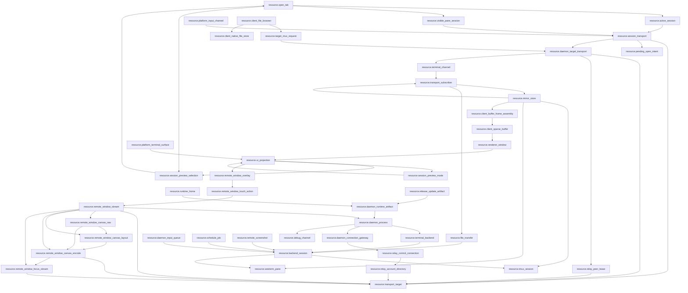

# Global Resource Map

Date: 2026-07-12

`docs/resource-registry.json` is the top-level machine-readable truth for global zterm resources. This file is the human review surface for the same graph. `docs/module-registry.json` groups those resources into daemon/client/shared/relay/release/observability modules, and `docs/edge-registry.json` is the only machine-readable list of allowed cross-module resource edges.

## Scope

Global scope includes:

- daemon process, daemon runtime artifact, runtime home, release/update artifacts, and debug channels.
- Android, Mac, and Windows platform terminal surfaces.
- terminal backend resources, including tmux and Windows WezTerm.
- client session, transport, input, buffer, renderer, and UI projection resources.
- CLI, release, update, debug, file transfer, schedule, screenshot, remote window stream, and remote window canvas side resources.

## Resource Families

| family | resource ids | owner rule |
| --- | --- | --- |
| Global runtime | `resource.runtime_home`, `resource.daemon_runtime_artifact`, `resource.daemon_process`, `resource.release_update_artifact`, `resource.debug_channel` | Runtime consumes compiled/staged artifacts and explicit runtime home truth. Debug observes only. |
| Platform client | `resource.open_tab`, `resource.active_session`, `resource.visible_pane_session`, `resource.session_transport`, `resource.daemon_target_transport`, `resource.terminal_channel`, `resource.transport_target`, `resource.pending_open_intent`, `resource.platform_terminal_surface`, `resource.platform_input_channel` | Platform clients own user intent, daemon-target physical transport identity, visible pane session projection, and terminal channel identity, not backend resources. |
| Relay runtime | `resource.relay_control_connection`, `resource.relay_account_directory`, `resource.relay_peer_lease` | Relay control is a role-scoped persistent WebSocket carrying endpoint/presence/control truth only. The account directory projects confirmed daemon candidates. Relay may preserve an idle-timeout bounded peer/signaling lease per concrete client device and daemon target route for 30 minutes. None may preserve terminal body, tmux, active-tab, or UI truth. |
| Daemon/backend | `resource.daemon_connection_gateway`, `resource.terminal_backend`, `resource.backend_session`, `resource.tmux_session`, `resource.wezterm_pane`, `resource.mirror_store`, `resource.transport_subscriber`, `resource.daemon_input_queue`, `resource.schedule_job`, `resource.file_transfer`, `resource.remote_screenshot`, `resource.remote_window_stream`, `resource.remote_window_canvas_raw`, `resource.remote_window_canvas_layout`, `resource.remote_window_canvas_encode`, `resource.remote_window_focus_stream` | Daemon gateway owns endpoint discovery/publication and physical ingress. Daemon owns backend sessions, physical subscribers, mirror truth, input queues, and daemon side jobs. It does not own client active/foreground/viewport/follow truth. Remote window stream owns desktop media capture/input and canvas truth, not terminal buffer truth. |
| Client buffer/render | `resource.client_buffer_frame_assembly`, `resource.client_sparse_buffer`, `resource.renderer_window`, `resource.ui_projection`, `resource.session_preview_selection`, `resource.session_preview_mode`, `resource.remote_window_overlay` | Frame assembly validates and atomically resolves authoritative wire frames. Client sparse buffer consumes only resolved mirror patches. Renderer declares visible demand. UI, preview, and remote-window overlay resources project state and emit intent only. |

## Allowed Direct Relations

## Required Indirect Relations

| source | target | required path |
| --- | --- | --- |
| `resource.ui_projection` | `resource.session_transport` | via `resource.active_session` |
| `resource.visible_pane_session` | `resource.session_transport` | direct; visible split panes may refresh their existing session transport without becoming active-session truth |
| `resource.renderer_window` | `resource.tmux_session` | via `resource.client_sparse_buffer -> resource.client_buffer_frame_assembly -> resource.mirror_store` |
| `resource.renderer_window` | `resource.wezterm_pane` | via `resource.client_sparse_buffer -> resource.client_buffer_frame_assembly -> resource.mirror_store` |
| `resource.platform_input_channel` | `resource.tmux_session` | via `resource.session_transport -> resource.daemon_target_transport -> resource.terminal_channel -> resource.transport_subscriber -> resource.daemon_input_queue -> resource.backend_session` |
| `resource.platform_input_channel` | `resource.wezterm_pane` | via `resource.session_transport -> resource.daemon_target_transport -> resource.terminal_channel -> resource.transport_subscriber -> resource.daemon_input_queue -> resource.backend_session` |
| `resource.platform_terminal_surface` | `resource.backend_session` | via `resource.active_session -> resource.session_transport -> resource.daemon_target_transport -> resource.terminal_channel -> resource.transport_subscriber -> resource.mirror_store` |
| `resource.release_update_artifact` | `resource.daemon_process` | via `resource.daemon_runtime_artifact` |
| `resource.session_transport` | `resource.transport_subscriber` | via `resource.daemon_target_transport -> resource.terminal_channel` |
| `resource.session_transport` | `resource.client_sparse_buffer` | via `resource.daemon_target_transport -> resource.terminal_channel -> resource.transport_subscriber -> resource.mirror_store -> resource.client_buffer_frame_assembly` |
| `resource.daemon_target_transport` | `resource.transport_subscriber` | via `resource.terminal_channel` |
| `resource.relay_peer_lease` | `resource.daemon_target_transport` | via `resource.transport_target` |
| `resource.relay_control_connection` | `resource.transport_target` | via `resource.relay_account_directory` |
| `resource.relay_control_connection` | `resource.daemon_target_transport` | via `resource.relay_account_directory -> resource.transport_target` |
| `resource.remote_window_overlay` | `resource.transport_target` | via `resource.active_session -> resource.session_transport -> resource.daemon_target_transport` |
| `resource.remote_window_overlay` | `resource.remote_window_stream` | via `resource.remote_window_touch_action` for input actions; via `resource.active_session -> resource.session_transport -> resource.daemon_target_transport` for catalog/stream/screenshot intents |
| `resource.remote_window_touch_action` | `resource.transport_target` | via `resource.active_session -> resource.session_transport -> resource.daemon_target_transport` |
| `resource.remote_window_stream` | `resource.tmux_session` | via `resource.daemon_input_queue -> resource.backend_session` |
| `resource.remote_window_canvas_layout` | `resource.remote_window_overlay` | via `resource.remote_window_canvas_encode -> resource.transport_target`; Android consumes metadata over the existing control transport and cannot become layout truth |

## Forbidden Direct Relations

| forbidden edge | reason |
| --- | --- |
| `resource.ui_projection -> resource.session_transport` | UI and drawer emit intent only through active-session/session-transport owner. |
| `resource.session_transport -> resource.transport_subscriber` | New multiplex path must reach daemon subscribers through `daemon_target_transport -> terminal_channel`. |
| `resource.daemon_target_transport -> resource.mirror_store` | Physical target transport must demux through terminal channels and subscribers before mirror truth. |
| `resource.relay_control_connection -> resource.terminal_channel` | Control endpoint/presence traffic and terminal channel traffic use different physical sockets and owners. |
| `resource.relay_control_connection -> resource.transport_subscriber` | Control traffic cannot bind subscribers or carry terminal body frames. |
| `resource.relay_control_connection -> resource.client_sparse_buffer` | Endpoint updates cannot write terminal body truth. |
| `resource.daemon_target_transport -> resource.client_sparse_buffer` | Physical target transport cannot write client buffer without channel demux, mirror provenance, and frame assembly. |
| `resource.relay_peer_lease -> resource.terminal_channel` | Relay idle resume preserves route/signaling state only and cannot own terminal channel truth. |
| `resource.relay_peer_lease -> resource.transport_subscriber` | Relay peer lease cannot bind daemon terminal subscribers directly. |
| `resource.relay_peer_lease -> resource.tmux_session` | Relay idle resume cannot store or infer tmux/session business truth. |
| `resource.relay_peer_lease -> resource.mirror_store` | Relay peer lease is route truth only and cannot observe or write terminal mirror rows. |
| `resource.renderer_window -> resource.tmux_session` | Renderer never owns terminal content layout or backend geometry. |
| `resource.renderer_window -> resource.wezterm_pane` | Renderer never owns terminal content layout or backend geometry. |
| `resource.platform_input_channel -> resource.backend_session` | Input must go through current session transport and daemon input queue. |
| `resource.daemon_process -> resource.active_session` | Daemon must not store client active/session/foreground state. |
| `resource.debug_channel -> resource.mirror_store` | Debug side channels observe only and cannot become business truth. |
| `resource.release_update_artifact -> resource.daemon_process` | Runtime must consume promoted deterministic artifacts, not direct release/update outputs. |
| `resource.ui_projection -> resource.remote_window_stream` | UI may only project the overlay and emit intent; daemon/native stream truth owns catalog, coordinates, capture, WebRTC, and input injection. |
| `resource.remote_window_overlay -> resource.remote_window_stream` | Touch/input actions must pass through the client touch/action boundary so UI state, hit-test state, and transport dispatch evidence are not conflated. |
| `resource.remote_window_stream -> resource.mirror_store` | Remote window video is desktop media truth and must not reuse terminal mirror rows as video truth. |
| `resource.ui_projection -> resource.remote_window_canvas_layout` | Android cannot compute or overwrite daemon source-to-canvas layout truth. |
| `resource.remote_window_canvas_raw -> resource.renderer_window` | Canvas video is desktop media truth and cannot flow through terminal renderer truth. |

## Owner Locks

- `resource.open_tab` is explicit current-process client truth; runtime sessions and daemon facts must not close or merge it, and cold launch must not restore it.
- `resource.session_transport` is the only platform-client path to daemon transport.
- `resource.visible_pane_session` is explicit platform-client pane projection truth for visible split panes. It may select one passive visible session for a bounded head refresh, but it must not rewrite active-session truth or backend session truth.
- `resource.session_transport` owns client-facing transport lifecycle and channel body-subscription intent. Physical socket truth moves to `resource.daemon_target_transport`; per-session wire identity moves to `resource.terminal_channel`.
- `resource.daemon_target_transport` owns one physical WebSocket/RTC data channel per daemon target route, mux capability negotiation, route diagnostics, and optional Relay peer lease consumption. It must not own active tab, renderer follow, tmux truth, mirror truth, or client sparse buffers.
- `resource.terminal_channel` owns transport-local channel identity for one terminal session and is the only path from daemon-target physical transport to daemon subscriber truth. Unknown, unwrapped, or mismatched channel frames must fail explicitly before reaching buffer/input/file/schedule truth.
- `resource.client_buffer_frame_assembly` owns bounded assembly of chunked authoritative frames, explicit frame rejection truth, exact repair range, and one dispatched repair per revision. A partial frame cannot advance local revision or reach `resource.client_sparse_buffer`; exact continuous coverage crosses one registered edge into sparse apply.
- `resource.relay_peer_lease` owns only an idle-timeout bounded Relay peer/signaling lease for one concrete client device and daemon target route. It may rebind that same phone signaling socket identity for 30 minutes before timeout, but it must reject missing client device identity, must not share the lease across phones, and must not store terminal channel, subscriber, tmux, mirror, active-tab, foreground, viewport, or UI truth.
- Android native `BackgroundService` is notification-only platform execution support. It must not become a `resource.session_transport` keepalive owner, acquire CPU WakeLock, request battery-optimization bypass, or keep body/video streams alive while app foreground truth is false.
- Android native `ImeAnchorPlugin` is the `resource.platform_input_channel` soft-keyboard entry for terminal and supported remote-window input contexts. The anchor starts with soft-input-on-focus disabled, enables it only while an explicit keyboard show intent is active, and disables it with the anchor; focus or `showSoftInput()` returning true is not keyboard truth unless the reported keyboard state or installed-phone screenshot shows a visible IME.
- `resource.transport_subscriber` owns only physical `bodySubscribed`, send accounting/backpressure, last-sent revision, and bounded pending-latest state. When one authoritative changed span exceeds the body-frame byte budget, this owner emits contiguous same-revision chunks that cover the full span; it must not replace the source span with a shorter live-tail projection. It must not store active tab, foreground, pane visibility, follow, reading, or viewport reasons.
- `resource.mirror_store` is the only daemon canonical terminal content, revision, absolute-index, and geometry truth. Hot-tail range patch and full reconciliation are two validated commit modes inside this one writer, not two truth paths.
- `resource.mirror_store -> resource.transport_subscriber` is the only unsolicited live body broadcast relation. Unsubscribe removes broadcast eligibility without closing the transport, detaching the mirror, or disabling explicit head/range reads.
- `resource.client_sparse_buffer` only merges daemon mirror patches by absolute row.
- `resource.renderer_window` owns follow/reading/render-bottom/visible demand and next-RAF commit only, not terminal content layout or network cadence.
- File synchronization has three module owners under one legacy cross-side feature id: `client.file_browser` owns `resource.client_file_browser`, `client.runtime` owns `resource.client_native_file_store`, and `daemon.file_transfer` owns `resource.file_transfer`. `docs/module-registry.json#owned_resources` is the machine truth; `owner_feature=daemon.file_transfer` groups the product lifecycle and never authorizes daemon code to own client bytes or UI projection.
- `resource.session_preview_selection` owns only an ordered 1-6 client preference resolved through current open-tab truth; remote drawer catalog rows must first materialize through the existing session-open owner and persist only the returned local session id; drawer checkbox and in-preview add both route to this owner, add/replacement candidates are every currently open unselected Session, reorder only changes preference order, and tile close removes only that preview target without closing a Session or transport.
- `resource.session_preview_mode` owns preview shell projection plus the captured entry-session projection used only by cancel. Its layout consumes the shared `WindowGroupLayout` projection module, where every selected Session remains its own child container and child click only promotes the primary preview. Entry does not mutate active session; tile activation emits one explicit switch only from the primary tile; Back/right-swipe/close cancellation restores the captured entry session. Buffer, transport, and backend geometry remain untouched.
- `resource.remote_window_overlay` owns only the Android picker/floating/fullscreen projection, one collapsed same-app picker row per app-window group, video-layer primary-plus-children window switcher inside the active video container for the active same-app stream (portrait child rail above the primary video, landscape child rail beside it), default-collapsed iTerm2 pane picker grouping, source-aspect floating resize with toolbar reachability bounds, TerminalPage-measured QuickBar + IME bottom chrome avoidance for the whole locked video container, daemon-frame-aspect receiver projection after stream start, fullscreen aspect-fit drawing plus default remote target `window-resize` fill request on fullscreen entry, fullscreen zoom/pan state with no minimap overlay, IME-aware fullscreen auto lift, projection-sized effective bitrate selection, adjustable/reversible remote scroll tuning projection, Back shrink, minimize, close intent, remote-window screenshot intent, touch-action emission, and background close/stop of any active stream. Screenshot capture is not input and must go through `resource.remote_screenshot` with the selected remote-window target manifest; it must not focus or raise the desktop app. Unsupported `tmux-input` / `iterm2-api` routes are projected as read-only and must not publish a remote-window input context. Local drawing and pointer normalization remain aspect-fit after a resize request; daemon capture/coordinate truth changes only if the daemon accepts the remote target resize. It does not perform transport dispatch, input injection, read iTerm2 split trees, or own capture lifecycle.
- `resource.remote_window_touch_action` owns client-side touch/action classification and dispatch evidence. Unzoomed floating/fullscreen single-finger touch stays remote input even when an IME bottom inset exists: tap emits one `click` action, drag emits no raw move stream and emits one release-time `gesture/swipe` action with start/end coordinates and bounded deltas; local single-finger pan is reserved for zoomed fullscreen projection, target-locked two-finger vertical movement emits one release-time `gesture/swipe` action from the midpoint path with selected per-action cap and default inverted direction, and mouse/trackpad wheel remains one pixel `scroll` action. It sends only the user operation action record for click/gesture/wheel/key/QuickBar/IME, not a client-side focus prelude; daemon input injection owns any inline focus/raise before OS injection. It validates that an active supported app-window `bring-to-focus + os-event` context exists before reporting send success, emits metadata-only debug for sent/unsent actions, and must not own daemon input injection, terminal buffer truth, or capture lifecycle.
- `resource.remote_window_stream` owns daemon/native app/window/iTerm2 pane catalog, coordinate manifest, ScreenCaptureKit capture, WebRTC media negotiation/sender lifecycle, receiver attach status, frame metadata, cleanup, input target lease, click/pointer/scroll/key OS-event injection, release-time gesture replay inside the daemon input owner, ready-checked persistent macOS input helper lifecycle, daemon process-local target enumeration cache, and the client-side daemon-wide target-catalog projection cache. Interactive app-window stream start may warm the input helper without emitting focus/input; actual user operations still obey the one-second stale/drop rule after helper readiness. Same-target action-only bursts may refresh the next queued action only after the preceding same-target action succeeds, so inline focus latency cannot stale the whole user action sequence; different-target or unrelated queued actions still use daemon-local receive time and drop when stale. The daemon cache is keyed by requested source set, warmed at runtime start, and uses a 60-second fresh window plus stale-while-refresh; the client cache is keyed by daemon identity (`daemonHostId + bridgeHost + bridgePort + authToken`), not by tmux/session id. Switching sessions on one daemon therefore cannot re-enumerate the same desktop app list. Explicit force refresh bypasses both fresh projections and awaits the daemon live owner; a closed transport cannot be hidden by cached client data. It may reverse-map iTerm2 `tty` to tmux client/session metadata, but terminal mirror/buffer/render resources are forbidden as video truth. Media negotiation still uses the existing session transport as the control plane; video frames must come only from the daemon capture source. Android derives video ICE servers from the current session traversal route, so Relay/cellular remote-window video does not start a separate no-ICE peer connection.
- `resource.remote_window_canvas_raw` owns the raw bitmap layer for full-display or reflowed app-group canvas at desktop-pixel truth. It composes/crops before encode and must not publish through terminal mirror, sparse buffer, renderer, or screenshot refresh loops.
- `resource.remote_window_canvas_layout` owns the layout generation, source rects, canvas rects, z-order, focus target, and stale-generation rejection. Android consumes layout metadata but cannot recompute macOS coordinates or mutate the generation.
- `resource.remote_window_canvas_encode` owns the encoded canvas stream, bitrate/frame cadence, ROI capability probe result, and low-rate canvas sender. Current Mac evidence does not expose a usable VideoToolbox ROI property, so ROI must remain disabled until a future positive capability gate exists.
- `resource.remote_window_focus_stream` owns the optional high-quality focus stream used when ROI is unavailable or disabled. It is a declared mode, not a hidden fallback, and focus switching must not restart the canvas stream or start one stream per sibling window.
- `resource.debug_channel` can observe and diagnose through bounded metadata-only trace records, but cannot become request/response business truth or contain terminal text/cells.
- `resource.release_update_artifact` must promote through `resource.daemon_runtime_artifact`; runtime cannot scan authoring directories as capability truth.

- `resource.session_idle_facts` owns daemon-derived tmux session idle/stopped facts derived from mirror `lastLiveActivityAt` timestamps. It is the only write path for idle classification; renderer, UI projection, open-tab, active-session, and notification truth are all forbidden as direct relations. Publishes through `session-activity` message over the control channel.

## Gate Contract

- `src/lib/resource-registry-truth.test.ts` validates schema, resource id uniqueness, owner feature existence, doc/gate references, relation ids, and forbidden direct edges.
- `src/lib/module-registry-truth.test.ts` validates project module ids, parents, owner features, owned/consumed/forbidden resources, pending resources, canonical docs, and single concrete resource ownership.
- `src/lib/edge-registry-truth.test.ts` validates allowed module/resource edges, direct/via relation status, forbidden direct edges, `mainline_call_id` bindings, and request/response/error chain shape.
- `src/lib/function-map-resource-truth.test.ts` validates function map resource binding and prevents feature-local maps from inventing resource ids.
- `src/lib/mainline-resource-call-map.test.ts` validates resource metadata on mainline call-map edges and rejects direct forbidden edges.
