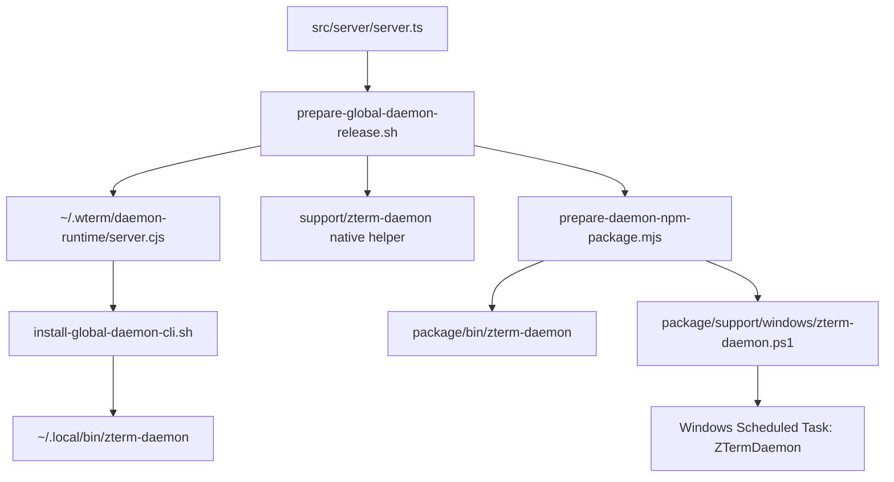

# CLI Wiki

Worker-readable CLI map. Generated diagram: `docs/wiki/generated/cli.html`.

## Owner

- `feature_id`: `daemon.cli_shell`
- Shell CLI: `scripts/zterm-daemon.sh`
- Windows CLI: `scripts/windows/zterm-daemon.ps1`
- Native helper: `scripts/native/zterm-daemon.swift`
- Global install shim: `scripts/install-global-daemon-cli.sh`
- Release staging: `scripts/prepare-global-daemon-release.sh`
- NPM package staging: `scripts/prepare-daemon-npm-package.mjs`
- Public global bin: `zterm-daemon`
- Legacy alias: `wterm`

## Command Map

| command | owner function | side effects | gate |
| --- | --- | --- | --- |
| `run` | `run_foreground` | stages daemon runtime and `exec`s `server.cjs` | daemon runtime truth tests |
| `start` | `start` -> platform service or direct process | launchd / Windows Scheduled Task start or direct pid-file process | port ready check |
| `stop` | `stop` -> platform service or direct process | launchd bootout / Windows Scheduled Task stop / explicit pid termination | port closed check |
| `restart` | `restart` -> platform service or direct stop/start | service-scoped restart only | ready check |
| `status` | `status` | prints direct/service health | status smoke |
| `service-status` | `status_service` / `Invoke-ServiceStatus` | reads launchd snapshot or Windows Scheduled Task state | service gate |
| `install-service` | `install_service` / `Invoke-InstallService` | writes plist or registers `ZTermDaemon`, primes macOS permissions, bootstraps service | service script test |
| `uninstall-service` | `uninstall_service` / `Invoke-UninstallService` | bootout/remove plist or unregister Windows task + legacy cleanup | service script test |
| `configure-relay` | `configure_relay` | writes `~/.wterm/config.json -> mobile.relay` | daemon-config test |

## Release Chain

## Shell Lifecycle (zterm-daemon.sh)

| step | function | behavior |
| --- | --- | --- |
| read config | `read_config` | runs `node --import tsx` against `daemon-config.ts` to extract host/port/session/auth source |
| dispatch | main `case` | routes `run/start/stop/restart/status/service-status/install-service/uninstall-service/configure-relay` |
| launchd label | `LAUNCH_AGENT_LABEL` | `com.zterm.android.zterm-daemon` (legacy `com.zterm.android.daemon` and `com.wterm.mobile.daemon` removed on install) |
| pid file | `DAEMON_PID_FILE` | `~/.wterm/run/zterm-daemon.pid` |
| runtime bundle | `STAGED_DAEMON_ENTRY` | `~/.wterm/daemon-runtime/server.cjs` (built from `src/server/server.ts`) |
| node-pty helper | `STAGED_NODE_PTY_HELPER_GLOB` | darwin `spawn-helper` glob for `node-pty` prebuilds |
| native helper | `NATIVE_DAEMON_BIN` | `~/.wterm/bin/zterm-daemon` (Swift Mach-O for Screen Recording + file access) |

## Windows Lifecycle (zterm-daemon.ps1)

| step | function | behavior |
| --- | --- | --- |
| package root | `Resolve-PackageRoot` | reads `ZTERM_PACKAGE_ROOT` from npm bin wrapper, then uses packaged `runtime/server.cjs` |
| dispatch | `switch ($command)` | routes `run/start/stop/restart/status/service-status/install-service/uninstall-service/configure-relay` |
| scheduled task | `ZTermDaemon` | installed by `Register-ScheduledTask`, trigger is current user logon |
| pid file | `$PidFile` | `~/.zterm/run/zterm-daemon.pid` for direct process truth |
| runtime bundle | `$RuntimeEntry` | `runtime/server.cjs`; terminal backend auto-selects WezTerm on `win32` |
| stop policy | `Stop-Process -Id <pid>` | only stops the explicit managed PID or explicit scheduled task; no broad process kill |

## Node CLI Helpers

| helper | purpose |
| --- | --- |
| `scripts/daemon-mirror-close-loop.ts` | terminal closed-loop verification |
| `scripts/daemon-mirror-lab.ts` | local tmux/mirror lab cases |
| `scripts/runtime-debug-remote.ts` | remote daemon debug pull |
| `scripts/collect-runtime-audit.ts` | collect runtime logs/snapshots |
| `scripts/analyze-runtime-debug.ts` | summarize runtime debug logs |
| `scripts/terminal-real-device-evidence.ts` | Android device evidence capture |
| `scripts/traversal-relay-local-smoke.ts` | relay smoke test |
| `scripts/build-function-wiki.mjs` | render worker-readable wiki HTML from mermaid blocks |
| `scripts/prepare-daemon-npm-package.mjs` | package daemon runtime + CLI bin into npm layout |
| `scripts/windows/zterm-daemon.ps1` | Windows daemon runner and Scheduled Task installer |
| `scripts/prepare-global-daemon-release.sh` | stage global release assets and runtime bundle |
| `scripts/install-global-daemon-cli.sh` | install `zterm-daemon` into `~/.local/bin` |
| `scripts/verify-release-assets.mjs` | release verify (APK + manifest + sha256) |
| `scripts/verify-relay-server-package.mjs` | relay server package verify |
| `scripts/check-wterm-runtime-published.mjs` | upstream runtime version check |

## No-Go

- Do not add broad process kill commands.
- Do not add new public subcommands without updating this page, `docs/function-map.md`, and `src/lib/function-wiki-truth.test.ts`.
- Do not make `status` imply readiness unless port/listener truth is verified.
