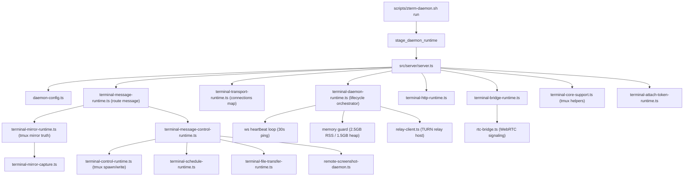

# Daemon Wiki

Worker-readable daemon map. Keep this page factual and short; generated diagrams live in `docs/wiki/generated/daemon.html`.

## Owner

- `feature_id`: `daemon.runtime_entry`
- Runtime entry: `src/server/server.ts`
- Runtime config truth: `src/server/daemon-config.ts`
- CLI launcher: `scripts/zterm-daemon.sh run`
- Staged runtime: `~/.wterm/daemon-runtime/server.cjs`
- State/log directories: `~/.wterm/run`, `~/.wterm/logs`, `~/.wterm/uploads`, `~/Downloads/zterm`

## Mainline

## Runtime Modules (from server.ts wiring order)

| module | responsibility | key file |
| --- | --- | --- |
| `terminal-daemon-runtime.ts` | lifecycle orchestrator: heartbeat, memory guard, SIGINT/SIGTERM/SIGHUP, daemon startup/shutdown, relay client | `src/server/terminal-daemon-runtime.ts` |
| `terminal-bridge-runtime.ts` | WebSocket/RTC connection accept, auth, message lane routing (attach/input/message) | `src/server/terminal-bridge-runtime.ts` |
| `terminal-transport-runtime.ts` | per-connection transport state, send, broadcast, ws/rtc unified | `src/server/terminal-transport-runtime.ts` |
| `terminal-message-runtime.ts` | message dispatcher: routes client messages to mirror/control/bridge/transfer | `src/server/terminal-message-runtime.ts` |
| `terminal-runtime.ts` | session lifecycle, tmux attach/detach, buffer head/range, schedule handoff | `src/server/terminal-runtime.ts` |
| `terminal-mirror-runtime.ts` | tmux mirror truth: capture scheduling, canonicalize, changed-ranges, subscriber broadcast | `src/server/terminal-mirror-runtime.ts` |
| `terminal-mirror-capture.ts` | tmux capture primitives: capture-pane, metrics, cursor, canonicalize | `src/server/terminal-mirror-capture.ts` |
| `terminal-message-control-runtime.ts` | tmux write queue, session control (resize/rename/kill), schedule/transfer/screenshot delegation | `src/server/terminal-message-control-runtime.ts` |
| `terminal-control-runtime.ts` | tmux spawnSync/Async, pane metrics, live mirror write, tmux command dispatch | `src/server/terminal-control-runtime.ts` |
| `terminal-schedule-runtime.ts` | schedule store, engine, per-session state, dispatch handoff | `src/server/terminal-schedule-runtime.ts` |
| `terminal-file-transfer-runtime.ts` | upload/download, chunking, binary bridge | `src/server/terminal-file-transfer-runtime.ts` |
| `terminal-http-runtime.ts` | HTTP debug routes, app-update manifest, connected payload | `src/server/terminal-http-runtime.ts` |
| `terminal-debug-runtime.ts` | client/daemon debug log capture, snapshot, runtime debug store | `src/server/terminal-debug-runtime.ts` |
| `runtime-debug-store.ts` | ring-buffer debug store, payload redaction | `src/server/runtime-debug-store.ts` |
| `terminal-core-support.ts` | pure tmux helpers: sanitize/name/build/cache-lines/cursor-equal | `src/server/terminal-core-support.ts` |
| `terminal-attach-token-runtime.ts` | per-session transport attach token issuance/consumption | `src/server/terminal-attach-token-runtime.ts` |
| `relay-client.ts` | TURN relay host client: device registration, signaling forward | `src/server/relay-client.ts` |
| `rtc-bridge.ts` | WebRTC signaling server for relay peers | `src/server/rtc-bridge.ts` |
| `remote-screenshot-daemon.ts` | daemon-side screenshot: native binary handoff | `src/server/remote-screenshot-daemon.ts` |

## Request Paths

| path | entry | owner module | hard boundary |
| --- | --- | --- | --- |
| WebSocket attach/connect | `server.ts` | `terminal-bridge-runtime.ts` | daemon must not own client active tab, foreground, pane, or UI state |
| input | `terminal-message-runtime.ts` | `terminal-bridge-runtime.ts` + `terminal-message-runtime.ts` | payload remains string-only; stale/detached input drops before tmux write |
| buffer head/range | `terminal-message-runtime.ts` | `terminal-mirror-runtime.ts` | read request must read mirror truth only; no client state policy |
| live mirror capture | `terminal-mirror-runtime.ts` | `terminal-mirror-capture.ts` | daemon owns tmux mirror, not renderer/window/follow state |
| schedule | `terminal-message-control-runtime.ts` | `schedule-engine.ts` + `schedule-store.ts` + `schedule-dispatch.ts` | daemon is schedule execution truth |
| file transfer | `terminal-message-control-runtime.ts` | `terminal-file-transfer-runtime.ts` | transfer chunks preserve payload semantics |
| remote screenshot | `terminal-message-control-runtime.ts` | `remote-screenshot-daemon.ts` + native `scripts/native/zterm-daemon.swift` | daemon/native binary owns local screenshot execution |
| debug runtime | `terminal-http-runtime.ts` | `terminal-debug-runtime.ts` + `runtime-debug-store.ts` | debug logs may redact payload; user-visible payload cannot be rewritten |

## Required Gates

- `src/server/server.daemon-runtime-truth.test.ts`
- `src/server/server.core-support-truth.test.ts`
- `src/server/server.http-truth.test.ts`
- `src/server/server.debug-truth.test.ts`
- `src/server/terminal-message-runtime.test.ts`
- `src/server/terminal-mirror-runtime.test.ts`
- `pnpm run test:terminal:regression`

## No-Go

- Do not add `clientSessionId` or active-tab truth to daemon internals.
- Do not use daemon read requests to trigger upstream sync policy.
- Do not kill tmux sessions except through explicit user-visible kill commands.
- Do not add fallback success paths; expose errors and fix the unique owner.
