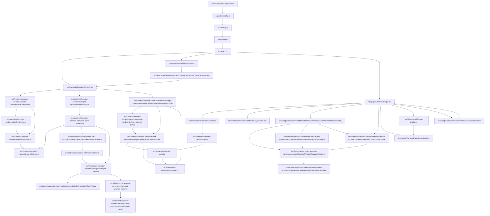
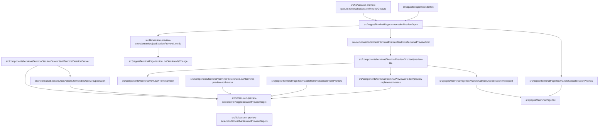
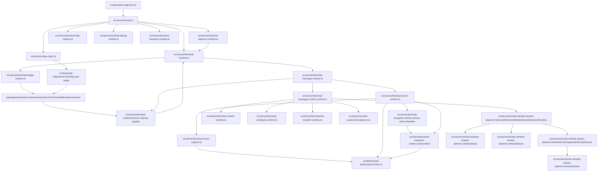
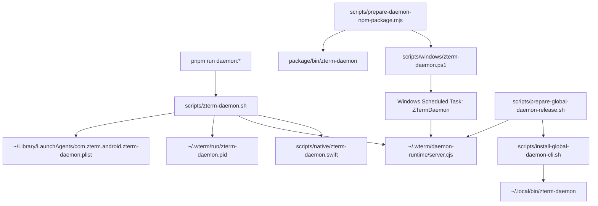
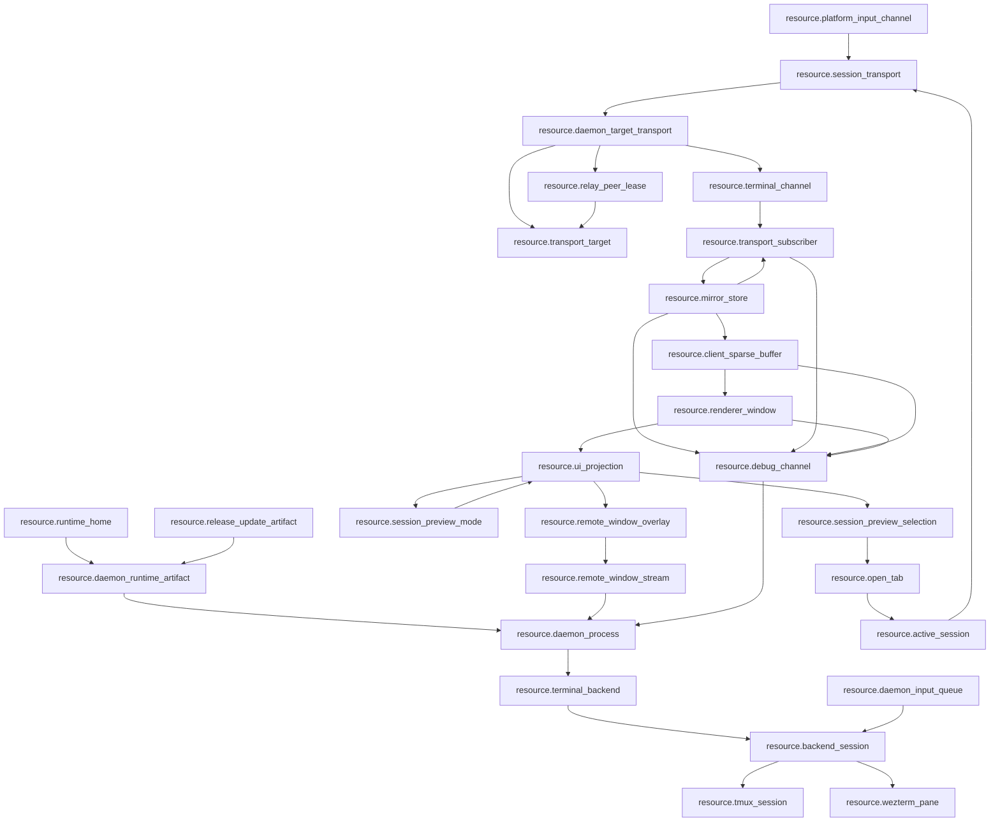

# Mainline Source Wiki

Worker-readable source ownership map. Generated diagram: `docs/wiki/generated/mainline-source.html`.

## Android Mainline

`App -> TerminalPage -> SessionDrawer` carries saved/Home server identity aliases alongside Relay endpoint and Session catalog facts. `TerminalPage` canonicalizes these into one daemon host rail; ambiguous rtc-only catalog matches remain separate and never guess identity.
`SessionOpenOwner` and the open-tab runtime audit path also reuse an existing open mux target transport for drawer refresh / session-picker refresh when a matching non-closed session exists; legacy tmux fetch is only the no-matching-open-target path.

## Android Session Preview Mainline

## Daemon Mainline

## CLI Mainline

## Global Resource Flow

The executable resource graph is declared in `docs/resource-registry.json`; the review surface is `docs/resource-map.md`. Mainline call-map edges in `docs/wiki/mainline-call-map.json` bind each lifecycle edge to `resource_from`, `resource_to`, `via_resources`, and `relation_status`.

## Published Source Surfaces

| surface | files |
| --- | --- |
| Android app entry | `src/main.tsx`, `src/App.tsx`, `src/pages/ConnectionsPage.tsx`, `src/pages/TerminalPage.tsx` |
| Client transport lifecycle | `packages/shared/src/connection/protocol.ts`, `src/contexts/SessionContext.tsx`, `src/contexts/session-context-session-orchestration-runtime.ts`, `src/contexts/session-context-session-runtime.ts`, `src/contexts/session-context-activity-runtime.ts`, `src/contexts/session-context-transport-orchestration-runtime.ts`, `src/contexts/session-context-transport-open-runtime.ts`, `src/contexts/session-context-socket-message-runtime.ts`, `src/contexts/session-transport-open-helpers.ts`, `src/lib/session-transport-runtime.ts`; target mux nodes are `TargetTransportRuntime`, `MuxHandshake`, `ChannelRuntime`, `ChannelMessageSend`, and `ChannelDemux`; WebRTC route diagnostics include metadata-only selected ICE pair projection through `src/lib/traversal/socket.ts` and `src/pages/TerminalPageDebugOverlay.tsx` |
| Terminal body receive/apply/render | `src/contexts/session-context-socket-message-runtime.ts#handleSocketServerMessageRuntime`, `src/contexts/session-context-buffer-runtime.ts#applyIncomingBufferSyncRuntime`, `src/lib/session-render-gate.ts#scheduleCommit`, `src/lib/session-render-buffer-store.ts` |
| Terminal performance observer | `src/lib/terminal-performance-trace.ts`, `src/server/terminal-debug-runtime.ts`, `src/lib/runtime-debug.ts`; metadata only, no terminal text/cells |
| Terminal shell and panes | `src/pages/TerminalPageStageShell.tsx`, `src/hooks/useTerminalWorkspace.ts`, `src/components/terminal/TerminalQuickBar.tsx` |
| Remote window stream projection | `packages/shared/src/connection/protocol.ts`, `src/server/remote-window-stream-daemon.ts`, `src/server/terminal-message-runtime.ts`, `src/server/server.ts`, `src/server/terminal-file-transfer-binary-runtime.ts`, `src/components/terminal/RemoteWindowOverlay.tsx`, `src/lib/remote-window-overlay-runtime.ts`, `src/lib/remote-window-message-runtime.ts`, `src/lib/remote-window-receiver-runtime.ts`, `src/lib/remote-window-video-quality.ts`, `src/contexts/session-context-remote-window-runtime.ts`, `src/contexts/session-context-transfer-runtime.ts`, `docs/decisions/2026-07-19-remote-window-stream-truth.md`; ScreenCaptureKit/WebRTC bindings are anchored under `RemoteWindowMessageRuntime`, `RemoteWindowReceiver`, `RemoteWindowStreamQualityRuntime`, `RemoteWindowCapture`, `RemoteWindowMedia`, `RemoteWindowInput`, and `RemoteWindowCleanup`; Android fullscreen projection now owns default-collapsed iTerm2 picker grouping, daemon-wide 60-second target catalog cache keyed by daemon identity, aspect-fit/default, aspect-fill cover display mode using one content rect for drawing and input mapping, source-aspect floating resize with toolbar reachability cap, daemon-frame-aspect receiver projection after stream start, IME bottom-inset fullscreen padding plus QuickBar chrome auto-pan, unzoomed pointer/gesture input and wheel pixel-scroll input even while IME inset is present, zoomed-only local single-finger pan, supported app-window-only input context, focus-aware image paste routing, floating-preview low bitrate, desktop-area-proportional stream quality defaults, adaptive network quality caps, and explicit max frame-rate request values; remaining live gates are Android rendered-pixel recheck and iTerm2-pane stream/input proof |
| Terminal session group layout | `src/lib/terminal-layout-profile.ts`, `src/lib/session-group-viewport.ts`, `src/pages/TerminalPage.tsx#resolveTerminalSessionGroupActiveSessionProjection`, `src/pages/TerminalPageStageShell.tsx`, `docs/features/terminal-session-group-layout.md`, `docs/testing/terminal-session-group-layout-test-design.md` |
| Session drawer (multi-host) | `src/components/terminal/TerminalSessionDrawer.tsx` (UI), `src/pages/TerminalPage.tsx` (`drawerServerIdentityAliases` canonicalizes live/session-group/Relay endpoint identity; `drawerSessions` projects hostKey/hostLabel + opened-first ordering) |
| Session quick preview | `src/lib/session-preview-selection.ts`, `src/lib/session-preview-gesture.ts`, `src/components/terminal/TerminalPreviewGrid.tsx`, `src/pages/TerminalPageStageShell.tsx` |
| Daemon runtime | `src/server/server.ts`, `src/server/terminal-daemon-runtime.ts`, `src/server/terminal-runtime.ts`, `src/server/terminal-message-runtime.ts`, `src/server/terminal-mirror-runtime.ts`, `src/server/terminal-message-control-runtime.ts`, `src/server/terminal-transport-runtime.ts`, `src/server/remote-window-stream-daemon.ts` |
| Daemon control edges | `src/server/terminal-control-runtime.ts`, `src/server/terminal-file-transfer-runtime.ts`, `src/server/terminal-schedule-runtime.ts`, `src/server/remote-screenshot-daemon.ts`, `src/server/remote-window-stream-daemon.ts`, `src/server/terminal-http-runtime.ts` |
| Daemon CLI | `scripts/zterm-daemon.sh`, `scripts/windows/zterm-daemon.ps1`, `scripts/install-global-daemon-cli.sh`, `scripts/prepare-global-daemon-release.sh`, `scripts/prepare-daemon-npm-package.mjs` |
| Release/update | `scripts/build-android-debug.sh`, `scripts/prepare-update-bundle.mjs`, `scripts/verify-release-assets.mjs`; Relay public update route and future `RelayPeerLease` idle-resume resource are authored in `src/traversal-relay/server.ts` and packaged by `scripts/prepare-relay-server-npm-package.mjs` with `ZTERM_TRAVERSAL_UPDATES_DIR` |
| Worker wiki generator | `scripts/build-function-wiki.mjs`, `docs/wiki/daemon.md`, `docs/wiki/cli.md`, `docs/wiki/mainline-source.md` |
| Global resource truth | `docs/resource-registry.json`, `docs/resource-map.md`, `docs/testing/resource-truth-test-design.md` |

## Gate

- `src/lib/feature-registry-truth.test.ts`
- `src/lib/function-wiki-truth.test.ts`
- `src/lib/resource-registry-truth.test.ts`
- `src/lib/function-map-resource-truth.test.ts`
- `src/lib/mainline-resource-call-map.test.ts`
- `pnpm run test:feature-registry`
