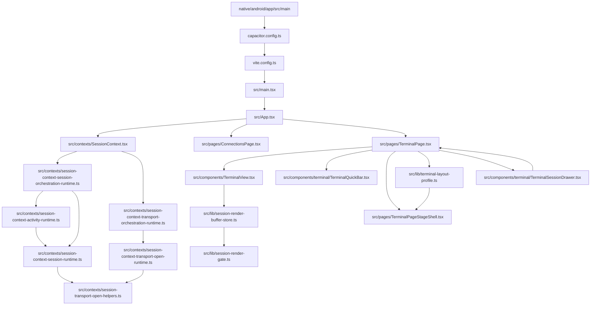
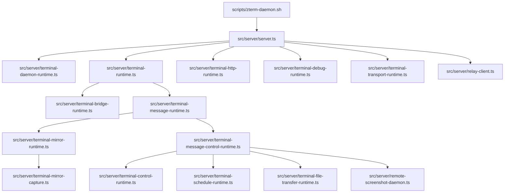
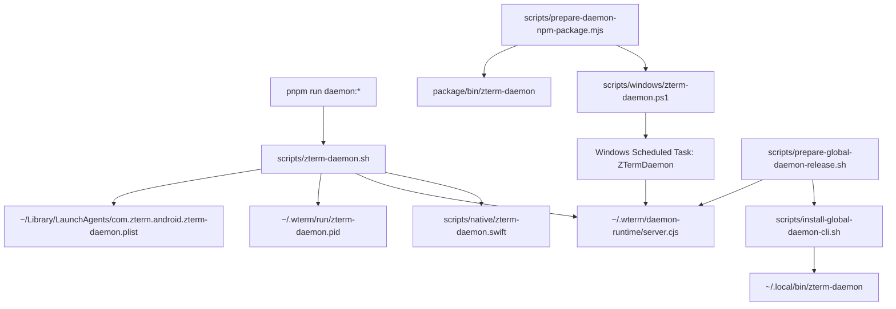
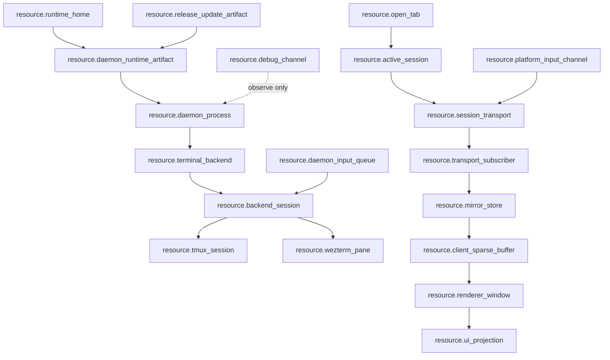

# Mainline Source Wiki

Worker-readable source ownership map. Generated diagram: `docs/wiki/generated/mainline-source.html`.

## Android Mainline

## Daemon Mainline

## CLI Mainline

## Global Resource Flow

The executable resource graph is declared in `docs/resource-registry.json`; the review surface is `docs/resource-map.md`. Mainline call-map edges in `docs/wiki/mainline-call-map.json` bind each lifecycle edge to `resource_from`, `resource_to`, `via_resources`, and `relation_status`.

## Published Source Surfaces

| surface | files |
| --- | --- |
| Android app entry | `src/main.tsx`, `src/App.tsx`, `src/pages/ConnectionsPage.tsx`, `src/pages/TerminalPage.tsx` |
| Client transport lifecycle | `src/contexts/SessionContext.tsx`, `src/contexts/session-context-session-orchestration-runtime.ts`, `src/contexts/session-context-session-runtime.ts`, `src/contexts/session-context-activity-runtime.ts`, `src/contexts/session-context-transport-orchestration-runtime.ts`, `src/contexts/session-context-transport-open-runtime.ts`, `src/contexts/session-transport-open-helpers.ts` |
| Terminal renderer | `src/components/TerminalView.tsx`, `src/lib/session-render-buffer-store.ts`, `src/lib/session-render-gate.ts` |
| Terminal shell and panes | `src/pages/TerminalPageStageShell.tsx`, `src/hooks/useTerminalWorkspace.ts`, `src/components/terminal/TerminalQuickBar.tsx` |
| Terminal session group layout | `src/lib/terminal-layout-profile.ts`, `src/pages/TerminalPageStageShell.tsx`, `docs/features/terminal-session-group-layout.md`, `docs/testing/terminal-session-group-layout-test-design.md` |
| Session drawer (multi-host) | `src/components/terminal/TerminalSessionDrawer.tsx` (UI), `src/pages/TerminalPage.tsx` (hostKey/hostLabel + opened-first ordering in `drawerSessions` useMemo) |
| Daemon runtime | `src/server/server.ts`, `src/server/terminal-daemon-runtime.ts`, `src/server/terminal-runtime.ts`, `src/server/terminal-message-runtime.ts`, `src/server/terminal-mirror-runtime.ts`, `src/server/terminal-message-control-runtime.ts`, `src/server/terminal-transport-runtime.ts` |
| Daemon control edges | `src/server/terminal-control-runtime.ts`, `src/server/terminal-file-transfer-runtime.ts`, `src/server/terminal-schedule-runtime.ts`, `src/server/remote-screenshot-daemon.ts`, `src/server/terminal-http-runtime.ts` |
| Daemon CLI | `scripts/zterm-daemon.sh`, `scripts/windows/zterm-daemon.ps1`, `scripts/install-global-daemon-cli.sh`, `scripts/prepare-global-daemon-release.sh`, `scripts/prepare-daemon-npm-package.mjs` |
| Release/update | `scripts/build-android-debug.sh`, `scripts/prepare-update-bundle.mjs`, `scripts/verify-release-assets.mjs` |
| Worker wiki generator | `scripts/build-function-wiki.mjs`, `docs/wiki/daemon.md`, `docs/wiki/cli.md`, `docs/wiki/mainline-source.md` |
| Global resource truth | `docs/resource-registry.json`, `docs/resource-map.md`, `docs/testing/resource-truth-test-design.md` |

## Gate

- `src/lib/feature-registry-truth.test.ts`
- `src/lib/function-wiki-truth.test.ts`
- `src/lib/resource-registry-truth.test.ts`
- `src/lib/function-map-resource-truth.test.ts`
- `src/lib/mainline-resource-call-map.test.ts`
- `pnpm run test:feature-registry`
