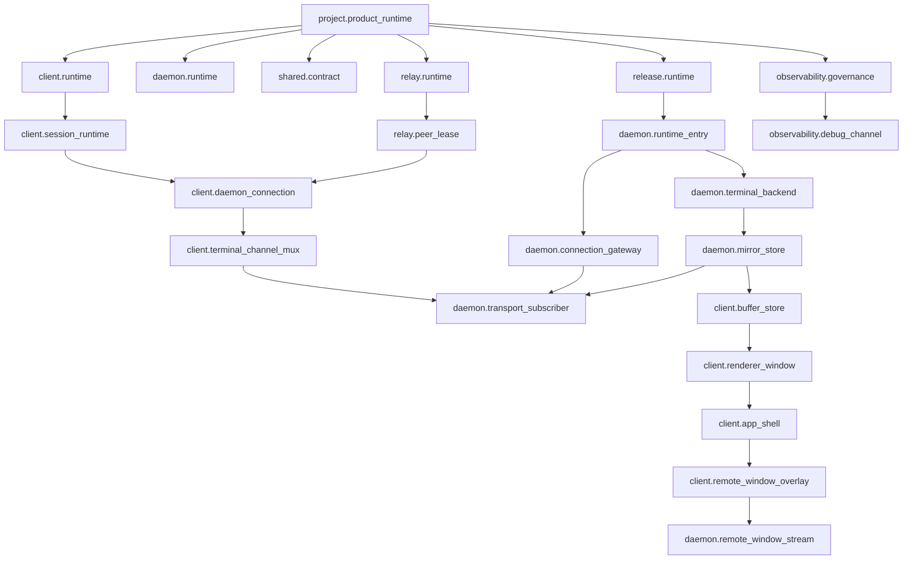

# Project Modules Wiki

Worker-readable module map. Generated diagram: `docs/wiki/generated/modules.html`.

## Owner

- `feature_id`: `mainline_source.android`
- Module manifest: `docs/module-registry.json`
- Edge manifest: `docs/edge-registry.json`
- Resource manifest: `docs/resource-registry.json`
- Human review: `docs/modules/project-modules.md`
- Test design: `docs/testing/module-edge-registry-test-design.md`

## Module Flow

## Rules

- Resource registry defines resource truth.
- Module registry groups resources into runtime ownership.
- Edge registry is the only cross-module connection list.
- Function map binds feature-local code after module/edge truth exists.
- Client connection owns one physical connection per daemon target.
- Terminal session is a mux channel, not a socket owner.
- Daemon must not store client active tab, foreground/background, viewport, renderer, or UI truth.
- Relay peer lease is route/signaling truth only.

## Gates

- `src/lib/module-registry-truth.test.ts`
- `src/lib/edge-registry-truth.test.ts`
- `src/lib/resource-registry-truth.test.ts`
- `src/lib/function-map-resource-truth.test.ts`
- `src/lib/mainline-resource-call-map.test.ts`
- `pnpm run test:feature-registry`
