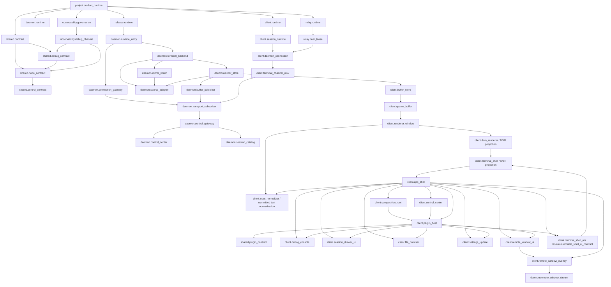

# Project Modules Wiki

Worker-readable module map. Generated diagram: `docs/wiki/generated/modules.html`.

## Owner

- `feature_id`: `mainline_source.android`
- Module manifest: `docs/module-registry.json`
- Edge manifest: `docs/edge-registry.json`
- Resource manifest: `docs/resource-registry.json`
- Human review: `docs/modules/project-modules.md`
- Test design: `docs/testing/module-edge-registry-test-design.md`

## Module Flow

## Rules

- Resource registry defines resource truth.
- Module registry groups resources into runtime ownership.
- Edge registry is the only cross-module connection list.
- Function map binds feature-local code after module/edge truth exists.
- Client connection owns one physical connection per daemon target.
- Terminal session is a mux channel, not a socket owner.
- Daemon must not store client active tab, foreground/background, viewport, renderer, or UI truth.
- `client.dom_renderer` owns immutable render snapshot to DOM projection through `TerminalView`, `VisibleRow`, `TerminalPreviewRow`, mirror-fixed zoom/pan, shared cell render, and terminal theme.
- `client.input_normalizer` owns only pure committed-text normalization through `src/lib/terminal-input-normalization.ts`; TerminalPage and TerminalView consume it without importing session transport, backend, mirror, or transport truth.
- `client.terminal_shell` owns Android terminal stage shell, shell skin, status, quickbar assembly, copy menu, and keyboard lift; it consumes renderer/DOM projections and emits user intent only.
- `client.plugin_host` owns one capability-scoped plugin host; `shared.plugin_contract` owns plugin capability contracts, the unique capability registry, and the typed UI slot registry; `client.debug_console` owns the typed debug console UI contract and debug overlay renderer; `client.session_drawer_ui` owns the typed session drawer UI slot contract and plugin-provided drawer projection; `client.file_browser` owns the typed file browser UI contract and plugin-provided FileTransferSheet projection; `client.settings_update` owns the typed settings update UI contract and plugin-provided AppUpdateSection projection; `client.remote_window_ui` owns the typed remote window UI contract and plugin-provided RemoteWindowOverlay projection; `client.quickbar_ui` owns the typed quickbar UI contract and plugin-provided TerminalQuickBar projection through `terminal.quickbar`; `client.terminal_shell_ui` owns the typed terminal shell UI contract and plugin-provided status/stage/copy/quickbar-shell/network-banner projection through `terminal.shell`.
- `client.composition_root` owns declared runtime port binding/validation and App-level plugin-host composition; it never owns transport, session, buffer, renderer, plugin implementation, or business truth.
- `client.control_center` owns client control command authorization, capability gate, deadline, idempotency, correlation, unique routing, and bounded audit; `shared.control_contract` owns the branded control contracts. App routes plugin-host disposal through the control center, not by direct `disposeAll` calls.
- `shared.node_contract` owns node identity, lifecycle, disposal, subscription, and typed adjacent node contracts in `packages/shared/src/terminal/node-contract.ts`; `shared.debug_contract` owns versioned snapshots, debug events, filters, sensitivity classes, bounded stores, and expiring debug permissions in `packages/shared/src/terminal/debug-contract.ts`. Neither shared contract owns session, transport, mirror, buffer, renderer, UI, backend, or business payload truth.
- `client.observability` owns bounded client debug snapshot/event/export truth through `src/lib/client-debug-snapshot.ts` and `src/lib/runtime-debug-http-exporter.ts`; `daemon.observability` owns bounded daemon debug event/snapshot/permission truth through `src/server/runtime-debug-store.ts` and `src/server/terminal-debug-runtime.ts`. Both consume shared debug contracts and never touch active session, transport, mirror, sparse buffer, renderer, or UI truth.
- `daemon.control_gateway` owns typed control ingress and `daemon.control_center` owns capability gate, deadline, idempotency, correlation, unique routing, and bounded audit. Schedule and tmux control commands do not retain a second routing path in `terminal-message-runtime.ts`.
- `daemon.session_catalog` owns backend session catalog construction and `list-sessions` dispatch; it consumes backend session and session idle facts only and never owns client active/session, mirror, transport, renderer, or UI truth.
- `daemon.source_adapter` owns the shared tmux/Herdr/WezTerm source adapter contract in `src/server/terminal-source-adapter.ts`; backend and mirror capture consumers import its contract without owning kind normalization, source session shape, or readback snapshot shape.
- `daemon.mirror_writer` owns validated source capture and authoritative mirror snapshot commit writes in `src/server/terminal-mirror-capture.ts`; `daemon.mirror_store` owns canonical mirror revision and runtime scheduling. There is one snapshot writer, not two truth paths.
- Plugins receive declared capabilities only and cannot access raw socket, store, backend, daemon, terminal buffer, renderer, or UI projection resources.
- Relay peer lease is route/signaling truth only.

## Gates

- `src/lib/module-registry-truth.test.ts`
- `src/lib/edge-registry-truth.test.ts`
- `src/lib/resource-registry-truth.test.ts`
- `src/lib/function-map-resource-truth.test.ts`
- `src/lib/mainline-resource-call-map.test.ts`
- `pnpm run test:feature-registry`
