# ZTerm Cordis v2 Architecture Review

Status: design / Phase 0 governance admission

Canonical machine manifest: [`../zterm-cordis-v2-phase-manifest.json`](../zterm-cordis-v2-phase-manifest.json)

Canonical design: [`../../design/2026-08-26-zterm-cordis-v2-cross-platform.md`](../../design/2026-08-26-zterm-cordis-v2-cross-platform.md)

Execution plan: [`../../goals/zterm-cordis-v2-rebuild-plan.md`](../../goals/zterm-cordis-v2-rebuild-plan.md)

## Review entry

`phase-0-governance` admits the shared-contract phase only after parity catalog,
owner maps, source anchors, review surface, and executable governance gate pass.

## Lifecycle

```mermaid
flowchart LR
  P0["phase-0-governance\nready"] --> P1["phase-1-shared-contracts\nblocked-on-phase-0"]
  P1 --> P2["phase-2-kernel-cordis\nblocked-on-phase-1"]
  P2 --> P3["phase-3-platform-hosts\nblocked-on-phase-2"]
  P3 --> P4["phase-4-runtime-parity\nblocked-on-phase-3"]
  P4 --> P5["phase-5-terminal-data-plane\nblocked-on-phase-4"]
  P5 --> P6["phase-6-ui-plugins\nblocked-on-phase-5"]
  P6 --> P7["phase-7-platform-parity\nblocked-on-phase-6"]
  P7 --> P8["phase-8-closeout\nblocked-on-phase-7"]
```



Machine source: [`zterm-cordis-v2-review.mmd`](zterm-cordis-v2-review.mmd)

## Phase checklist

| Node | Owner claim | Current state | Exit evidence |
| --- | --- | --- | --- |
| `phase-0-governance` | `zterm.v2.phase0.governance` | ready | maps, parity catalog, source anchors, gate |
| `phase-1-shared-contracts` | `zterm.v2.phase1.shared.contracts` | blocked | framework-neutral contracts and red gates |
| `phase-2-kernel-cordis` | `zterm.v2.phase2.kernel.cordis.adapter` | blocked | Playground adapter evidence |
| `phase-3-platform-hosts` | `zterm.v2.phase3.platform.hosts` | blocked | typed IPC and packaged smoke |
| `phase-4-runtime-parity` | `zterm.v2.phase4.runtime.parity` | blocked | exact v1/v2 replay |
| `phase-5-terminal-data-plane` | `zterm.v2.phase5.terminal.data-plane` | blocked | daemon/source-to-DOM/data stream evidence |
| `phase-6-ui-plugins` | `zterm.v2.phase6.ui.plugins` | blocked | UI ownership and interaction gates |
| `phase-7-platform-parity` | `zterm.v2.phase7.platform.parity` | blocked | Android/iOS/macOS/Windows live evidence |
| `phase-8-closeout` | `zterm.v2.phase8.closeout` | blocked | main-tree verification and review PASS |

## Boundary checklist

- Cordis is process-local composition infrastructure.
- Shared domain contracts do not import React, DOM, Capacitor, Electron, native APIs, or Cordis.
- UI plugins read projections and dispatch actions only.
- Terminal bytes, file/media chunks, buffer frames, and reliable input use dedicated data streams.
- Control, debug, routing, retry, provider, health, and snapshot metadata do not enter business payloads.
- No fallback, shadow route, second owner, or runtime source copied from `../wterm`.

## Gate status

| Gate | Status | Meaning |
| --- | --- | --- |
| `phase-manifest-structure` | active | validator runs from root scripts and CI/prebuild |
| `source-owner-baseline` | pending | Phase 0 map worker owns implementation |
| `v1-parity-catalog` | pending | Phase 0 parity worker owns implementation |
| `payload-isolation` | pending | Phase 1 contract worker owns implementation |
| `module-dag` | pending | Phase 1 contract worker owns implementation |

## Review commands

```text
pnpm run test:cordis-v2-governance
pnpm run test:cordis-v2-governance:negative
```

The HTML review surface is deterministic and offline. It contains no runtime
script, external stylesheet, CDN, or external URL dependency.
